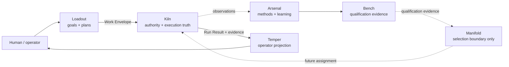

# Invariant

**AI-assisted engineering where capability is not authority and completion requires evidence.**

Invariant is a local-first engineering system for turning model intelligence into bounded, inspectable software work. Models can investigate, propose, and reason. Separate infrastructure decides what is allowed to execute, records what actually happened, preserves evidence, and presents the result to a human without inventing missing facts.

This repository is the canonical monorepo for the Invariant product system.

## Why this exists

A coding model can produce useful code. That does not answer the harder engineering questions around the code:

- What repository state did it act on?
- What work was actually authorized?
- Which capability or method was selected, and on what evidence?
- What changed, exactly?
- Which verification ran against which state?
- Did a passing command prove the acceptance property or only a proxy?
- Can the result survive restart and still be inspected?
- Who decided the work was acceptable?

Invariant keeps those questions out of the model's self-report.

The core rule is simple: **intelligence may propose; authority, effects, evidence, and acceptance must have explicit owners.**

## A workflow that runs today

The repository-recon integration path is the current cross-product proof:

```text
Goal: “Understand this repository”
        │
        ▼
Loadout installs repository-recon
        │
        ▼
Loadout compiles a Plan + Work Envelope
        │
        ▼
Kiln evaluates authority and supervises the real run
        │
        ▼
Kiln returns the canonical Run Result Envelope
        │
        ▼
Temper renders plan, authority, evidence, artifacts, and repository currentness
```

Run it from one checkout:

```bash
./invariant test integration
```

The executable scenario lives at [`integration/scenarios/repository-recon/run.sh`](integration/scenarios/repository-recon/run.sh). It asserts that the result uses `engineering-system/run-result-envelope/v0` and is **not** simulated.

That proof is intentionally narrower than the larger architecture. The golden path is automated today; the broader restart, negative-case, and dogfood matrix remains incomplete.

## The system at a glance



The dashed Manifold path is architectural direction, not current runtime behavior.

## Products

| Area | Owns | Current state |
| --- | --- | --- |
| **Arsenal** | reusable engineering intelligence, methods, research, learning | Current; machine-checked asset/capability system and distribution work exist |
| **Bench** | evaluation and qualification evidence inside Arsenal | Current/experimental; 19-case v0 corpus with explicit executed vs designed-not-run semantics |
| **Loadout** | goals, capabilities, planning, Work Envelope preparation | Current; CLI/web surface, simulated boundary, and real Kiln boundary |
| **Kiln** | authority, execution, effects, artifacts, evidence, registered verification, acceptance truth | Current/partial; durable single-Run foundation and real supervision exist; broader roadmap remains incomplete |
| **Temper** | operator experience and truthful projection | Current/partial; read-only real-run workbench |
| **Manifold** | intelligence selection and allocation semantics | Planned boundary; **no runtime implementation** |

Architectural ownership is enforced by [`invariant.boundaries.json`](invariant.boundaries.json). Bench is not a peer repository or `products/bench`; it lives at [`products/arsenal/evaluation/`](products/arsenal/evaluation/).

## What works today

- **One canonical Git root** with Arsenal, Loadout, Kiln, Temper, Manifold boundary docs, contracts, integration scenarios, and program history.
- **Arsenal** asset registry, capability contracts, compiler/distribution path, governance checks, qualification/evaluation machinery, and Repository Truth distribution work.
- **Bench** case-health, counterfactual/ablation, evidence-passport, and lifecycle concepts backed by a 19-case v0 corpus. Its own docs explicitly refuse to turn deterministic contract evidence into unsupported model-efficacy claims.
- **Loadout** Goal → Capability → Plan / Work Envelope preparation, repository-recon and verify-change paths, deterministic simulation, and a fail-closed real Kiln driver.
- **Kiln** durable Run/journal foundations, authority evaluation, artifact/evidence substrate, Work Envelope supervision, registered verification, Run Result projection, and recovery foundations implemented in the current codebase.
- **Temper** read-only inspection of real Loadout Plan and Kiln Run Result records, including truthful `n/a` states when the contract does not contain a fact.
- **Cross-product Repository Recon** through real Kiln supervision and Temper projection from a single monorepo checkout.

See [`docs/status.md`](docs/status.md) for the evidence-backed current-state matrix as the documentation foundation fills out.

## What is not done

- Manifold has no runtime.
- The complete Development Loop v0 — one real code change from planning through governed mutation, registered verification, independent review, human decision, projection, and learning observation — is not yet a finished product path.
- The full Wave 3 integration matrix is not automated by the current monorepo runner.
- Planned Kiln child-run, broader recovery, provider, and execution slices must not be inferred from roadmap prose as existing capability.
- A roadmap is not execution authority.

## Inspect the repository

Start by asking the repository what is actually present:

```bash
./invariant status
./invariant doctor
./invariant check
./invariant check boundaries
```

Then exercise the current integration path:

```bash
./invariant test integration
```

Or run all product gates:

```bash
./invariant test
```

`doctor` reports missing prerequisites; it does not install them.

## How Invariant treats authority and evidence

The architecture keeps several concepts deliberately separate:

```text
capability ≠ authority
proposal   ≠ mutation
exit zero  ≠ acceptance
receipt    ≠ permission
projection ≠ source of truth
roadmap    ≠ authorization
```

A useful method can live in Arsenal. Bench can produce evidence that a configuration is qualified for a role. Loadout can prepare work. Manifold may eventually select among qualified intelligence. None of those facts grants repository mutation authority. Kiln owns runtime authorization and durable execution truth. Temper can show that truth; it cannot create it. Human decisions remain explicit where the workflow requires them.

Read [`docs/concepts/authority.md`](docs/concepts/authority.md), [`docs/concepts/evidence.md`](docs/concepts/evidence.md), and [`docs/architecture/product-boundaries.md`](docs/architecture/product-boundaries.md) for the deeper model.

## Contracts, not source coupling

Products exchange facts through canonical contracts and files rather than importing one another's source trees.

Current cross-product contracts live in [`contracts/`](contracts/):

- Work Envelope v0
- Run Result Envelope v0
- Qualified Method Record v0
- Learning Observation v0

Their `engineering-system/*` schema identity strings are historical stable identifiers. They are intentionally **not** renamed during the monorepo migration.

## Documentation

The documentation system is being built from canonical Markdown under [`docs/`](docs/). Generated HTML is presentation output, not source truth.

Start here:

- [Documentation home](docs/index.md)
- [Current system status](docs/status.md)
- [System map](docs/architecture/system-map.md)
- [Product boundaries](docs/architecture/product-boundaries.md)
- [Repository Recon workflow](docs/workflows/repository-recon.md)
- [Roadmap](docs/roadmap/index.md)
- [Source-of-truth audit](docs/_meta/source-of-truth-audit.md)

Historical migration evidence remains in [`docs/MONOREPO-MIGRATION.md`](docs/MONOREPO-MIGRATION.md), [`MIGRATION-REPORT.md`](MIGRATION-REPORT.md), and [`program/historical/`](program/historical/).

## Development and verification

Broad prerequisites are Git, Python 3.12+, Node 20.10+ and npm, Elixir/Erlang for Kiln, a C compiler, and the product-specific tools reported by `./invariant doctor`.

Canonical root commands:

```bash
./invariant check
./invariant check boundaries
./invariant test arsenal
./invariant test loadout
./invariant test kiln
./invariant test temper
./invariant test integration
./invariant test
```

Product-local `AGENTS.md` and READMEs still apply inside each product tree. Root [`AGENTS.md`](AGENTS.md) governs cross-product work.

## Roadmap direction

The next system milestone is the smallest coherent **Development Loop v0** that proves a real code change through public boundaries without collapsing ownership:

```text
Loadout request / plan
→ qualified intelligence selection when selection is actually needed
→ Kiln-governed implementation and mutation
→ registered verification
→ independent review
→ explicit human decision
→ truthful Temper projection
→ learning observation back toward Arsenal / Bench
```

The dependency-aware roadmap lives under [`docs/roadmap/`](docs/roadmap/). It separates **NOW**, **NEXT**, **LATER**, and **FRONTIER** and records acceptance properties instead of calendar promises.

## Repository rules

- One Git root. No submodules. No nested product repositories.
- The monorepo removes repository boundaries, not architectural boundaries.
- Products do not gain authority by being colocated.
- Cross-product schema identities are stable contracts, not paths to rename.
- Historical evidence stays historical.
- Completion claims require evidence against the intended property.
