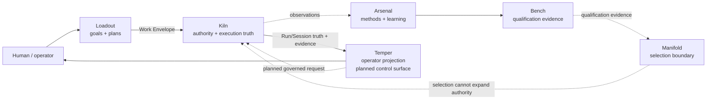

# Invariant

**AI-assisted engineering where capability is not authority and completion requires evidence.**

Invariant is a local-first engineering system for turning model intelligence into bounded, inspectable software work. Models can investigate, propose, and reason. Separate infrastructure decides what is allowed to execute, records what actually happened, preserves evidence, and presents the result to a human without inventing missing facts.

This repository is the canonical monorepo for the Invariant product system.

## Two-track repository model

Repository archaeology established two intentionally different branch lines:

- `main` descends from A0 (`0c6ed3ad39c6a9a8808a37c8728c56f3dcd254af`), the strongest
  pre-Graph Workbench state found;
- `dev` descends from B0 (`5e7b0134d5e901603904ca5b1f4f3f16d4a472ec`), its Graph-enabled
  descendant.

The branches now make that distinction inspectable and independently usable;
publication does not retroactively qualify the historical runtime candidates.
A0 has failing Kiln tests and lacks later root/integration repairs. B0 retains
shared Kiln failures and adds an experimental `products/temper-elixir` surface
whose direct sibling-source dependency on Kiln violates the product boundary.
Read the recorded limitations before treating either branch as release
evidence.

Use [the current-system inventory](docs/reference/current-system-inventory.md)
to compare the candidates, [the qualification record](docs/qualification/two-track-qualification.md)
for executed evidence and remaining gates, and [the branch reconciliation
ledger](docs/development/branch-reconciliation.md) before choosing a source for
experimentation or Lab installation. Candidate labels describe proposed roles,
not acceptance or authority.

### Fast historical-candidate workflow

The root helper makes the historical versions reproducible without moving a
branch or calling a provider:

```bash
./invariant track list
./invariant track doctor /path/to/invariant-lab
./invariant track create main /path/to/invariant-main-a0
./invariant track create dev /path/to/invariant-dev-b0
./invariant track test main /path/to/invariant-main-a0 qualification
./invariant track test dev /path/to/invariant-dev-b0 qualification
./invariant track use main /path/to/invariant-main-a0 /path/to/practice-repo
./invariant track lab main /path/to/invariant-main-a0 /path/to/invariant-lab
```

`track test` removes `MINIMAX_API_KEY`, keeps every gate's output, continues
after an individual failure, checks that tests left the candidate clean, and
returns nonzero when any gate fails. The
`smoke`, `full`, `runtime`, `graph`, and `qualification` profiles allow a fast
local loop without confusing partial evidence with promotion. `graph` is valid
only for the dev candidate. Canonical dependency setup is logged and may need
package-network access on a fresh machine.

For the current checkout, `./invariant run /path/to/practice-repo` is the short
form of the bounded Kiln + Temper launcher. It generates scoped runtime tokens,
uses the public daemon boundary, and does not bypass Kiln authority.

## Why this exists

A coding model can produce useful code. That does not answer the harder engineering questions around the code:

- What repository state did it act on?
- What work was actually authorized?
- Which capability or method was selected, and on what evidence?
- What changed, exactly?
- Which verification ran against which state?
- Did a passing command prove the acceptance property or only a proxy?
- Can the result survive restart and still be inspected?
- Who decided the work was acceptable?

Invariant keeps those questions out of the model's self-report.

The core rule is simple: **intelligence may propose; authority, effects, evidence, and acceptance must have explicit owners.**

## A workflow that runs on the verified documentation baseline

The repository-recon integration path is the cross-product proof represented by the current docs status page:

```text
Goal: “Understand this repository”
        │
        ▼
Loadout installs repository-recon
        │
        ▼
Loadout compiles a Plan + Work Envelope
        │
        ▼
Kiln evaluates authority and supervises the real run
        │
        ▼
Kiln returns the canonical Run Result Envelope
        │
        ▼
Temper renders plan, authority, evidence, artifacts, and repository currentness
```

Run it from one checkout:

```bash
./invariant test integration
```

The executable scenario lives at [`integration/scenarios/repository-recon/run.sh`](integration/scenarios/repository-recon/run.sh). It asserts that the result uses `engineering-system/run-result-envelope/v0` and is **not** simulated.

Newer engineering branches/worktrees may contain later accepted work. Documentation upgrades a current capability claim only after that implementation and its evidence basis are reconciled into the repository state being documented.

## The system at a glance



Not every edge above is automated on the same repository state. Product/status docs distinguish current behavior from accepted direction.

## Product boundaries

| Area | Owns | Must not become |
| --- | --- | --- |
| **Arsenal** | reusable engineering intelligence, methods, research, learning | execution/mutation authority |
| **Bench** | evaluation and qualification evidence inside Arsenal | runtime selection or execution authority |
| **Loadout** | goals, capabilities, planning, Work Envelope preparation | durable execution truth or authority grantor |
| **Manifold** | intelligence selection/allocation semantics | executor, mutator, qualifier, authority grantor, generic workflow engine |
| **Kiln** | authority, execution/effects, artifacts/evidence, registered verification, acceptance truth | model qualification/R&D owner |
| **Temper** | operator experience, truthful projection | canonical workflow state, execution truth, mutation authority |

Architectural ownership is enforced by [`invariant.boundaries.json`](invariant.boundaries.json). The Workbench roadmap plans richer Temper control-surface behavior, including initiating requests that Kiln must authorize and execute; that planned behavior is not current Temper ownership. Bench is not a peer repository or `products/bench`; it lives at [`products/arsenal/evaluation/`](products/arsenal/evaluation/).

## Inspect the repository

Start by asking the repository what is actually present:

```bash
./invariant status
./invariant doctor
./invariant check
./invariant check boundaries
```

Then exercise the repository-visible integration path:

```bash
./invariant test integration
```

For day-to-day development:

```bash
./invariant setup <product>            # project-local dependencies
./invariant test changed HEAD --list   # preview fast-feedback routing
./invariant test changed origin/main   # run selected gates
./invariant format <product>           # check only
./invariant format <product> --write   # explicit rewrite
./invariant run /path/to/practice-repo
```

The changed-file router is intentionally conservative and is never promotion
evidence. Finish with the property-owning product/integration gates and
`./invariant test` when making a repository-wide completion claim. See the
[developer loop](docs/development/developer-loop.md).

Or run all product gates:

```bash
./invariant test
```

`doctor` reports missing prerequisites; it does not install them.

## How Invariant treats authority and evidence

```text
capability ≠ authority
proposal   ≠ mutation
exit zero  ≠ acceptance
receipt    ≠ permission
projection ≠ source of truth
roadmap    ≠ authorization
```

A useful method can live in Arsenal. Bench can produce evidence that a configuration is qualified for a role. Loadout can prepare work. Manifold may select among qualified intelligence. None of those facts grants repository mutation authority. Kiln owns runtime authorization and durable execution truth. Temper can show that truth. The Workbench roadmap may let Temper initiate governed requests, but Kiln still owns the authority and resulting canonical state. Human decisions remain explicit where the workflow requires them.

Read [`docs/concepts/authority.md`](docs/concepts/authority.md), [`docs/concepts/evidence.md`](docs/concepts/evidence.md), and [`docs/architecture/product-boundaries.md`](docs/architecture/product-boundaries.md) for the deeper model.

## Contracts, evidence, and engineering traceability

Products exchange facts through canonical contracts and files rather than importing one another's source trees. Current cross-product contracts live in [`contracts/`](contracts/).

Consequential engineering work should make the chain visible:

```text
acceptance property
→ owner / authority
→ canonical contract(s)
→ exact implementation state
→ verification evidence
→ independent review
→ human decision
→ documentation / roadmap reconciliation
```

The [evidence-driven engineering process](docs/development/engineering-process.md) defines the working gate model. [Engineering traceability](docs/reference/traceability.md) defines the minimal fields needed to connect existing authoritative artifacts without building a second ledger in Markdown.

## Documentation

Canonical Markdown under [`docs/`](docs/) is both the documentation source and the durable process map. Generated HTML is presentation output, not source truth.

Start here:

- [Documentation home](docs/index.md)
- [Current system status](docs/status.md)
- [Current-system candidate inventory](docs/reference/current-system-inventory.md)
- [Two-track qualification](docs/qualification/two-track-qualification.md)
- [Branch reconciliation ledger](docs/development/branch-reconciliation.md)
- [Evidence-driven engineering process](docs/development/engineering-process.md)
- [Engineering traceability](docs/reference/traceability.md)
- [System map](docs/architecture/system-map.md)
- [Product boundaries](docs/architecture/product-boundaries.md)
- [Roadmap](docs/roadmap/index.md)
- [Strategic programs / T3 preservation](docs/roadmap/strategic-programs.md)
- [Source-of-truth audit](docs/_meta/source-of-truth-audit.md)

Historical migration evidence remains in [`docs/MONOREPO-MIGRATION.md`](docs/MONOREPO-MIGRATION.md), [`MIGRATION-REPORT.md`](MIGRATION-REPORT.md), and [`program/historical/`](program/historical/).

## Near-term product direction

After the current WP-09 durable foundation is accepted, the next product target is **Temper Workbench Alpha**:

> From a repository directory, an operator can start Temper with one obvious command, enter a project-centric workbench, see the current governed Session and repository state, inspect activity/changes/evidence, take required human actions, recover after disconnect, and hand editing to Zed without transferring execution authority out of Kiln.

The visible entry point is intended to be:

```text
temper .
```

The local acceptance path should prove project discovery, canonical Session reconstruction, explicit attention, governed human actions, evidence traversal, and UI-loss recovery. The stretch target moves Temper to a separate operator Mac while Kiln remains on the execution/repository host and preserves the same authority, identity, freshness, and reconnect semantics.

See [`docs/roadmap/`](docs/roadmap/) for the dependency-aware capability roadmap.

## Strategic programs

The T3 Challenge / 30-day competitive program is an accelerator and comparison program, not the durable product architecture. Existing T3 program records are protected historical/program artifacts: preserve them and prefer additive cross-links. Do not rewrite old targets or failures to match the newest product sequencing.

## Repository rules

- One Git root. No submodules. No nested product repositories.
- The monorepo removes repository boundaries, not architectural boundaries.
- Products do not gain authority by being colocated.
- Cross-product schema identities are stable contracts, not paths to rename.
- Historical evidence stays historical.
- Completion claims require evidence against the intended property.
- Passing tests are evidence; acceptance remains an explicit judgment where the process requires it.
