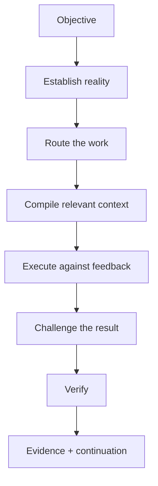
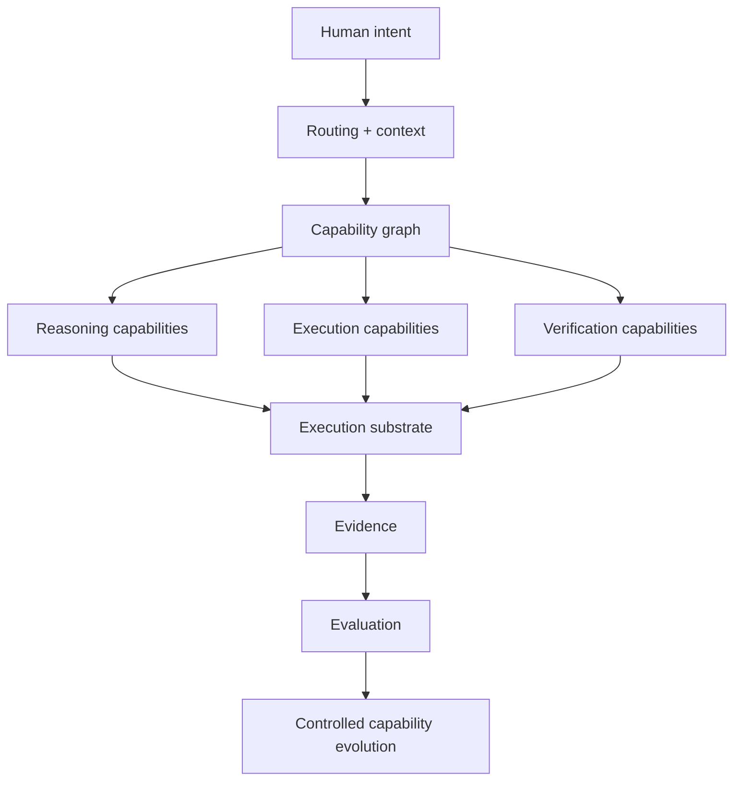

# Project Arsenal

> **Stop re-teaching your coding agent how to work.**
>
> **Reusable engineering judgment for coding agents.**

Understand · Decide · Build · Diagnose · Review · Verify · Continue

Project Arsenal captures ways of doing technical work that were worth learning once and makes them reusable across sessions, projects, models, and harnesses.

Your model still provides intelligence. Your harness still provides tools and interaction. Arsenal provides **reusable engineering judgment, boundaries, feedback, and proof**.

---

## What keeps going wrong?

| Failure pattern | Arsenal response |
|---|---|
| Agent starts coding before understanding the repository | **Repository Truth** |
| Consequential requirements are still fuzzy | **Pressure Test** |
| The destination matters but the route is still foggy | **Recon** |
| Architecture is being debated instead of tested | **Prototype** |
| A small change is becoming a giant diff | **Tracer Decomposition** |
| Bugs are being patched before they are understood | **Diagnose** |
| The resulting change needs an independent challenge | **Review** |
| “Tests passed” is turning into “done” | **Verify** |
| A fresh session is rediscovering everything | **Resume** |

Those are not marketing categories invented for this README. They point at working Arsenal methods, prompts, workflows, and engineering disciplines already in the repository.

Public names are intentionally clearer than some current canonical IDs. For example, **Pressure Test** currently maps to the `agent.grill` / grilling lineage, and **Recon** maps to the `agent.wayfind` / Wayfinding lineage. Stable IDs are not being mechanically renamed until the capability contract can represent display names, aliases, and compatibility safely.

---

## See the difference

### Without Arsenal

```text
“Add durable retry handling.”

read some files
→ infer architecture
→ start coding
→ broaden scope
→ run convenient tests
→ declare success
```

### With Arsenal

```text
“Add durable retry handling.”

establish repository truth
→ resolve consequential ambiguity
→ investigate structural uncertainty if necessary
→ choose the narrowest defensible slice
→ implement against deterministic feedback
→ review the actual change
→ verify the final state
→ preserve evidence + continuation context
```

Arsenal is not trying to make every task heavyweight. It is trying to make the **right discipline reusable when the task actually needs it**.

---

## Try Arsenal today

**Status: AVAILABLE — Repository Truth distribution pilot.**

Arsenal still does not ship a universal `arsenal` CLI. The first low-friction portable package is **Repository Truth** as an Agent Skill.

### Codex project-local quickstart

```bash
git clone https://github.com/jenksed/project-arsenal.git
cd project-arsenal
scripts/install-repository-truth-skill --project /path/to/target-repository
```

Then start or restart Codex in the target repository and ask:

> Establish repository truth for this repository before planning or changing code.

The installer targets:

`<target-repository>/.agents/skills/repository-truth`

It is idempotent when the installed package is identical and refuses to overwrite a divergent installation.

The portable package lives at [`distribution/agent-skills/repository-truth/`](distribution/agent-skills/repository-truth/). Its bundled canonical workflow is deterministically checked against [`agent_workflows/repository_truth_audit.md`](agent_workflows/repository_truth_audit.md).

See the full [`Repository Truth quickstart`](docs/use/repository-truth-quickstart.md) for manual installation, user-global installation, limitations, and the compiler-regression contract.

If you are adopting Arsenal more broadly into a repository, also inspect:

- [`engineering/doctrine/CORE.md`](engineering/doctrine/CORE.md)
- [`engineering/templates/AGENTS.md`](engineering/templates/AGENTS.md)
- [`agent_workflows/install_engineering_doctrine.md`](agent_workflows/install_engineering_doctrine.md)
- [`agent_workflows/setup_project_arsenal.md`](agent_workflows/setup_project_arsenal.md)

**Next:** ARS-01 introduces Capability Contract v2. ARS-03 will later be required to reproduce this manually proven distribution shape rather than inventing packaging from theory.

---

## The Core Arsenal

The generated [`CATALOG.md`](CATALOG.md) is the full machine-backed library view. It is deliberately **not** the storefront.

Start here instead:

| Capability | Job | Current canonical asset |
|---|---|---|
| **Repository Truth** | Understand the real repository before acting | [`agent_workflows/repository_truth_audit.md`](agent_workflows/repository_truth_audit.md) |
| **Pressure Test** | Resolve consequential ambiguity through focused questioning | [`agent_workflows/grill_decision_tree.md`](agent_workflows/grill_decision_tree.md) |
| **Recon** | Map genuine multi-session uncertainty without pretending it is already a plan | [`agent_workflows/wayfind.md`](agent_workflows/wayfind.md) |
| **Diagnose** | Reproduce and understand failure before patching | [`software_engineering/diagnose_bug_feedback_loop.md`](software_engineering/diagnose_bug_feedback_loop.md) |
| **TDD** | Build behavior through narrow red/green vertical slices | [`software_engineering/tdd_vertical_slice.md`](software_engineering/tdd_vertical_slice.md) |
| **Review** | Challenge a change across requirements, engineering quality, and evidence | [`software_engineering/code_review_multi_axis.md`](software_engineering/code_review_multi_axis.md) |
| **Verify** | Independently prove completion claims and preserve receipts | [`agent_workflows/independent_verification_and_receipts.md`](agent_workflows/independent_verification_and_receipts.md) |
| **Resume** | Continue verified work without paying the rediscovery tax | [`agent_workflows/resume_from_checkpoint.md`](agent_workflows/resume_from_checkpoint.md) |

Other Arsenal assets cover planning, research, product strategy, learning, writing, job search, cloud engineering, governance, prompt design, and reusable software-engineering disciplines.

---

## What an Arsenal run looks like



Arsenal does **not** replace the coding model.

It gives the model reusable ways of doing the work.

---

## What Arsenal adds

| Layer | Responsibility |
|---|---|
| **Method** | proven ways to approach recurring work |
| **Routing** | when those methods apply |
| **Context** | what belongs in the working set |
| **Structure** | reusable assets, capabilities, and composition |
| **Boundaries** | explicit authority and safer execution |
| **Feedback** | deterministic checks where possible |
| **Evidence** | proof before completion |
| **Continuity** | decisions and state worth carrying forward |

A useful way to separate responsibilities:

```text
MODEL       intelligence / reasoning / generation

HARNESS     tools / session / interaction

ARSENAL     reusable engineering judgment
```

The current repository already separates reusable behavior from harness-specific packaging through the [`arsenal/INVOCATION_MODEL.md`](arsenal/INVOCATION_MODEL.md). The deeper capability system is the next architectural step, not a claim that all of it already exists.

---

## Why Arsenal exists

Every session-by-session improvisation asks the model to rediscover things that may already have been learned:

```text
what matters
how the repository works
what questions should be answered
what should not be touched
how the work should be validated
what “done” actually means
```

Arsenal's answer is simple:

> **Capture what was worth learning. Make it reusable.**

The longer-term engineering path is:

```text
expert judgment
      ↓
principle
      ↓
method
      ↓
capability
      ↓
deterministic mechanism
      ↓
evaluation
      ↓
trusted operating behavior
```

**Make good judgment reusable.**

---

## Evidence, not vibes

Project Arsenal treats completion and lifecycle as evidence claims.

A healthy receipt looks more like this:

```text
COMPLETION RECEIPT
────────────────────────────────────────

CHANGE
Durable webhook retry behavior

PROVED
✓ original failure reproduced
✓ regression added
✓ targeted checks passed
✓ required completion gate passed
✓ final revision identified

BOUNDARY
! real provider semantics not exercised

RESULT
VERIFIED WITHIN DECLARED SCOPE
```

This is the same epistemology used by the Local Cloud / Floci work: local protocol or behavior evidence cannot silently become a claim about real-provider semantics.

Operating principle:

> **Think broadly. Implement narrowly. Constrain deliberately. Verify with evidence.**

---

## Execution: earn escalation

**Status: AVAILABLE as a foundation; general substrate contract is BUILDING TOWARD.**

Arsenal already has a [`Cloud Execution Boundary`](foundations/cloud_execution_boundary.md) and Local Cloud execution/fidelity methods. The broader direction is to choose the lowest-blast-radius world capable of answering the engineering question.

```text
LOWER BLAST RADIUS
        ▲
        │
deterministic function
in-process test
local process
container
real local dependency
emulator
local cluster
disposable sandbox
shared non-production
staging
production
        │
        ▼
HIGHER CONSEQUENCE
```

> **Use only as much reality and authority as the evidence requires.**

A mock, emulator, real local service, disposable remote environment, staging system, and production system do not establish the same claims. Evidence does not get to jump those boundaries silently.

---

## Development Packs

**Status: AVAILABLE.**

Development Packs adapt general Arsenal engineering contracts into concrete ecosystems without turning ecosystem details into universal doctrine.

```text
UNIVERSAL METHOD
      │
      ▼
DEVELOPMENT PACK
      │
      ├── environment discovery
      ├── ecosystem tooling
      ├── structural invariants
      ├── deterministic checks
      ├── execution integration
      └── verification gates
```

The most developed tracer today is **Floci / Local Cloud Engineering**, which has already exercised:

- safe execution boundaries;
- deterministic cloud fixtures;
- AWS golden-path behavior;
- Terraform/OpenTofu/CloudFormation preflight;
- LocalStack migration and diagnosis;
- Azure, GCP, and OCI overlays;
- provider/capability routing;
- composed delivery and evidence receipts.

See [`engineering/development_packs/floci/`](engineering/development_packs/floci/) for the implementation and its fidelity boundaries.

---

## Does Arsenal actually help?

**ARSENAL BENCH — Status: BUILDING TOWARD (ARS-02).**

The project should not answer that question with confidence, prose quality, or cherry-picked examples.

The benchmark question is:

> **Does the same coding agent perform better engineering with Arsenal than without it?**

The intended comparison holds task, repository state, model, harness, tools, and resource budget constant while changing the Arsenal intervention.

Measure more than pass/fail:

- correctness and acceptance criteria;
- scope discipline;
- verification quality;
- false completion;
- human intervention;
- tokens and cost;
- wall time and tool use;
- repair cycles;
- later continuation quality.

Losses matter. Ablations matter. Model/harness differences matter.

The former Floci **FLC-06 evaluation/stabilization** program is being absorbed into Arsenal Bench as the first substantial execution-backed evaluation track rather than receiving a separate one-off benchmark framework.

See the canonical [`capability-system roadmap`](docs/roadmap/capability-system.md).

---

## Capability is the next technical primitive

**Status: BUILDING TOWARD (ARS-01).**

Today Arsenal has a machine-readable Asset Contract, typed assets, relationships, invocation modes, lifecycle states, routers, workflows, Development Packs, and deterministic audit infrastructure.

Next, Arsenal will add a richer behavioral **Capability Contract**.

Working definition:

> A Capability is a versioned representation of a useful outcome, including what it needs, what authority it requires, how it should be approached, where it may operate, and what evidence is necessary before success can be claimed.

Conceptually:

```text
identity + version
purpose
inputs + outputs
preconditions
context + method
authority + forbidden authority
execution substrate
verification + evidence
evaluation suite
provenance + compatibility + lifecycle
```

The existing [`arsenal/ASSET_CONTRACT.md`](arsenal/ASSET_CONTRACT.md) remains the current artifact metadata contract. Capability Contract v2 will extend the system behaviorally rather than pretending the distinction already ships.

---

## Where this is heading

**Status: architecture direction, not all shipped today.**



The architecture is the reason the public promise can become durable. It is not the first thing a user should have to understand.

---

## Arsenal status

### AVAILABLE

- machine-readable asset registry + generated catalog;
- Asset Contract and invocation model;
- Engineering Doctrine and repository templates;
- Repository Truth;
- Repository Truth Agent Skills distribution pilot + Codex project-local installer;
- Pressure Test / grilling method;
- Recon / Wayfinding method;
- software-engineering diagnosis, TDD, review, prototyping, specification, and decomposition disciplines;
- independent verification and receipts;
- session handoff / resume workflows;
- Development Pack contract;
- Floci Local Cloud suite through composed multi-cloud delivery;
- deterministic Arsenal Integrity audit.

### BUILDING TOWARD

- Capability Contract v2;
- Arsenal Bench and executable evaluation infrastructure;
- compiler / harness exports;
- capability graph;
- generalized execution substrates;
- evidence observability;
- trust and authority.

### FRONTIER

- typed project knowledge;
- intent compilation;
- counterfactual engineering;
- failure laboratories;
- model-specific capability routing;
- living specifications;
- time-travel run analysis;
- controlled capability evolution.

Exact sequencing and acceptance criteria live in [`docs/roadmap/capability-system.md`](docs/roadmap/capability-system.md).

---

## Lifecycle

```text
source
  ↓
draft / unverified
  ↓
testing
  ↓
stable
  ↓
deprecated
```

> **Stable is an evidence claim.**

A prompt, method, workflow, pack, or future capability is not stable because its prose looks convincing. Evaluation evidence must earn that status.

The registry and catalog are validated with:

```bash
python3 scripts/arsenal_audit.py
```

After registry changes, regenerate the catalog with:

```bash
python3 scripts/arsenal_audit.py --write-catalog
```

---

## Go deeper

- [`CATALOG.md`](CATALOG.md) — generated full asset catalog
- [`arsenal/ASSET_CONTRACT.md`](arsenal/ASSET_CONTRACT.md) — current asset metadata and integrity contract
- [`arsenal/INVOCATION_MODEL.md`](arsenal/INVOCATION_MODEL.md) — harness-neutral invocation semantics
- [`engineering/doctrine/CORE.md`](engineering/doctrine/CORE.md) — compact engineering doctrine
- [`engineering/doctrine/ENGINEERING_DOCTRINE.md`](engineering/doctrine/ENGINEERING_DOCTRINE.md) — full doctrine and tradeoffs
- [`engineering/development_packs/CONTRACT.md`](engineering/development_packs/CONTRACT.md) — Development Pack contract
- [`docs/roadmap/capability-system.md`](docs/roadmap/capability-system.md) — canonical program roadmap
- [`docs/source_audits/`](docs/source_audits/) — provenance and conceptual-adoption audits

Project Arsenal is not finished becoming a capability system.

It is already useful while it gets there.