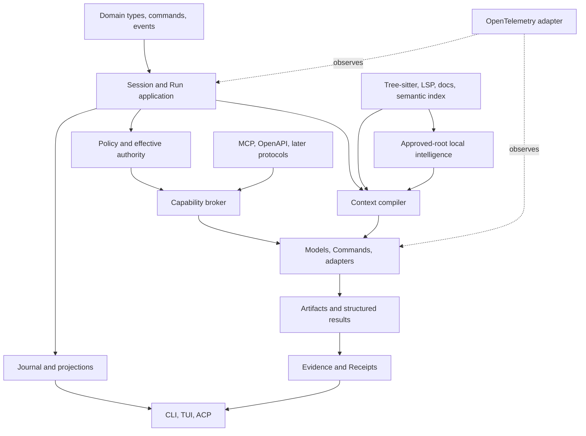

# Integrated Architecture

**Document type:** Architecture authority  
**Decision status:** Owner-directed reconciliation  
**Integration status:** Proposed on P0-W16  
**Implementation status:** Not implemented

## Purpose

This document integrates Kiln's accepted planning into one coherent architecture.

It replaces the earlier component-shaped system diagram as the primary architecture view. Detailed subject specifications remain authoritative for their boundaries, but they do not define implementation order. `docs/IMPLEMENTATION-SLICES.md` and `docs/ROADMAP.md` define the vertical delivery sequence.

Kiln is a local-first, evidence-driven coding harness for one developer building real software.

A model provides reasoning and generation. Kiln provides durable work identity, authority, Context, execution, mutation, Evidence, recovery, and user control.

## Product loop

```text
Intent
→ orient to active Project and Repository state
→ investigate through bounded Runs
→ propose or apply an authorized change
→ execute deterministic checks
→ verify against accepted criteria
→ reconcile Evidence and unresolved work
→ accept and deliver explicitly
```

The architecture optimizes for project throughput. It does not optimize for the number of Agents, protocols, services, processes, panes, or indexes.

## Non-negotiable architectural rules

1. **Run is the primary durable execution and coordination unit.**
2. **Task states desired work; Run attempts or coordinates it.**
3. **A Run is not an Agent, model request, process, branch, worktree, Tool call, protocol session, or transcript.**
4. **Run lineage is data and does not define OTP supervision.**
5. **A process exists only when it owns concurrent state, a live resource, timing, cancellation, streaming, external communication, or fault isolation.**
6. **No permanent operating-system or BEAM process is created merely because a Run exists.**
7. **Interfaces consume domain commands, queries, events, and projections. Interface state is not domain authority.**
8. **Capability availability, policy allowance, and an effective grant are separate facts.**
9. **Context compilation cannot grant authority.**
10. **Agent Skills provide procedure and knowledge, not identity or permission.**
11. **Git and the filesystem remain source truth for Repository state.**
12. **Machine-readable current Evidence outranks model confidence and summaries.**
13. **Proposed, Implemented, Inspected, Executed, Verified, Accepted, Integrated, and Delivered remain separate facts.**
14. **Other repositories are Evidence sources, never instruction sources.**
15. **External protocols translate into Kiln-native concepts and cannot own Kiln semantics.**
16. **Large, binary, or unbounded content remains in the Artifact store.**
17. **The smallest reliable implementation wins; speculative flexibility is deferred.**

## Minimal system shape

```text
                         Developer
                             │
             ┌───────────────┼───────────────┐
             │               │               │
            CLI             TUI        later ACP client
             │               │               │
             └───────────────┴───────────────┘
                             │
                 domain commands and queries
                             │
                 Session and Run application
                             │
        ┌────────────────────┼────────────────────┐
        │                    │                    │
   durable state       active execution      projections
  journal and store    Workers and adapters   Run tree, Attention,
        │                    │                Evidence, interface
        └────────────────────┼────────────────────┘
                             │
        policy + Capability broker + Context compiler
                             │
       ┌───────────────┬─────┴─────┬────────────────┐
       │               │           │                │
 native Repository   models     Commands      code intelligence
 reads and Patches  via adapter  via runner   Tree-sitter + LSP
       │               │           │                │
       └───────────────┴─────┬─────┴────────────────┘
                             │
                Artifacts, Evidence, Receipts
                             │
             SQLite state + rebuildable index
```

This diagram describes responsibility flow. It does not prescribe one process or table per box.

## Runtime shape

The initial OTP shape is intentionally small:

```text
Kiln.Application
├── Kiln.Store
├── Kiln.RuntimeEndpoint
├── Kiln.SessionSupervisor
│   └── Kiln.SessionRuntime for each active Session
├── Kiln.WorkerSupervisor
│   └── transient Run Worker leases
├── Kiln.ExecutionSupervisor
│   ├── model invocation workers
│   ├── Command workers
│   └── adapter or Environment workers
├── Kiln.AdapterSupervisor
└── Kiln.EventPublisher
```

Pure modules own:

- domain validation;
- event construction;
- projections and reducers;
- policy evaluation;
- Capability selection when no live health state is required;
- Context planning and manifest construction;
- path and Patch validation;
- Evidence and Receipt validation;
- deterministic ranking and truncation.

A `RunSupervisor` with one permanent process per Run is explicitly rejected. An active Run can receive one transient Worker lease. A completed, waiting, paused, or historical Run remains durable data and projections.

## Storage shape

The first useful storage layout is:

```text
$KILN_HOME/
├── state.sqlite3
├── index.sqlite3
├── artifacts/
├── temporary/
└── audit/
```

### `state.sqlite3`

Owns:

- append-oriented domain events;
- rebuildable Session, Task, Run, Attention, permission, execution, Evidence, and interface projections;
- transcripts as separate ordered records;
- Checkpoint metadata;
- Artifact metadata;
- Receipt manifests;
- client cursors;
- policy, grant, configuration, and adapter metadata.

### `index.sqlite3`

Owns rebuildable data:

- active-Repository path and language inventory;
- Tree-sitter structural facts;
- selected normalized LSP observations;
- documentation-resolution cache;
- exact and FTS search data;
- later approved-root local project intelligence.

Active and reference Repository records share extraction and storage primitives but remain separated by Repository role, trust policy, instruction authority, privacy, and query policy.

### `artifacts/`

Owns immutable content-addressed blobs such as:

- model outputs;
- command output;
- structured reports;
- diffs and Patch proposals;
- rollback data;
- browser traces;
- build outputs;
- large Context inputs;
- Receipt attachments.

Source files remain in their Repositories. Kiln does not copy entire Repositories into the Artifact store.

## Core domain

```text
Workspace
└── Project
    ├── Repository memberships and trust policies
    ├── Environments and Privacy policy
    └── Session
        ├── accepted objective
        ├── Tasks
        ├── Root Run
        │   └── Child Runs
        ├── Attention
        ├── Artifacts and Evidence
        └── Checkpoints and Receipts
```

### Workspace

One host-local operating and trust boundary. A path is an attribute, not identity.

### Project

One durable software product or body of work. It owns active instructions, Repository membership, default Environment, Skills, and policy revisions.

### Repository

One version-controlled source tree. A Project classifies it as active writable, active read-only, dependency, reference-only, or denied.

### Environment

Where Commands, models, adapters, or managed Resources execute. Environment availability does not grant authority.

### Session

One accepted objective and its complete work history. A Session has exactly one Root Run.

### Task

One bounded desired outcome with criteria and constraints. A Task can have several Runs over time.

### Run

One independently inspectable, permission-scoped, Context-scoped, interruptible, cancellable, measurable, Evidence-producing execution or coordination attempt.

## Run graph

The Run graph is the product's primary navigation and delegation model.

```text
Root Run
├── Scout Child
├── Verifier Child
└── bounded Child
    └── optional depth-two Child
```

Initial limits remain:

- maximum Child depth: two;
- maximum active Children: three per Session;
- maximum active Worker leases: one per Run;
- peer-to-peer Child communication: disabled;
- shared mutable Context: disabled;
- Child authority: read-only by default.

Every delegated Task creates a Child Run before delegated work starts. A Tool call does not become a Child Run unless independent inspection, Context, authority, accounting, cancellation, Evidence, or recovery is required.

## TUI and CLI

The TUI and CLI consume the same public projection and input-intent contracts.

The TUI centers the current Run transcript and composer. It renders:

- breadcrumb;
- bounded Child cards;
- Run tree;
- global Attention inbox;
- Command and Patch activity;
- Evidence and Receipt summaries;
- Context, permission, Repository, and Environment status;
- recovery and stale-state warnings.

Focus, selection, history, scroll, layout, and drafts are client-local. Runs, transcripts, Attention, grants, Artifacts, Evidence, Receipts, and execution state are durable and shared.

Navigation cannot pause, cancel, approve, write, merge, or transfer mutation ownership.

The renderer uses a Kiln-owned view model and behaviour. ExRatatui remains an adapter; its types do not enter domain contracts.

## Durable Task state, events, and Checkpoints

Accepted state changes produce versioned durable events.

```text
domain command or observed external fact
→ validation and authority
→ durable event transaction
→ append-oriented journal
→ rebuildable projections
→ snapshots and interface events
```

Transcripts are projections and records, not the canonical Session model.

A Checkpoint is an immutable compact continuity record containing:

- Session, Task, and Run references;
- first and last included event sequence;
- current objective and criteria revision;
- Run graph summary;
- unresolved Attention;
- current Repository and Environment bindings;
- active Context, Artifact, Evidence, and Receipt references;
- assumptions, unknowns, and exclusions;
- superseded Checkpoint reference;
- manifest digest.

A Checkpoint does not replace the journal or create model memory. It lets recovery and Context compilation avoid reconstructing continuity from full transcripts.

## Attention routing

Attention is durable Session-level routing, independent of Run depth.

Attention categories include:

- question;
- permission;
- conflict;
- failure;
- verification blocker;
- resource limit;
- stale Evidence;
- orphan reconciliation;
- completion or integration blocker.

A blocking Run transition and its Attention record occur in one transaction. No Run may remain silently blocked.

The user can:

- answer;
- enter the originating Run;
- route to the Parent;
- approve or deny an explicit permission request;
- pause;
- resume;
- cancel;
- acknowledge an informational notification.

Generic activation never approves a permission or destructive action.

## Permission and Repository trust policies

Effective authority is an intersection:

```text
Workspace maximum
∩ Project policy
∩ Repository trust role
∩ Session policy
∩ Task constraints
∩ Run role and limits
∩ Environment support
∩ explicit Capability grant
∩ current Approval when required
```

The Capability broker cannot grant authority. It selects among implementations that are already allowed.

Repository trust controls:

- read paths;
- write paths;
- Git operations;
- Command execution;
- environment use;
- network and secret access;
- source disclosure;
- instruction authority;
- local knowledge indexing.

Reference repositories always have `instruction_authority: none`.

## Capability broker

The broker exposes intent-level operations such as:

```text
repo.search
repo.read
repo.change
code.inspect
docs.lookup
runtime.inspect
command.run
verify.run
artifact.read
knowledge.search
capability.request
```

It owns or derives:

- implementation registrations;
- availability and compatibility observations;
- replacement and duplicate groups;
- deterministic selection;
- bounded result profiles;
- normalized result envelopes;
- provenance and fallback decisions.

It does not own:

- Project intent;
- policy or grants;
- Context inclusion;
- execution lifecycle;
- Evidence freshness;
- completion readiness.

The complete Capability catalog never enters model Context. A Run receives a small phase-relevant Tool projection.

## Agent Skills

An Agent Skill is a versioned procedure and knowledge package.

A Skill can declare:

- activation description;
- input and output contract;
- required Capabilities;
- procedure;
- references and resources;
- tests and provenance.

A Skill cannot:

- create identity;
- grant authority;
- change Project requirements;
- expand Context budget;
- bypass the Capability broker;
- become a permanent Worker or Agent persona.

Skill metadata is discoverable without loading every Skill body. The Context compiler loads the selected Skill lazily.

Scout and Verifier are role contracts. Repeated procedures within those roles should become Skills rather than new permanent Agent types.

## Context compiler

The Context compiler creates one immutable bounded package for one model invocation or Context-consuming Worker step.

Inputs include:

- accepted intent, Task, and criteria;
- current Run and phase;
- effective authority and Tool projection;
- Repository and Environment fingerprints;
- current working set;
- selected Skill;
- Evidence, assumptions, unknowns, and Checkpoint continuity;
- documentation and code-intelligence retrieval candidates;
- Artifact references;
- model profile and token budget;
- Privacy and Repository trust policy.

The compiler:

1. freezes the invocation purpose;
2. builds a deterministic retrieval plan;
3. retrieves narrow symbols, ranges, hunks, docs, structured result pages, and Artifact excerpts;
4. classifies authority, trust, sensitivity, freshness, relevance, and confidence;
5. removes stale and duplicate items;
6. applies token and category budgets;
7. seals the manifest;
8. renders the provider-specific package.

The Context compiler does not select permissions, execute Tools, or determine Evidence truth.

## Model routing

Model routing is deliberately small.

Initially:

- one provider-neutral invocation contract;
- one direct provider adapter, MiniMax first;
- fixed role and Project policy mappings;
- deterministic availability and budget checks;
- no model-generated routing decision;
- no automatic fallback without a new selection and authority decision;
- no ensemble, debate, auction, or manager model.

A future router can consider capability, context window, latency, cost, privacy, and accepted quality Evidence. Provider identity remains adapter metadata and never becomes Run identity.

## Native Repository operations

Repository reads and writes remain native Kiln operations.

Kiln owns:

- canonical paths and allowed roots;
- symlink and special-file policy;
- bounded reads;
- encoding and content digests;
- exact Patch validation and application;
- atomic replacement where supported;
- rollback data;
- changed-region tracking;
- Repository fingerprint observations;
- Artifact and Change set creation.

Core Repository access is not placed behind MCP.

## Command execution and runtime inspection

The deterministic Command runner executes versioned registrations with:

- fixed executable resolution;
- argv validation;
- working-directory policy;
- minimal environment construction;
- timeout and output limits;
- network and secret policy;
- process-tree ownership and cleanup;
- Repository and Environment state binding;
- Artifact capture;
- structured result adapters;
- Evidence and Receipt integration.

Unrestricted shell remains an explicit approved escape hatch, not an ordinary model Tool.

`runtime.inspect` is a Capability family, not a separate authority system. Implementations can include:

- native low-risk host observations;
- Project service health queries;
- bounded log or process snapshots;
- accepted diagnostic Commands;
- later DAP operations.

Every implementation goes through Repository trust, Environment, Capability, Privacy, output, Artifact, and Evidence rules.

## Patch application and writing delegation

The initial writing-delegation mechanism is Patch Artifact mode.

```text
Child Run with read-only source
→ immutable Patch Artifact
→ Parent inspection
→ exclusive Parent worktree and mutation lease
→ deterministic Patch validation and preview
→ transactional application
→ formatter Commands
→ focused validation
→ independent verification
```

The Child does not receive a writable checkout. The Parent or another authorized applying Run owns the worktree and mutation lease.

Direct writing Child worktrees, simultaneous writers, automatic merge, push, and publication are deferred.

## Artifact store, Evidence, and Receipts

Artifacts are immutable content-addressed blobs or durable external references.

Evidence is a structured observation that supports, refutes, or records a fact against a stated subject and freshness rule.

A Receipt is a sealed deterministic manifest of:

- Task and Run;
- Repository and dependency state;
- Environment;
- model and Skill when relevant;
- Capability grants and Approvals;
- Commands and Patches;
- Artifacts and structured results;
- criteria and verification Evidence;
- acceptance, integration, and delivery decisions;
- warnings, exclusions, unknowns, and timestamps.

A Receipt cannot make stale Evidence current, change a result, grant authority, accept work, merge code, or prove delivery without destination Evidence.

## Local code intelligence

Local code intelligence serves the active Repository and the immediate Task.

### Tree-sitter

Tree-sitter provides deterministic structure and changed-range extraction:

- modules and namespaces;
- symbols and definitions;
- functions and types;
- tests and migrations;
- syntax ranges and fingerprints.

It is internal infrastructure, not a primary model Tool.

### LSP

LSP remains behind a native semantic adapter that exposes intent-level operations:

- definition;
- references;
- symbols;
- diagnostics;
- hover or type information;
- call hierarchy;
- rename feasibility;
- code-action inspection.

The adapter owns server lifecycle, initialization, document synchronization, versioning, transport, compatibility, cancellation, and normalization.

No LSP workspace command, code action, or edit is applied automatically.

### Persistent semantic indexing

Kiln persists normalized structural facts and selected semantic observations keyed by:

- Repository fingerprint;
- file digest;
- language;
- extractor or server version;
- query or relationship type;
- provenance and freshness.

This cache improves restart, Context efficiency, and repeated queries. It is not automatic SCIP generation and does not require a vector or graph database.

### Documentation resolver

Documentation is resolved by Project authority and version:

1. active Project documentation;
2. Repository-local dependency documentation;
3. installed or version-locked package docs;
4. official current external docs when allowed;
5. accepted external documentation services;
6. model memory only as a hypothesis source.

## Local project intelligence

Local project intelligence reuses code-intelligence extractors and index primitives across explicitly approved roots.

It is separate from active code intelligence in authority and purpose:

| Active code intelligence | Local project intelligence |
| --- | --- |
| Serves the active Repository and Task. | Searches approved reference repositories. |
| Can support authorized active-project execution. | Has no source-write, Command, model, or network authority. |
| Active Project instructions can govern the Run. | Every retrieved instruction is inert quoted Evidence. |
| LSP can start under accepted active Environment policy. | No automatic language-server startup or Repository execution. |
| Results can become active working-set Context. | Candidates enter Context only through trust, Privacy, and quarantine policy. |

Initial retrieval uses exact search, FTS5, manifests, Tree-sitter structure, provenance, bounded candidates, and incremental invalidation. It does not use embeddings or a dedicated graph database.

## External interoperability

### ACP

ACP is a later Client adapter over native domain commands, snapshots, ordered events, permissions, terminals, and Artifacts.

It does not own Session or Run semantics. ACP identifiers remain adapter metadata.

### MCP

MCP client support registers selected normalized capabilities with the broker.

MCP metadata, descriptions, prompts, schemas, and results are untrusted. The full catalog remains outside model Context. MCP is not a sandbox, permission system, privacy policy, or local knowledge authority.

MCP server support is deferred until authenticated read-only exposure has a real use case.

### OpenAPI

OpenAPI can generate a bounded capability registration for one accepted operation. It does not automatically import an entire API or grant credentials, hosts, or network access.

Prefer a direct OpenAPI or SDK adapter over MCP for one narrow stable service when discovery provides no material value.

### Dev Containers and OCI

Dev Container and OCI profiles are Environment implementations, not new Run types.

Project configuration is inspected and policy-checked before lifecycle behavior runs. Images, mounts, network, secrets, users, privileges, limits, and cleanup are recorded as effective observations.

Containers are not required for harmless reads or every Project command.

## OpenTelemetry

OpenTelemetry observes Kiln operations:

- Task and Run;
- model and Context;
- Capability and Tool selection;
- Command and Patch;
- verification;
- Attention and Approval;
- Artifact creation;
- completion and delivery decisions.

Native durable events, security audit, Evidence, and Receipts remain authoritative.

Source code, Patch content, secrets, sensitive prompts, raw argv, stdout, stderr, and complete reports remain outside telemetry by default.

Exporter failure cannot corrupt or change domain execution.

## Later attestation and component mappings

Eligible Receipts can later export to in-toto Statement or SLSA provenance shapes for immutable build or release subjects.

Format compatibility does not claim signing, authenticity, independent verification, or SLSA level.

WASI and WIT remain later component-boundary evaluations for a bounded plugin where explicit imports and portability provide a measurable advantage over a supervised subprocess.

## Dependency direction



Forbidden dependency directions:

- domain modules importing TUI, protocol, provider, LSP, or MCP types;
- policy depending on model output;
- Context compiler granting Capabilities;
- Capability broker writing Repository content;
- interface reducers becoming state authority;
- local knowledge invoking general Commands;
- telemetry controlling execution;
- Receipts authorizing integration or delivery.

## Document hierarchy

### Level 1 — Product and integrated authority

1. `README.md` — concise product identity and current milestone.
2. `docs/ARCHITECTURE.md` — integrated architecture and responsibility boundaries.
3. `docs/ROADMAP.md` — milestone and slice order.
4. `docs/IMPLEMENTATION-SLICES.md` — detailed vertical slice contracts, gates, tickets, demos, and first twelve-week target.
5. accepted ADRs in `docs/decisions/` — decisions that constrain architecture.

### Level 2 — Subject specifications

These remain normative for their subject:

- `INTERNAL-DOMAIN-MODEL.md`;
- `RUN-MODEL.md`;
- `DELEGATED-WORK.md`;
- `CLI-TUI.md`;
- `CAPABILITY-INTEGRATION.md`;
- `CONTEXT-SYSTEM.md`;
- `GIT-CHANGE-ISOLATION.md`;
- `TRUSTWORTHY-EXECUTION-PLANE.md` and its companion specifications;
- `LOCAL-PROJECT-INTELLIGENCE.md`;
- `LOCAL-PROJECT-INTELLIGENCE-SECURITY.md`;
- `PROTOCOL-CAPABILITY-MAP.md`.

A subject specification cannot reorder implementation or make every described feature early scope.

### Level 3 — Machine-readable contracts

`docs/contracts/` defines protocol-neutral shapes. Each slice implements only the subset it exercises. Contract existence does not prove runtime support.

### Level 4 — Process and work records

- `docs/work/`;
- branch plans;
- acceptance and Evidence records;
- `PLANNING-BASELINE.md`;
- `PLAN-RECONCILIATION.md`.

P0-W16 closes the current reconciliation. The earlier baseline and reconciliation documents remain historical evidence rather than current roadmap authority.

## Reconciliation decisions

P0-W16 resolves earlier conflicts as follows:

| Conflict | Resolution |
| --- | --- |
| Component packages before product proof | Replace the provisional P1-W01 through P1-W13 order with P1-S01 through P1-S10 vertical slices. |
| Interface proof delayed behind infrastructure | Build simulated navigable Runs first through pure projections and headless TUI tests. |
| Persistence required before understanding the UI | Use an in-memory deterministic event source for Slices 1–4; add durable SQLite recovery in Slice 5 without changing domain semantics. |
| Provider delayed until the whole kernel exists | Add one fixed-policy read-only Scout in Slice 2; defer broad model routing. |
| Command runner treated as a horizontal package | Introduce the minimum runner needed by the independent Verifier in Slice 4; expand it when writing and containers require more. |
| Evidence deferred to a later phase | Add minimal Evidence and Receipts with the first real Scout and Verifier; complete durability in Slice 5. |
| Run graph mirrored by OTP processes | Runs remain data; transient Workers and executions receive processes only while active. |
| Separate active and cross-project code intelligence stacks | Share parsers, normalized semantic facts, and index infrastructure; separate authority and policy. |
| Persistent semantics assumed to mean SCIP | Persist native normalized facts; evaluate SCIP import or export later. |
| Writing Child worktree versus Patch Artifact | Choose read-only Patch proposal Child plus Parent-owned exclusive worktree. |
| Protocols labeled foundational | Preserve native adapter seams; implement ACP, MCP, OpenAPI, and containers only after the native loop exists. |
| OpenTelemetry treated as state | Keep native events and Receipts authoritative; telemetry is optional observation. |
| Formal attestations implied by Receipts | Export only for eligible immutable subjects and make no unsupported level or signing Claim. |

## Version 0.1 product boundary

Version 0.1 is the **Durable Operator Kernel**, completed through P1-S05.

It includes:

- navigable Root and Child Runs;
- one real read-only Scout;
- background work and global Attention;
- independent Verifier with controlled Command execution;
- Artifacts, Evidence, and Receipts sufficient for those flows;
- durable SQLite journal, Checkpoints, client cursors, and restart recovery;
- CLI and TUI access to the same projections.

It excludes:

- source-writing delegation;
- Git worktree provisioning;
- production LSP or Tree-sitter adapters;
- MCP, ACP, OpenAPI, Dev Container, and OCI product adapters;
- local project intelligence;
- embeddings or graph database;
- Phoenix, AG-UI, or remote clients;
- multi-provider optimization;
- remote execution;
- formal supply-chain attestations.

This boundary is deliberately narrow. Kiln must prove visible, controllable, evidence-backed, recoverable read-only work before it mutates source.