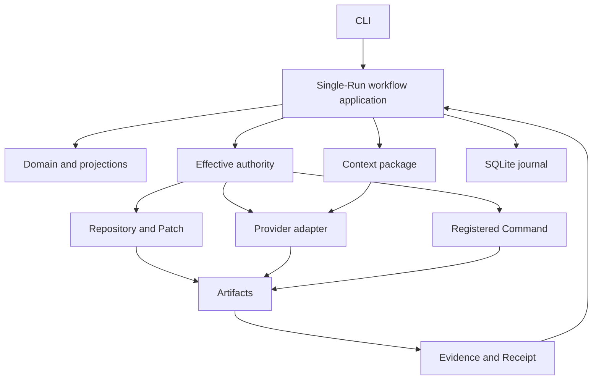

# Integrated Architecture

**Document type:** Architecture authority  
**Decision status:** Proposed P0-W18 reconciliation; owner acceptance required  
**Integration status:** Proposed on `work/p0-w18-product-scope-architecture`  
**Implementation status:** Not implemented  
**Product-scope authority:** `docs/PRODUCT-SCOPE-AND-MINIMUM-ARCHITECTURE.md`

## Purpose

This document defines the minimum architecture required to complete one durable, controlled, evidence-backed Repository change.

It also defines the immediately adjacent Child Run and verification architecture. It does not pre-design every future protocol, index, interface, Environment, or integration.

The Roadmap controls implementation order. Subject specifications can narrow or explain a boundary. They cannot add early scope.

## Product loop

```text
Intent
→ bounded investigation
→ explicit change proposal
→ controlled application
→ deterministic verification
→ evidence-backed acceptance
→ durable recovery
```

Kiln optimizes for completed trustworthy work. It does not optimize for Agent count, Run count, protocol count, process count, panes, indexes, or tool catalogs.

## Non-negotiable rules

1. A Task states desired work. A Run attempts or coordinates that work.
2. Run is the durable execution and observation identity.
3. A Run is not an Agent, model request, Tool call, Command, process, branch, worktree, protocol session, or transcript.
4. The first useful product has one Root Run and no Child Run requirement.
5. Child Runs enter only when independent Context, authority, cancellation, Evidence, or background visibility creates user value.
6. Logical Run lineage does not define OTP supervision.
7. No permanent process exists merely because a Run, Session, Task, Capability, Context package, Artifact, Evidence record, Receipt, or Attention item exists.
8. A process must own a live Resource, concurrency, timing, cancellation, streaming, subscriptions, external communication, or fault isolation.
9. Git and the filesystem remain Repository source truth.
10. SQLite records Kiln work state and recovery facts. It does not replace Git or source files.
11. Model output is a proposal or Claim. It cannot grant authority, apply its own Patch, verify itself, or accept completion.
12. Capability availability, policy allowance, explicit grant, and user Approval are separate facts.
13. Context selection cannot grant authority.
14. A successful Command does not imply every criterion passed.
15. Evidence must identify subject, method, state binding, freshness, and completeness.
16. A Receipt references Evidence and decisions. It cannot change them.
17. Other repositories are disabled through version 0.1 and later remain Evidence sources without instruction authority.
18. External protocols translate to Kiln-native requests and results. They do not own Kiln semantics.
19. Large, sensitive, binary, or unbounded content remains outside the journal and normal model Context.
20. The smallest reliable implementation wins. Speculative flexibility is deferred.

# Minimum first-month system

```text
Developer
   │
   ▼
CLI
   │
   ▼
Single-Run workflow application
   ├── Domain and projections
   ├── Effective-authority evaluator
   ├── Context package builder
   ├── Native Repository reader and Patch service
   ├── One provider adapter
   ├── Registered Command runner
   ├── Artifact, Evidence, and Receipt functions
   └── SQLite journal and current projections
           │
           └── transient model and Command Workers
```

The first-month product has one active Project, one active Repository, one Session, one Task, and one Root Run.

It does not require:

- a Run graph process;
- Child Runs;
- a TUI;
- background scheduling;
- a general Capability broker service;
- a general retrieval framework;
- managed worktrees;
- code intelligence;
- protocol adapters;
- telemetry export;
- local project intelligence.

# Core domain subset

## Workspace

Workspace is the host-local maximum path and trust boundary.

The first month can derive it from configuration and the selected Repository root. It does not require a durable Workspace registry or process.

## Project

Project is one active Repository plus accepted instructions, disclosure policy, mutation policy, and default verification entry.

The first month supports one active Project at a time.

## Repository

Repository is one version-controlled source tree.

Git and the filesystem own:

- commits and refs;
- branch and checkout state;
- file content;
- dirty state;
- worktrees;
- source history.

Kiln observes those facts and records state bindings.

## Session

Session is one accepted Project objective and its complete Kiln work history.

A Session owns:

- objective and criteria revisions;
- one initial Task;
- one Root Run;
- journal sequence;
- current projection;
- user decisions;
- final outcome.

## Task

Task states one desired outcome with criteria, constraints, and exclusions.

The initial design does not create a separate Root Task concept. The Session's initial Task is attempted or coordinated by the Root Run.

## Run

Run is one durable independently inspectable attempt or coordination boundary for one Task.

The first-month Root Run owns or references:

- current status and workflow step;
- policy and authority references;
- Context package manifests;
- model invocation references;
- Tool calls;
- Patch proposal and application;
- Command execution;
- Artifacts, Claims, Evidence, and Receipt;
- warnings, unknowns, cancellation, and recovery state.

Run identity never uses a process identifier, provider request identifier, branch, worktree, or transcript position.

# Minimum Run lifecycle

```text
created
→ ready
→ running
→ waiting_for_user | waiting_for_command | verifying
→ completed | failed | canceled | orphaned
```

Rules:

- `created` records accepted identity but does not imply readiness.
- `ready` means Project, Repository, criteria, and policy prerequisites are valid.
- `running` means one Worker can advance the Run.
- `waiting_for_user` identifies the exact pending decision and resume point.
- `waiting_for_command` identifies the owned Command execution.
- `verifying` identifies criteria and exact evaluated state.
- `completed`, `failed`, and `canceled` are terminal for one attempt.
- `orphaned` records unknown external effects and requires explicit reconciliation.
- Evidence staleness is an Evidence property in the first month, not a Run status.

Later Child workflows can add `queued`, `waiting_for_child`, `waiting_for_permission`, and `paused` when those states become observable requirements.

# Primary data flow

## Intent transaction

```text
CLI request
→ validate Project and Repository
→ accept objective and criteria revisions
→ create Session, Task, Root Run
→ append durable events
→ update current projection
→ return exact identifiers and Repository state
```

## Investigation flow

```text
Root Run purpose and criteria
→ authority evaluation
→ explicit Context selection
→ sealed Context manifest
→ one provider invocation Worker
→ bounded native Repository Tools
→ Claims, source observations, and Patch proposal
```

## Mutation flow

```text
Patch proposal
→ exact base and path validation
→ user Approval for Patch digest
→ rollback data retained
→ transactional application
→ resulting file and Repository observations
→ Patch Evidence
```

## Verification flow

```text
accepted criteria and changed state
→ registered Command request
→ Command Worker owns process tree
→ bounded output and retained Artifact
→ structured result
→ criterion Evidence
→ PASS | FAIL | BLOCKED
```

## Completion flow

```text
current Patch state
+ current criterion Evidence
+ no unknown effects
+ no blocking decision
+ user acceptance
→ sealed Receipt
→ completed Task and Run projection
```

# State ownership

## Authoritative source state

Git and the filesystem own source truth.

Kiln records:

- Repository root and identity;
- branch and commit observations;
- dirty fingerprint;
- relevant file hashes;
- Patch base and result bindings.

Kiln must re-observe source state before mutation, verification, and completion.

## Authoritative Kiln state

The SQLite journal owns accepted Kiln work facts:

- objective and criteria changes;
- Session, Task, and Run transitions;
- authority requests, grants, denials, and Approvals;
- Context package manifests;
- model invocation requests and results;
- Patch requests and outcomes;
- Command requests and outcomes;
- Evidence state;
- user acceptance;
- recovery and orphan decisions.

## Rebuildable projections

Current projections can include:

- Session status;
- Task satisfaction;
- Root Run status and current activity;
- pending user action;
- current Patch state;
- verification status by criterion;
- Artifact and Evidence summaries;
- completion readiness.

Projections are rebuildable from the journal and current Repository observations.

## Transcript records

Conversation messages and model stream records are ordered interaction records.

They do not replace objective, criteria, mutation, Evidence, or completion state.

# Storage boundary

The first useful storage layout is:

```text
$KILN_HOME/
├── state.sqlite3
├── artifacts/
└── temporary/
```

## `state.sqlite3`

Owns:

- append-oriented work events;
- current projections;
- transcript metadata and bounded records;
- policy and Approval references;
- Artifact metadata;
- Evidence records;
- Receipt manifests;
- migration state.

## `artifacts/`

Initial Artifact types are:

- model result;
- Patch proposal;
- rollback data;
- Command stdout and stderr;
- structured test report when present;
- completion attachment.

Artifact content is not copied into journal events.

## Not present in the first month

- `index.sqlite3`;
- vector storage;
- graph storage;
- remote object storage;
- distributed event log;
- hosted telemetry store.

# Event journal boundary

The journal exists because Kiln requires:

- restart recovery;
- ordered audit;
- projection rebuild;
- duplicate-effect prevention;
- client resume later;
- honest unknown-effect reconciliation.

The journal records material accepted transitions and external-effect boundaries.

It does not record:

- every model token;
- every UI movement;
- static documentation;
- complete Artifacts;
- rebuildable code-index facts;
- all provider metadata;
- general analytics events.

Kiln uses event journaling as a bounded recovery mechanism. It does not adopt a generalized event platform.

# Authority and permission boundary

Effective authority is the intersection of:

```text
Workspace maximum
∩ Project policy
∩ Repository role and path scope
∩ Session limits
∩ Task constraints
∩ Run profile
∩ Environment support
∩ explicit grant
∩ current Approval when required
```

A lower layer cannot widen an upper-layer denial.

The first-month profiles are fixed and small:

- Repository read and exact search;
- provider invocation to one configured destination;
- Patch proposal;
- Patch application only after exact user Approval;
- one registered verification Command;
- Artifact write under Kiln-owned storage.

The first month does not require a live Capability catalog, fallback selector, or broker process.

# Context and model boundary

## Context package

One provider invocation receives one immutable Context package.

The package can contain:

- accepted objective and criteria;
- current workflow step;
- current Repository fingerprint;
- approved Project instructions;
- selected source ranges with path and digest;
- current Patch or failure summary when relevant;
- current Evidence, assumptions, and unknowns;
- output contract;
- limits;
- at most four Tool schemas.

## Excluded by default

- complete conversation history;
- full files when ranges suffice;
- complete Tool or Capability catalog;
- all Skills;
- reference repositories;
- raw logs and reports;
- secrets and denied paths;
- stale criteria;
- provider credentials.

## Inspectability

Every selected Context item records:

- source;
- authority and trust;
- sensitivity;
- state binding and freshness;
- selection reason;
- transformation;
- token estimate;
- disclosure decision when remote.

## Model worker

The model invocation Worker owns:

- one provider request and stream;
- cancellation handle;
- time, token, and output limits;
- transient buffers;
- normalized result and failure.

Provider identity is adapter metadata. It is not Run identity.

No automatic fallback occurs under the same authority decision.

# Repository and Patch boundary

Repository reads and writes are native Kiln operations.

The first-month Repository boundary owns:

- canonical root validation;
- path normalization;
- excludes and size limits;
- symlink and special-file policy;
- bounded reads and exact search;
- content digests;
- base and result Repository observations;
- exact Patch validation and application;
- rollback references;
- changed-region observations.

The model can call `change.propose`. It cannot call a direct mutation Tool.

Patch application requires:

- selected writable checkout;
- one mutation owner;
- exact base file hashes;
- allowed paths;
- no conflicting unowned dirty change;
- user Approval for the exact proposal digest;
- retained rollback data;
- observed final state.

No fuzzy application, automatic commit, push, merge, publication, or deployment exists.

Managed worktree provisioning is deferred. Harmless reads never require a worktree.

# Command execution boundary

The first Command runner supports one or a small number of accepted Project verification registrations.

Each registration freezes:

- purpose and version;
- executable resolution;
- argv schema;
- working-directory policy;
- environment allowlist;
- network and secret policy;
- timeout;
- output limits;
- side-effect class;
- expected exit semantics;
- structured-result adapter when present.

The Command Worker owns:

- process or Port;
- process-tree identity on the primary supported platform;
- timeout and cancellation;
- stdout and stderr capture;
- cleanup result;
- normalized execution result.

Shell strings and arbitrary shell access are rejected for version 0.1.

Unknown effects or incomplete cleanup produce `BLOCKED` or `orphaned`, never `PASS`.

# Evidence, Artifact, Receipt, and completion boundary

## Claim

A Claim is an assertion that can be wrong.

Model conclusions and completion recommendations remain Claims.

## Evidence

Evidence is a structured observation bound to a subject, method, state, time or sequence, freshness, and completeness.

Initial Evidence types:

- Repository state observation;
- source content observation;
- Patch proposal observation;
- Patch application observation;
- Command result;
- criterion result;
- user Approval and acceptance decision.

## Artifact

An Artifact stores content too large, sensitive, or durable for normal Context or event payloads.

Artifact existence does not make it Evidence or authorize model disclosure.

## Receipt

A Receipt is a deterministic manifest of required references and outcomes.

It cannot:

- grant authority;
- modify state;
- make Evidence current;
- turn `FAIL` or `BLOCKED` into `PASS`;
- accept or deliver work.

## Completion

A Task can complete only when:

- the accepted Patch is the observed Repository state;
- every required criterion has current passing Evidence;
- no required execution is blocked or orphaned;
- no unknown effect remains;
- the user accepts the result.

# OTP process ownership

## First-month processes

```text
Kiln.Application
└── Kiln.ExecutionSupervisor
    ├── transient model invocation Worker
    └── transient Command Worker
```

The selected SQLite library can own one connection process or pool. Kiln does not add a domain process only to wrap it.

## Justification

| Owner | Live state or Resource | Failure and cancellation boundary |
| --- | --- | --- |
| Application supervisor | Required process topology | Restarts live owners according to accepted policy |
| Model invocation Worker | Network stream and cancellation handle | Provider failure does not corrupt durable Run state |
| Command Worker | External process tree, timeout, output, cleanup | Command failure and cancellation remain bounded |
| Library-owned SQLite connection | Database connection and transaction lifecycle | Connection and transaction failure remain explicit |

## Not processes

The following remain data or pure modules in the first month:

- Workspace;
- Project;
- Repository registration;
- Session;
- Task;
- Run;
- Event;
- projections;
- authority evaluation;
- Context package selection;
- Patch validation;
- Evidence;
- Receipt;
- Artifact metadata.

## Adjacent processes

A Session coordinator becomes justified only when one background Child requires scheduling, timers, Attention routing, and delivery subscriptions.

An event publisher becomes justified only when multiple live Clients or the TUI require ordered subscriptions and backpressure.

# Child Run expansion

Child Runs are not required in the first month.

Version 0.1 can add:

```text
Root Run
├── one read-only Scout Child
└── one independent Verifier Child
```

Operational limits:

- maximum depth one;
- maximum one active Child;
- no nested delegation;
- no peer communication;
- no shared mutable Context;
- no writing Child;
- no Child authority expansion.

A deterministic application service creates a Child only after validating purpose, role, limits, and effective authority.

The CLI can list, inspect, enter, cancel, and return to Root without requiring a TUI.

A Child returns one bounded structured result with Evidence and Artifact references. It does not copy its transcript into Root Context.

# Interface boundary

## CLI

The CLI is the permanent first interface.

It exposes stable actions such as:

- initialize or open Project;
- start or resume Session;
- show status;
- inspect current proposal and Evidence;
- approve or reject Patch;
- run verification;
- accept or continue work;
- cancel active execution;
- reconcile orphaned state;
- later list and inspect Child Runs.

CLI output can support human text and structured JSON without exposing persistence schemas.

## TUI

The TUI is deferred until:

- the single-Run runtime is correct;
- a real Child Run exists;
- CLI commands and projections are stable;
- navigation has actual work to display;
- the TUI dependency passes a focused review and prototype.

The TUI will consume the same commands, projections, and events. It will not become domain authority.

## External Clients

ACP, AG-UI, web, and remote clients are deferred. They must consume native commands and projections after those surfaces stabilize.

# Integration boundary

Kiln uses this selection order:

1. direct deterministic function;
2. library;
3. deterministic CLI;
4. direct API or software development kit;
5. local service or socket;
6. dedicated adapter;
7. protocol client;
8. protocol server;
9. MCP only when discovery or replacement provides measured value.

A later integration must satisfy:

- correct semantics;
- cancellation and timeout;
- lifecycle ownership;
- security and Privacy;
- bounded output and Artifact handling;
- Evidence and provenance;
- deterministic tests;
- replacement cost.

Protocol availability never grants permission.

# Local-first and security boundary

## Local state

Objective, criteria, Run state, journal, projections, Repository observations, Patches, Commands, Artifacts, Evidence, Receipts, and user decisions remain local.

Only the sealed provider Context package and required provider metadata may leave the machine.

## Secrets

- do not inherit the complete user environment;
- use opaque secret references;
- deny configured secret paths;
- screen selected excerpts before disclosure;
- do not persist secret values in journal, logs, Receipt, or normal Artifact metadata.

## Instructions in files

Only accepted active Project instruction sources can govern work.

Instructions found in source comments, documentation, generated files, prompts, issues, or later reference repositories remain untrusted data unless explicitly promoted by the user.

## Reference repositories

Reference repositories are disabled through version 0.1.

Later reference access remains read-only and receives no Command, model, network, write, or instruction authority.

## Delegation

A Child receives independent Context and explicit narrower grants.

A Parent can request authority for a Child. The Child cannot grant or widen authority.

## Concurrent writes

Version 0.1 has one Root mutation owner in one selected checkout.

No concurrent writing Child or automatic worktree exists.

# Dependency direction



Forbidden directions:

- domain importing provider, CLI, TUI, protocol, MCP, LSP, or persistence-specific types;
- provider output changing policy or criteria;
- Context code granting authority;
- Repository adapter accepting completion;
- Evidence code executing Commands;
- Receipt code approving work;
- interface state becoming durable domain authority;
- telemetry controlling execution.

# Near-term delivery architecture

## First month

Required:

- single Project and Repository;
- Session, Task, Root Run;
- SQLite journal and restart;
- one provider and fake provider;
- bounded Context and four or fewer Tools;
- native read and exact search;
- exact Patch proposal and user-approved application;
- one registered Command;
- minimal Artifact, Evidence, Receipt, and completion gate;
- CLI only.

## Twelve weeks

Add:

- cancellation and unknown-effect recovery hardening;
- one read-only Scout Child;
- one independent Verifier Child;
- one active Child at a time;
- Root-visible Attention;
- CLI Run navigation and bounded result delivery.

Still exclude:

- TUI;
- nested or concurrent Child graph;
- writing Child;
- managed worktree provisioning;
- LSP, Tree-sitter, and code index;
- runtime Skills;
- protocol adapters;
- local project intelligence;
- embeddings;
- telemetry export;
- remote execution;
- publication and formal attestations.

# Future architecture entry gates

## TUI

Requires stable CLI commands, projections, and one real Child workflow.

## Managed worktrees

Requires a demonstrated need for isolated mutation beyond one selected checkout.

## General Capability broker

Requires two real interchangeable implementations or a real dynamic adapter source.

## Code intelligence

Requires measured retrieval or token failures that basic source search cannot solve.

## Runtime Skills

Requires one repeated stable procedure with tested inputs, outputs, and value.

## Protocol adapter

Requires a concrete external Client, capability, or Environment and a comparison against simpler boundaries.

## Local project intelligence

Requires a stable active-Repository workflow, explicit approved roots, adversarial security fixtures, and measured user value.

## Telemetry

Requires stable operation names and a privacy-reviewed data model.

## Formal attestation

Requires an immutable build or release subject and complete provenance.

# Source layout authority

The first-month source layout is defined in `docs/PRODUCT-SCOPE-AND-MINIMUM-ARCHITECTURE.md` and summarized in `docs/AGENT-FRIENDLY-CODEBASE.md`.

Namespaces are created only when an accepted ticket implements their responsibility.

Do not pre-create the full roadmap.

# Document hierarchy

## Level 1 — Product and implementation authority

1. `README.md` — product summary and current targets.
2. `docs/PRODUCT-SCOPE-AND-MINIMUM-ARCHITECTURE.md` — product scope, classifications, rationale, and planning-domain assessment.
3. `docs/ARCHITECTURE.md` — component, state, process, and boundary authority.
4. `docs/ROADMAP.md` — implementation order and milestones.
5. `docs/IMPLEMENTATION-SLICES.md` — detailed slice contracts.
6. `docs/SLICE-ACCEPTANCE-GATES.md` — future aggregate proof.
7. accepted ADRs — binding decisions.

## Level 2 — Subject specifications

Subject specifications remain normative only inside their stated boundary.

They cannot:

- restore superseded early scope;
- require the full long-term contract in an earlier slice;
- create a process per domain noun;
- reorder the Roadmap;
- grant authority;
- make planned capability appear implemented.

## Level 3 — Machine-readable contracts

`docs/contracts/` remains provisional conformance scaffolding.

Prompt 3 must identify which contract subsets still match the reconciled target. Prompt 6 can add justified validation after that disposition.

## Level 4 — Historical planning and work records

P0 work records, earlier baselines, prior roadmap versions, merged pull requests, and CI runs preserve provenance. They do not override current authority.

# Status

This architecture is proposed by P0-W18. It adds no product implementation.

Build authorization has not been issued.
