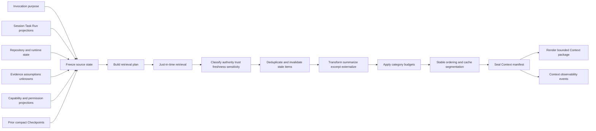

# Context System

**Document type:** Reference  
**Decision status:** Owner-accepted direction  
**Integration status:** Proposed on P0-W08  
**Implementation status:** Not implemented  
**Contract version:** `kiln.context/v0`

## Purpose

This document defines how Kiln compiles the smallest sufficient model context for the next decision or action.

A larger provider context window is not permission to load more material. Kiln treats model context as a bounded execution input, not as a transcript, archive, cache of everything seen, or substitute for retrieval.

The context system must:

- preserve accepted intent, requirements, authority, and current work state;
- retrieve supporting material just in time;
- prefer current and authoritative sources;
- expose only phase-relevant capabilities;
- keep large results in Artifacts;
- replace stale or low-value material rather than endlessly append;
- give Child Runs and Verifier Runs independent contexts;
- preserve provenance, trust, freshness, and token accounting;
- remain provider-neutral and protocol-neutral.

This document defines intended architecture. It does not claim that the compiler, resolver, metrics, or contracts are implemented.

## Core decision

Kiln shall compile a new bounded Context package for each model invocation or other context-consuming Worker step.

The compiler shall select the smallest sufficient set of current, relevant, authoritative, permission-compatible Context items for the immediate purpose. It shall omit low-confidence or low-relevance material unless the omission itself would hide a material unknown.

A new package replaces the previous active package. Earlier packages remain immutable manifests for audit and recovery, but their content does not remain active merely because it appeared before.

The model shall not receive:

- the complete Session transcript by default;
- the complete Capability catalog;
- every available Tool schema;
- raw MCP catalogs;
- raw LSP protocol objects;
- complete logs, test output, documentation pages, DOM snapshots, or database results when a digest and Artifact reference are sufficient;
- complete Parent Run or sibling Run contexts;
- stale source excerpts after their state binding is invalidated.

## Architectural rules

1. Context is compiled for one immediate purpose.
2. Context size is constrained by a Run policy, not expanded automatically to fill a model window.
3. Every included item has provenance, trust, freshness, sensitivity, a selection reason, and a token estimate.
4. Current user intent and accepted requirements are not replaced by retrieved reference material.
5. Current Repository and runtime observations outrank stale summaries about those observations.
6. Context retrieval does not grant Capability authority.
7. Artifact existence does not imply Context inclusion.
8. Tool availability does not imply Tool exposure.
9. Skill availability does not imply Skill loading.
10. Context7 remains a supported documentation source but cannot override Repository-local or version-locked documentation.
11. Child Runs and Verifier Runs receive independently compiled manifests.
12. Compaction creates a replacement manifest and records what changed; it does not mutate history.
13. Provider prompt caching is an optimization only. Correctness cannot depend on a cache hit.
14. Model memory is the last documentation source and may be used to form a hypothesis or retrieval query, not to override resolvable sources.
15. Prefer omission over weak relevance, weak confidence, unclear authority, or unverifiable freshness.

## System boundaries

The Context compiler is a deterministic control-plane responsibility.

It is not:

- an Agent;
- a model;
- a vector database requirement;
- a transcript summarizer that owns Session truth;
- a permission service;
- a Capability broker;
- an Artifact store;
- a documentation source;
- a provider cache;
- an Evidence authority.

The compiler consumes accepted domain state and produces an immutable Context manifest plus one rendered Context package.

The Capability broker decides which implementations can satisfy intent-level Tools. The Context compiler decides which approved Tool schemas and results are model-visible for the immediate phase. The privacy evaluator decides which items may leave their allowed boundary.

## High-level architecture



## Compiler inputs

The compiler accepts a versioned input envelope containing:

- current user intent;
- accepted requirements;
- current Task;
- current Run;
- current workflow phase;
- Repository state;
- changed files;
- relevant symbols;
- current hypothesis;
- observed Evidence;
- assumptions;
- unknowns;
- active Skill;
- available Capabilities;
- permission profile and effective-authority projection;
- model characteristics;
- remaining token budget;
- prior compact Checkpoints;
- requested output contract;
- privacy and Repository-trust policy snapshots;
- current Artifact and Context references;
- source and Environment fingerprints.

The compiler may accept missing inputs, but it must record the absence. It must not invent accepted requirements, Evidence, permissions, or Repository state to fill a field.

## Compilation pipeline

### 1. Freeze the invocation purpose

Before retrieval, Kiln records:

- the immediate question, decision, or action;
- Task and Run identifiers;
- workflow phase;
- requested output contract;
- model profile;
- effective-authority digest;
- Repository and Environment fingerprints;
- accepted requirement revision;
- compiler version and policy version.

This frozen purpose prevents later retrieved content from silently changing what the invocation is trying to do.

### 2. Build a candidate plan

The compiler creates candidate categories, not a bulk content dump.

Candidate categories include:

- mandatory control and safety instructions;
- accepted intent and requirements;
- Task and Run state;
- current phase and output contract;
- current changed-file and symbol working set;
- current hypothesis, Evidence, assumptions, and unknowns;
- active Skill procedure;
- phase-relevant Tool schemas;
- compact Checkpoint continuity;
- documentation candidates;
- Artifact references and possible continuation handles.

Each candidate receives an expected value, expected token cost, source-authority class, freshness requirement, and retrieval method.

### 3. Retrieve just in time

Kiln retrieves only enough material to support the immediate purpose.

Preferred retrieval units are:

1. symbol definition or declaration;
2. relevant line range;
3. changed hunk;
4. nearby enclosing function or module;
5. selected documentation section;
6. bounded structured result page;
7. Artifact excerpt;
8. whole small file only when its complete structure is materially required.

Repository retrieval shall use Kiln-native Repository operations and semantic intent-level operations. Raw LSP requests and responses remain behind the native semantic adapter.

The initial retrieval pass should be narrow. Additional material is disclosed only after an observed gap, unresolved reference, failed hypothesis, or explicit model request survives policy and budget evaluation.

### 4. Classify each item

Every candidate item is classified across separate dimensions:

- **instruction authority:** can this source direct the current work;
- **project-decision authority:** can this source define accepted architecture or requirements;
- **technical reference authority:** how authoritative it is for a language, dependency, or external system;
- **observational authority:** whether it records current Repository, runtime, command, or verification facts;
- **trust label:** how safely the content may be interpreted;
- **sensitivity:** how it may be retained or sent;
- **freshness:** whether its state binding remains current;
- **relevance:** how directly it supports the immediate purpose;
- **confidence:** how certain the classification and extraction are.

Authority is not one scalar. For example, an official dependency guide may be technically authoritative for the dependency but has no authority to change Project intent.

### 5. Transform and externalize

The compiler may transform a candidate through:

- exact excerpting;
- symbol extraction;
- line selection;
- structured projection;
- deterministic normalization;
- deduplication;
- redaction;
- bounded summarization;
- conversion to an Artifact reference.

Every transformation records its method, input digest, output digest, completeness, omitted portions, and whether a model participated.

A model-generated summary is a Claim-bearing transformation, not an authoritative replacement for the source. Kiln must preserve the source reference and digest.

### 6. Remove duplicates and stale items

The compiler deduplicates by canonical source identity, source digest, semantic span, and transformation lineage.

When two candidates substantially overlap, Kiln keeps the smallest item that preserves the required meaning and records the omitted duplicate.

A current item replaces an older item in the active package when:

- the source digest changed;
- the Repository fingerprint changed in a relevant path;
- a changed hunk invalidated the excerpt;
- a symbol definition or dependency version changed;
- an accepted requirement, ADR, policy, Skill, Agent, Tool contract, or model profile changed;
- Evidence became stale or was superseded;
- Capability availability or effective authority changed;
- the workflow phase changed enough to alter relevance;
- a newer Checkpoint superseded the previous continuity summary;
- the immediate purpose changed.

The older item remains addressable through its historical manifest but is removed from active Context.

### 7. Apply budgets

The compiler first includes mandatory control items, then selects optional items by expected decision value per token while respecting authority, privacy, and category limits.

It must not fill unused budget with lower-value material merely because tokens remain.

When the package does not fit, the compiler shall reduce in this order unless policy requires otherwise:

1. remove duplicate or superseded material;
2. replace full results with summaries and Artifact references;
3. narrow files to symbols, hunks, and relevant lines;
4. remove low-relevance documentation;
5. remove resolved assumptions and obsolete hypotheses;
6. shorten Checkpoint continuity to unresolved state only;
7. reduce exposed Tool schemas;
8. request a narrower next action;
9. fail with an explicit context-budget error if mandatory content still cannot fit.

The compiler must not silently drop mandatory requirements, current permission limits, unresolved high-risk unknowns, or relevant contradictory Evidence.

### 8. Order and segment the package

The package uses stable ordering:

1. stable Kiln, Agent, and Project prefix;
2. current user intent and accepted requirements;
3. Task, Run, phase, and output contract;
4. permission, trust, and privacy constraints;
5. active Skill procedure;
6. model-facing Tool schemas;
7. Repository working set;
8. hypothesis, Evidence, assumptions, and unknowns;
9. compact Checkpoint continuity;
10. Artifact references, retrieval handles, and provenance notes.

Within each section, items use stable kind, authority, source, path, symbol, and position ordering. Volatile timestamps and invocation identifiers stay out of stable cacheable segments unless semantically required.

### 9. Seal the manifest

Before rendering, Kiln records an immutable Context manifest containing:

- every included item and transformation;
- every material exclusion and reason;
- budget allocation and actual token estimates;
- source-state bindings;
- Tool and Skill versions;
- permission and policy digests;
- stable-prefix and cache-segment digests;
- retrieval provenance;
- compiler decision records;
- package digest.

The rendered provider request references this manifest. Provider-specific message layout may differ, but the semantic package remains Kiln-native.

## Context package schema

The JSON contract is defined in `docs/contracts/kiln-context.schema.json`.

The top-level package contains:

```text
schema_version
package_id
manifest_id
project_id
session_id
run_id
task_id
model_invocation_id
compiler_version
compiled_at
purpose
workflow_phase
model_profile
source_state
stable_prefix
control
permission_profile
active_skill
tools
working_set
reasoning_state
checkpoint_continuity
artifact_references
retrieval_handles
budget
cache
ordering
provenance
exclusions
invalidations
integrity
```

### Context item

Each item records:

```text
context_item_id
kind
source_ref
source_type
source_authority
trust_label
sensitivity
freshness_state
state_binding
source_digest
content_digest
selection_reason
relevance_score
confidence
estimated_tokens
transformation_history
retrieval_provenance
inline_content or artifact_reference
expires_when
```

An item cannot contain both an unbounded payload and an Artifact reference that claims the payload was externalized.

### Source state

The package binds to current source state where relevant:

- Repository fingerprint;
- commit and branch observation;
- dirty-state digest;
- changed-file digest;
- Environment fingerprint;
- dependency-lock digest;
- accepted-requirements revision;
- policy versions;
- Skill and Agent digests;
- Capability availability and effective-authority digests.

### Exclusion records

Material exclusions record:

- candidate reference;
- exclusion reason;
- estimated tokens saved;
- whether the item was duplicate, stale, low relevance, low confidence, unauthorized, privacy-blocked, superseded, or externalized;
- replacement item or Artifact reference when present.

This makes omission inspectable without placing omitted content back into active Context.

## Token-budget policy

### Budget does not follow the model window

Kiln shall configure a Run-level Context ceiling independently from the provider maximum.

The initial default maximum active package is **16,000 input tokens**. A Project or Run may set a lower ceiling. A higher ceiling requires an explicit policy revision or invocation-specific exception with a recorded reason; it is never inferred from a larger model context window.

Initial phase targets are:

| Workflow phase | Target active package |
| --- | ---: |
| Orientation | 6,000 tokens |
| Investigation | 10,000 tokens |
| Change | 12,000 tokens |
| Verification | 8,000 tokens |
| Reconciliation | 10,000 tokens |
| Recovery | 8,000 tokens |

A package may exceed its phase target by up to 25 percent only when mandatory context or one justified retrieval step requires it and the result remains under the Run ceiling. The compiler records the burst reason.

The usable input budget is:

```text
minimum of:
  Run Context ceiling
  phase target plus allowed burst
  model safe input limit minus output reserve minus transport margin
```

Initial output reserve is 4,000 tokens and initial transport margin is 1,000 tokens unless the model adapter requires more.

### Default category envelopes

At the 16,000-token ceiling, the initial maximum envelopes are:

| Category | Default maximum |
| --- | ---: |
| Stable prefix | 1,500 |
| Intent, accepted requirements, Task, Run, phase | 2,000 |
| Repository working set | 5,000 |
| Hypothesis, Evidence, assumptions, unknowns, Checkpoint | 2,500 |
| Active Skill | 1,200 |
| Tool schemas | 2,500 |
| Provenance, references, and package overhead | 800 |
| Unallocated reserve | 500 |

These are maximum envelopes, not fill targets. Unused tokens stay unused. A category may borrow from another flexible category only when the compiler records the transfer. Stable-prefix and Tool-schema hard limits cannot be exceeded through borrowing.

### Tool-schema limits

- default Tool-schema budget: 2,500 tokens;
- absolute Tool-schema ceiling: 4,000 tokens;
- default active Tool target: 6 to 8;
- hard maximum active model-facing Tools: 12;
- default maximum per Tool schema: 600 tokens;
- duplicate implementations never receive duplicate model-facing schemas;
- implementation catalogs, server metadata, and protocol schemas stay outside Context.

When Tool schemas exceed budget, Kiln removes the least phase-relevant Tools and retains `capability.request` only when lazy discovery is available and authorized.

### Retained Tool-result limits

A normalized Tool result placed directly into active Context should normally contain no more than:

- 300 summary tokens;
- 20 structured items per page;
- 120 text lines;
- 8,000 characters;
- 1,200 estimated tokens of excerpted content.

The first reached limit applies. Larger content becomes an Artifact with a stable continuation.

## Progressive disclosure

Kiln uses five disclosure levels.

### Level 0: control package

Always include only the compact control plane needed to act:

- intent;
- accepted requirements;
- Task and Run;
- phase;
- permission summary;
- current hypothesis and material unknowns;
- minimal working-set map;
- phase-relevant Tools;
- output contract.

### Level 1: location and identity

Expose paths, symbol names, changed-hunk identifiers, documentation headings, Artifact summaries, and source digests without full bodies.

### Level 2: targeted excerpts

Expose the exact symbol, relevant line range, changed hunk, documentation section, or structured result page required to evaluate the next step.

### Level 3: related context

Expose callers, callees, enclosing module, adjacent specification clauses, related Evidence, or another Artifact segment when the initial excerpt is insufficient.

### Level 4: explicit deep read

Expose a complete small file, complete Artifact segment, full documentation page, or broad result only when the Task explicitly requires global structure and the compiler records why lower levels were insufficient.

Progression is monotonic only for the current question. A later invocation may return to a lower level. Deep disclosure does not permanently enlarge the Run context.

## Repository retrieval rules

### Symbol-level and relevant-line retrieval

Kiln should prefer:

- exact definitions;
- protocol-neutral semantic symbol queries;
- changed hunks;
- references limited to the immediate question;
- enclosing function or module only when required;
- line ranges with source digest and Repository fingerprint.

Raw language-server protocol objects shall not enter model Context. The semantic adapter returns Kiln-native symbol, definition, reference, hover-summary, diagnostic, and relationship results.

### Repeated reads

A read is repeated when the same canonical source span and source digest are retrieved again for the same Run without a recorded reason.

The compiler should reuse the existing Context item or Artifact reference when it remains current. Re-reading is justified when:

- the source digest changed;
- a different transformation is required;
- the previous excerpt was incomplete;
- the verifier needs independent retrieval;
- the previous result is unavailable or privacy-restricted for the new scope.

Repeated reads are measured even when they are justified.

## Source authority and trust

### General inclusion order

For active software work, the compiler normally prefers:

1. current user intent and accepted requirement revisions;
2. active Project instructions and accepted decisions;
3. current Task, Run, permission, and policy state;
4. current Repository and runtime observations;
5. current Evidence bound to relevant state;
6. version-matched dependency and language documentation;
7. official external sources;
8. general external research;
9. model inference or memory.

Contradictory higher-authority material is never hidden merely to simplify the package. The compiler includes the contradiction or raises an unknown or Attention request.

### Trust labels

Initial trust labels are:

- `authoritative_instruction`;
- `accepted_project_decision`;
- `observed_repository_state`;
- `observed_runtime_state`;
- `current_evidence`;
- `dependency_authoritative`;
- `official_external_reference`;
- `external_reference`;
- `user_supplied_unverified`;
- `reference_repository_untrusted`;
- `model_generated_claim`;
- `model_memory_unverified`.

Freshness and sensitivity are recorded separately. Trust does not imply instruction authority, and authority does not remove privacy restrictions.

## Artifact-reference policy

Kiln externalizes content when any of these apply:

- it exceeds the inline result limits;
- it is binary;
- it is a complete log, test stream, documentation page, DOM snapshot, database result, trace, large diff, or generated report;
- it is likely to be reused by several Runs;
- it contains material that must be retained but not sent to the current model;
- only a small excerpt is relevant;
- privacy policy requires local retention;
- stable pagination is required.

The model-facing Artifact reference contains:

```text
artifact_id
content_digest
media_type
size_bytes
producer
source_ref
summary
bounded_excerpt
trust_label
sensitivity
freshness_state
state_binding
available_segments
continuation_cursor
retention_class
retrieval_provenance
```

Artifact references must not claim that omitted content was reviewed. Opening an Artifact creates a new retrieval record and, when model-visible, a new Context item in a replacement package.

An Artifact summary should normally remain under 200 tokens. A reference may include one bounded excerpt under the ordinary Tool-result limit.

## Truncation, pagination, and cursors

Truncation is always explicit.

A truncated result records:

- original size or known lower bound;
- retained size;
- truncation reason;
- omitted item or line count when known;
- whether the summary covers the complete result;
- Artifact reference;
- continuation cursor.

Default pagination is 20 structured items or 4,000 characters, whichever is reached first. The hard page maximum is 100 items.

Cursors are opaque Kiln-native values bound to:

- query digest;
- source digest;
- Repository or runtime snapshot;
- ordering rule;
- page size;
- policy scope;
- expiration or invalidation condition.

A cursor becomes invalid when its bound source changes. Kiln must return `stale_cursor` rather than silently continuing against a different snapshot.

## Result summaries

A result summary must distinguish:

- what was observed;
- what was omitted;
- what remains unknown;
- whether the result is complete for the requested scope;
- whether the source changed during retrieval;
- whether any transformation was model-generated;
- which Artifact and cursor continue the result.

Summaries must not convert a partial result into a complete Claim.

## Documentation resolver

The documentation resolver is a deterministic Context subsystem that selects authoritative, version-compatible documentation and returns bounded sections with provenance.

It does not change Project decisions, grant network access, or treat documentation as current runtime Evidence.

### Elixir documentation order

For Elixir Projects, use this order:

1. active Repository documentation;
2. accepted ADRs and specifications;
3. dependency-authored usage rules;
4. version-locked local ExDoc;
5. running-Project documentation through a runtime adapter;
6. Context7;
7. official external documentation;
8. general web research;
9. model memory.

Context7 is supported as an indexed convenience source. It cannot override active Repository documentation, accepted Project decisions, dependency-authored rules, local version-locked ExDoc, or documentation observed from the running Project.

### Resolution process

The resolver shall:

1. classify the question by Project, language, dependency, symbol, API, and behavior;
2. observe Elixir, OTP, and dependency versions from accepted Project files and runtime state;
3. identify available sources in authority order;
4. reject or label version-mismatched sources;
5. retrieve the narrowest relevant section;
6. preserve source URL or local Resource, version, heading, digest, retrieval time, and resolver path;
7. report conflicts rather than silently choosing a lower-authority answer;
8. externalize complete pages as Artifacts;
9. return a bounded answer, excerpt, and continuation;
10. record whether model memory was used only to generate a query or hypothesis.

### Active Repository documentation

This includes current accepted instructions, README files, guides, module documentation, Project-specific usage notes, and generated local documentation that the Project designates as authoritative.

Repository documentation must still be checked for status. Draft, historical, rejected, superseded, example, and reference-only documents cannot outrank accepted material merely because they are local.

### Accepted ADRs and specifications

Accepted ADRs and specifications govern Kiln Project decisions. They can define intended architecture even before implementation exists.

Observed source and runtime behavior may reveal that implementation diverges from the decision. The resolver reports the mismatch; it does not rewrite either fact.

### Dependency-authored usage rules

Dependency-authored README files, changelogs, migration guides, package metadata, and bundled documentation are preferred over third-party summaries when version-compatible.

### Version-locked local ExDoc

Local ExDoc generated or installed for the exact dependency version is preferred over remote latest documentation. The resolver binds results to the package and lockfile digest.

### Running-Project documentation adapter

A native runtime adapter may expose documentation from loaded modules and applications through Kiln-native semantic results. The model shall not receive raw IEx, BEAM, or protocol objects.

The adapter records the running Elixir and OTP versions, application version, module digest when available, and Environment fingerprint.

### Context7

Context7 results are labeled as externally indexed documentation. The resolver records the library identifier, selected version, query, retrieved section, source metadata, and any mismatch with the active Project.

A Context7 result is omitted when a higher-authority version-matched source answers the question sufficiently.

### Official external documentation

Official language, framework, library, vendor, or standards documentation is used when local and dependency-bound sources are unavailable or incomplete. The resolver requests the closest compatible version and records when only latest documentation exists.

### General web research

General web research is a discovery and corroboration source. It is not accepted Project authority and should not displace official or version-locked documentation.

### Model memory

Model memory is last. It may:

- suggest search terms;
- identify a likely symbol or source;
- form an explicitly labeled hypothesis.

It may not be presented as resolved documentation when a source could reasonably be retrieved.

## Capability-exposure policy

The Capability broker owns the full catalog. The Context compiler receives a filtered projection and decides which Tool schemas fit the immediate model package.

### Phase-specific defaults

| Phase | Default Tool classes |
| --- | --- |
| Orientation | `repo.search`, `repo.read`, `docs.lookup`, `artifact.read` |
| Investigation | orientation Tools plus `code.inspect`, `runtime.inspect`, narrowly scoped `command.run` |
| Change | investigation Tools plus `repo.change`; `verify.run` when immediate checks are expected |
| Verification | `repo.read`, `code.inspect`, `verify.run`, `artifact.read`, narrowly scoped `command.run` |
| Reconciliation | `repo.search`, `repo.read`, `code.inspect`, `docs.lookup`, `artifact.read`, `knowledge.search` when justified |
| Recovery | `repo.read`, `runtime.inspect`, `artifact.read`, `command.run`, `verify.run` when safe-state checks require them |

These are defaults, not grants. Availability, effective authority, Task intent, and output budget may remove Tools.

### Lazy Tool discovery

Kiln shall not expose all MCP, API, CLI, or adapter Tools at once.

When the current projection is insufficient:

1. the model or deterministic planner requests an intent class through `capability.request`;
2. the broker evaluates available implementations outside Context;
3. policy evaluates authority;
4. the compiler adds at most the newly justified intent Tool schema to the next replacement package;
5. implementation details remain outside the Tool name and schema;
6. the manifest records the discovery and added schema tokens.

A discovery response returns compact names, purposes, required authority, and availability. It does not dump full schemas for every candidate.

### MCP policy

MCP Tools are adapter implementations behind Kiln intent-level Tools. Their server catalogs, transport metadata, authentication details, and raw schemas stay outside model Context except for bounded diagnostic Artifacts when debugging the integration itself.

MCP availability does not justify exposure. MCP does not bypass the active Tool maximum, schema budget, phase filter, duplicate collapse, permissions, privacy, output normalization, or Artifact rules.

### LSP policy

Language-server behavior is exposed through `code.inspect` or another accepted semantic intent contract. Raw JSON-RPC messages, LSP method catalogs, capability negotiation, URIs, ranges, and server-specific payloads are adapter details.

## Lazy Skill loading

The full Skill catalog stays outside active Context.

The compiler may include:

- a compact Skill index entry under 200 tokens during selection;
- one active Skill digest and applicability statement;
- only the procedure sections required for the current phase;
- referenced templates or examples only when used.

The initial active Skill envelope is 1,200 tokens. A larger Skill section requires externalization or an explicit budget exception.

Skill selection records:

- Skill identifier and version;
- source and trust;
- selection reason;
- required Capabilities;
- included sections;
- omitted sections;
- token cost;
- whether deterministic helpers were invoked.

A Skill cannot override user intent, accepted requirements, policy, permissions, or Evidence.

## Stable prompt prefixes and cache awareness

Kiln separates stable and dynamic segments.

Stable segments may include:

- Kiln core execution contract version;
- Agent definition version;
- accepted Project instruction version;
- stable output and Tool contract versions;
- phase Tool bundle version;
- active Skill version when unchanged.

Stable segments must use canonical serialization, exact ordering, and content digests. They should avoid volatile timestamps, random identifiers, changing counters, and current Repository excerpts.

Provider adapters may apply prompt-cache hints or provider-specific cache controls. Kiln records requested and observed cache behavior.

Cache invalidation occurs when any segment digest, model identity, provider cache contract, privacy policy, or authorization-relevant content changes.

A cache hit cannot authorize stale content, restore removed Tools, bypass egress evaluation, or suppress a new Context manifest.

## Context replacement and Checkpoints

Every model invocation receives a new immutable manifest.

Replacement rules:

- carry forward unresolved intent, requirements, assumptions, unknowns, and current Evidence only when still relevant and current;
- replace old file excerpts with current excerpts or references;
- replace complete Tool results with compact digests after the next decision;
- remove resolved hypotheses and completed intermediate instructions;
- retain prior package identifiers for traceability, not their full content;
- include only the newest sufficient compact Checkpoint continuity summary;
- externalize historical conversation and Tool streams as Artifacts when retention is required.

A compact Checkpoint for context continuity should include:

- accepted objective and requirements revision;
- current Task and Run status;
- current hypothesis;
- material Evidence and state bindings;
- unresolved assumptions and unknowns;
- changed-file and Artifact references;
- open Attention;
- next intended action;
- previous manifest and package digests.

A Checkpoint is not automatically authoritative if current Repository or policy state contradicts it.

## Child-Run context policy

A Child Run receives an independent Context manifest.

It does not inherit the Parent Run transcript, Tool results, Tool schemas, Skill body, permissions, or full working set by default.

The Parent provides a bounded delegation envelope containing:

- Child Task statement;
- acceptance criteria;
- explicit scope and exclusions;
- relevant current source-state bindings;
- selected Artifacts and Context items;
- scoped assumptions and unknowns;
- requested output schema;
- requested Capabilities.

The initial Parent brief target is 1,000 tokens. Additional material is retrieved independently by the Child through its own authorized Tools.

Child Runs cannot see sibling Context unless the Parent or user explicitly includes a shared Artifact or Context item.

The Child returns:

- a structured result summary normally under 500 tokens;
- Claims and Evidence references;
- Artifact references;
- changed-state observations;
- unresolved unknowns;
- provenance and token metrics.

The Parent does not ingest the complete Child transcript. It receives the structured return and opens supporting Artifacts only when needed.

## Verifier-context policy

A Verifier Run receives an independently compiled, bias-reduced context.

The default first-pass Verifier package includes:

- accepted requirements and acceptance criteria;
- current Repository fingerprint;
- relevant Change set or diff;
- relevant source and test excerpts;
- declared verification methods;
- current Evidence and freshness state;
- relevant authoritative documentation;
- known constraints and explicit unknowns;
- read and verification Tools permitted by policy.

The first pass excludes by default:

- the implementer's conclusion that the work is correct;
- celebratory or persuasive completion narratives;
- unsupported rationale;
- irrelevant planning transcript;
- hidden model reasoning;
- the Parent's complete context;
- write Tools.

Implementation Claims are included as labeled assertions to test, not as facts.

After the first pass, the Verifier may request implementation rationale, prior failures, or additional Artifacts when a concrete gap requires them. The manifest records staged disclosure.

Verifier independence requires:

- a separate Run and Context manifest;
- independent retrieval records;
- separate Tool calls and Evidence production;
- no inherited permission beyond explicit grants;
- disclosure of model, Agent, Tool, source, and Context overlap with the implementation Run.

Using the same model provider does not by itself invalidate independence, but Kiln must disclose shared model identity and Context overlap.

## Tool and protocol efficiency

Kiln optimizes the complete model-facing interface, not only document tokens.

The compiler and broker shall minimize:

- active Tool count;
- schema tokens;
- duplicate Tools;
- protocol metadata;
- repetitive Tool descriptions;
- repeated file reads;
- repeated commands;
- retained result tokens;
- unbounded streaming output;
- catalog discovery calls;
- model-visible implementation details.

Intent-level Tool contracts should use stable shared types and short field descriptions. Long examples, server instructions, implementation notes, and compatibility matrices belong in external contracts or Artifacts.

A command is repeated when its normalized executable, arguments, working directory, relevant Environment fingerprint, and Repository fingerprint match a prior command in the same Run. Kiln may reuse current deterministic results only when the operation is declared reusable and freshness conditions remain satisfied. Verification commands are not assumed reusable across relevant source changes.

## Context observability

Kiln shall measure Context behavior without retaining sensitive raw content by default.

### Required metrics

For every model invocation:

- model input tokens;
- model output tokens;
- Tool-schema tokens;
- retained Tool-result tokens;
- cache hits and misses by stable segment;
- active Tool count;
- repeated file reads;
- repeated commands;
- Context compactions and replacements;
- retrieval source counts;
- largest retained Artifacts by size and type;
- token cost by Run;
- token cost by accepted Change set;
- Context compilation latency;
- retrieval latency;
- candidate item count;
- included item count;
- excluded item count by reason;
- tokens removed through deduplication;
- tokens removed through stale-context invalidation;
- tokens externalized to Artifacts;
- category budget allocation and use;
- phase target and burst use;
- package and manifest digests;
- documentation resolver source and version decisions;
- Tool discovery additions and removals;
- Skill tokens loaded;
- Child and Verifier Context overlap.

### Token cost by accepted change

Kiln attributes model, Tool-schema, retained-result, retrieval, and output tokens from Runs linked to one Change set.

When one Run contributes to several Change sets, Kiln uses explicit attribution events or records the cost as shared or unallocated. It must not invent a precise allocation.

An accepted-change cost record includes:

- Change set identifier and digest;
- contributing Run identifiers;
- total model input and output tokens;
- Tool-schema tokens;
- retained Tool-result tokens;
- Context compilation and retrieval counts;
- verification and Verifier costs;
- accepted, rejected, superseded, or reverted outcome.

### Repetition metrics

Repeated reads and commands are metrics, not automatic errors. Each repeat records whether it was:

- unnecessary;
- source-changed;
- transformation-different;
- independent-verification;
- recovery-related;
- retry after failure;
- explicitly requested.

### Context compaction metrics

A compaction is recorded when a new manifest replaces prior active material primarily to reduce size or remove resolved history.

Record:

- previous and new manifest identifiers;
- tokens before and after;
- item counts before and after;
- removed, summarized, externalized, and replaced items;
- source-state changes;
- whether a model-generated summary was used;
- retrieval handles retained.

### Privacy

Observability events should store identifiers, digests, counts, classes, and reasons. Raw Context content, secrets, source code, user text, and external documents are not copied into metrics unless policy explicitly permits it.

## Failure behavior

The compiler returns a structured failure instead of silently producing an unsafe or incomplete package.

Initial failures include:

- `mandatory_context_exceeds_budget`;
- `privacy_blocked`;
- `authority_conflict`;
- `stale_source_binding`;
- `missing_required_source`;
- `tool_schema_budget_exceeded`;
- `no_authorized_retrieval_path`;
- `documentation_version_unresolved`;
- `stale_cursor`;
- `artifact_unavailable`;
- `compiler_invariant_violation`.

A partial package must state which required category is missing and whether the model may safely proceed.

## Initial implementation slice

The first implementation should prove the compiler without a live MCP server, browser automation, or broad external search.

It should support:

- one Root Run Context request;
- one phase target and Run ceiling;
- current intent, accepted requirements, Task, Run, and permission summary;
- Repository fingerprint and changed-file map;
- native file, line, and symbol retrieval;
- one active Skill excerpt;
- no more than eight active Tools in the proof scenario;
- Tool-schema token accounting;
- one bounded Tool result and one externalized Artifact;
- one immutable Context manifest and package digest;
- one replacement package after a source change;
- stale-item invalidation;
- one compact Checkpoint;
- one Child Run delegation package;
- one independent Verifier package;
- one documentation lookup resolved from Repository-local or local ExDoc sources;
- all required metrics emitted as deterministic events or projections.

The proof should not require Context7. Context7 can be added after the local resolver order and version binding are proven.

## Acceptance criteria

### CC-01: smallest sufficient package

Given a model with a context window larger than the Run ceiling, when the compiler builds a package, then it stays within the configured phase target or records a justified burst and does not fill unused capacity with low-value material.

### CC-02: bounded immutable manifest

Given one model invocation, when compilation completes, then Kiln seals one immutable ordered manifest with item provenance, trust, freshness, transformations, budgets, exclusions, and a package digest.

### CC-03: just-in-time retrieval

Given a Repository question, when the initial working-set map is insufficient, then Kiln retrieves the narrowest relevant symbol, line range, hunk, or documentation section before escalating disclosure.

### CC-04: stale replacement

Given an included source excerpt, when its bound source digest or relevant Repository fingerprint changes, then the next package removes or replaces the excerpt and records the invalidation.

### CC-05: deduplication

Given overlapping excerpts or repeated results, when the package is compiled, then Kiln retains the smallest sufficient representation and records duplicate tokens avoided.

### CC-06: source authority and trust

Given conflicting local accepted documentation and a lower-authority external source, when the resolver compiles documentation, then it keeps the local accepted source authoritative and labels the conflict rather than silently using the external source.

### CC-07: Context7 position

Given a Context7 result and version-matched Repository-local or local ExDoc documentation, when both answer the question, then Kiln prefers the local source and may omit Context7.

### CC-08: bounded Tool exposure

Given more than twelve available Tools or protocol operations, when a model package is compiled, then the model receives no more than twelve phase-relevant intent Tools and stays within the Tool-schema budget.

### CC-09: protocol hiding

Given MCP and LSP implementations, when the model package is inspected, then it contains neither the complete MCP catalog nor raw LSP protocol objects.

### CC-10: Artifact externalization

Given a complete log, test stream, documentation page, DOM snapshot, or database result over the inline limit, when the result is normalized, then the complete content becomes an Artifact and the package contains only a bounded digest, excerpt, and continuation.

### CC-11: explicit truncation and stable pagination

Given a result over one page, when the model receives the first page, then truncation is explicit and the cursor is bound to the query and source snapshot. A changed source causes `stale_cursor`.

### CC-12: replacement instead of accumulation

Given several invocations in one Run, when prior intermediate material becomes resolved or irrelevant, then the next package removes it while preserving historical manifests and compact continuity references.

### CC-13: lazy Skill loading

Given several available Skills, when one phase uses one procedure, then only the selected Skill sections enter Context and the complete Skill catalog remains outside.

### CC-14: independent Child Context

Given a Parent Run that delegates a bounded Task, when the Child starts, then it receives an independent manifest, explicit brief, scoped references, and explicit grants rather than the Parent transcript or ambient authority.

### CC-15: independent Verifier Context

Given an implementation Run and material completion Claim, when a Verifier starts, then its first package is independently retrieved, criteria-centered, bias-reduced, read-oriented, and excludes the implementer's conclusion as fact.

### CC-16: prompt-cache correctness

Given a cache hit or miss, when the provider request executes, then semantic Context, policy, permissions, and manifest generation remain identical for the same accepted inputs. A cache cannot restore stale items.

### CC-17: observability

Given a completed invocation, when Context metrics are inspected, then they report all required token, Tool, repetition, compaction, retrieval, Artifact, cache, Run-cost, and accepted-change-cost fields without requiring raw content retention.

### CC-18: omission over weak context

Given low-confidence or low-relevance candidates that are not required to disclose a material unknown, when the compiler selects items, then it omits them and records the exclusion reason.

### CC-19: privacy before egress

Given a locally available item that policy does not allow to leave the Environment, when a remote model package is compiled, then the item is omitted or transformed according to policy and the decision is recorded.

### CC-20: complete design boundary

Given this planning work package, when the final diff is reviewed, then it defines architecture and contracts only and does not claim production Context compilation, documentation resolution, model invocation, Tool execution, or metrics implementation.

## Deferred decisions

The following require implementation or dogfooding evidence:

- exact Elixir module and OTP process boundaries;
- tokenizer implementation and provider-specific estimation error;
- final phase targets and category envelopes;
- semantic relevance scoring algorithm;
- whether embeddings improve any accepted retrieval case;
- Artifact storage backend and retention tiers;
- local ExDoc indexing strategy;
- Context7 adapter and authentication;
- provider-specific cache segmentation;
- accepted-change token attribution across shared Runs;
- automatic contradiction detection;
- first model-assisted summarization policy;
- maximum Child and Verifier concurrency;
- cross-Project knowledge retrieval;
- external web research adapter;
- DOM and database-specific summarizers.

None of these unknowns justify loading more material into active Context.