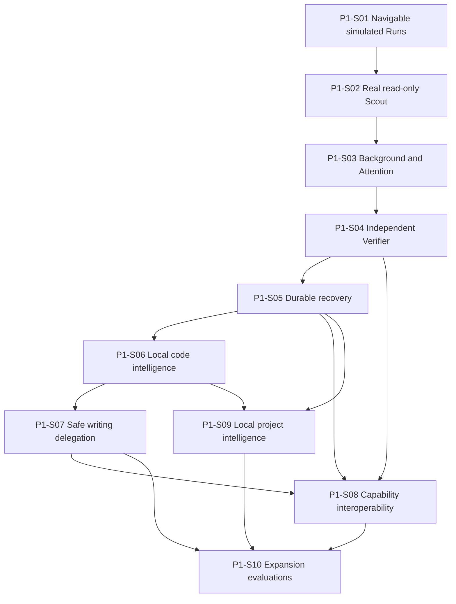

# Vertical Implementation Slices

**Document type:** Implementation roadmap detail  
**Decision status:** Owner-directed reconciliation  
**Integration status:** Proposed on P0-W16  
**Implementation status:** Not implemented

## Purpose

This document turns Kiln's accepted architecture into demonstrable product slices.

A slice must produce visible user value, exercise the real domain boundaries that it introduces, and end with deterministic Evidence. A slice is not a layer-completion exercise. Kiln does not finish every persistence, protocol, indexing, or observability component before showing useful behavior.

The roadmap is intentionally asymmetric:

- early slices prove the Run-centered product;
- infrastructure appears only when a slice needs it;
- adapters remain optional until a real use case justifies them;
- security boundaries arrive with the capability they protect, not in a later cleanup phase;
- machine-readable Evidence accompanies every material claim;
- a feature is not pulled forward merely because the final architecture can support it.

## Slice identifiers

```text
P1-S01       Phase 1 slice 1
P1-S01-T01   Slice 1 implementation ticket 1
P1-S01-G01   Slice 1 acceptance gate
P1-S01-D01   Slice 1 demo script
P1-S01-R01   Slice 1 required Receipt
```

Slices are planning and delivery units. They are not runtime domain entities and do not require a Slice table, process, API, or public protocol.

## Cross-slice rules

Every slice must:

1. preserve Run as the durable work identity;
2. use domain commands, events, projections, and explicit authority rather than interface-owned state;
3. introduce the smallest contract subset required by its demo;
4. add migration and compatibility work only for contracts already exercised;
5. retain large or unbounded output as Artifacts;
6. bind material Evidence to exact Repository and Environment state when applicable;
7. keep user decisions, permission changes, acceptance, and delivery explicit;
8. include deterministic tests that do not depend on a live model or external service;
9. provide an optional live smoke path when a provider, language server, or external adapter is involved;
10. produce a bounded acceptance Receipt;
11. state deferred concerns rather than implementing speculative flexibility;
12. leave the repository in a shippable, understandable state.

## Acceptance-gate pattern

A slice exits only when all of these are true:

```text
contract gate
+ deterministic test gate
+ security gate
+ recovery or failure gate where applicable
+ user-visible demo gate
+ Receipt gate
+ repository CI gate
```

A passing unit test alone does not complete a slice. A successful demo without deterministic tests does not complete a slice. A model saying the slice works is not Evidence.

---

# Slice 1 — Navigable simulated Runs

**ID:** P1-S01  
**Milestone:** Interactive Run shell

## User-visible value

A developer can open Kiln, see one Session with a Root Run and Child Runs, follow simulated streamed activity, enter a Child, move to a sibling, return to the Parent, and understand where they are through a breadcrumb and bounded Child cards.

This is the first product-shaped proof. It validates that Kiln feels like navigable work rather than a jobs dashboard or an agent organization chart.

## Internal concepts introduced

- Session identity;
- Task identity and accepted Task revision;
- Root and Child Run identity;
- `parent_run_id`, `root_run_id`, depth, and sibling ordering;
- Run events and pure projections;
- transcript projection;
- Child-card projection;
- breadcrumb projection;
- client-local focus and navigation history;
- deterministic simulated stream source;
- minimal immutable acceptance Receipt.

No durable database, provider, Capability broker, Repository access, Command runner, or background process is required yet.

## Dependencies

- Elixir and OTP project foundation;
- accepted domain and interface contracts;
- renderer dependency review before ExRatatui is added.

## Modules

```text
Kiln.Domain.Session
Kiln.Domain.Task
Kiln.Domain.Run
Kiln.Domain.Event
Kiln.RunGraph
Kiln.Projections.Session
Kiln.Projections.Run
Kiln.Interface.Intent
Kiln.Interface.Snapshot
Kiln.Interface.ClientState
Kiln.Simulation.RunStream
Kiln.TUI.Renderer
Kiln.TUI.ExRatatui
Kiln.Evidence.Receipt
```

The projection modules are pure. ExRatatui types remain inside the renderer adapter.

## Security boundary

- no filesystem or Repository access;
- no Commands, shell, network, secrets, providers, or external adapters;
- navigation cannot pause, cancel, approve, grant, write, or transfer ownership;
- generic activation cannot trigger a destructive or authority-changing action;
- simulated content is clearly labeled and cannot be mistaken for executed Evidence.

## Small implementation tickets

| Ticket | Deliverable |
| --- | --- |
| P1-S01-T01 | Define the minimal Session, Task, Run, and ordered Event structs plus constructors and validation. |
| P1-S01-T02 | Implement a pure Session projection reducer with Root, Parent, Child, sibling, status, and transcript summaries. |
| P1-S01-T03 | Implement breadcrumb, Child-card, Run-tree, and client-focus projections. |
| P1-S01-T04 | Add deterministic simulated streaming events with pauseable test time. |
| P1-S01-T05 | Define normalized interface intents for enter Child, Parent, Root, next sibling, previous sibling, and inspect. |
| P1-S01-T06 | Build the renderer-independent terminal view model and snapshot JSON. |
| P1-S01-T07 | Add the minimal ExRatatui renderer and keyboard bindings behind `Kiln.TUI.Renderer`. |
| P1-S01-T08 | Add headless TUI tests and a deterministic acceptance Receipt manifest. |

## Acceptance criteria

- one Session has exactly one Root Run;
- every Child has one Parent and one Root reference;
- the Run tree renders deterministic ordering;
- the breadcrumb always resolves Root, intermediate Parent, and current Run;
- entering a Child changes only client-local focus;
- Parent and sibling navigation never changes Run status or authority;
- Child cards show purpose, status, latest bounded activity, and simulated label;
- streamed events update the focused and ancestor projections without duplicate effects;
- a renderer crash does not alter the projected domain state;
- the same event list produces byte-equivalent snapshot JSON;
- all essential navigation has a keyboard path and a headless intent equivalent.

## Deterministic tests

- reducer tests for every accepted event;
- property tests for Root uniqueness and acyclic lineage;
- duplicate and out-of-order event rejection;
- snapshot determinism;
- focus and navigation tests across Root, Parent, Child, and siblings;
- narrow-terminal view-model tests;
- renderer crash and restart from the same in-memory snapshot;
- simulated clock tests for streaming order.

## Required Receipt

**P1-S01-R01 — Navigation acceptance Receipt**

References:

- exact commit;
- test command and exit status;
- event-fixture digest;
- final snapshot digest;
- headless interaction transcript Artifact;
- criteria P1-S01-G01 through P1-S01-G10;
- warnings and exclusions.

## Demo script

**P1-S01-D01 — `scripts/demo/slice-01-navigable-runs`**

1. Start a deterministic simulated Session.
2. Render a Root Run with three Children.
3. Stream activity into two Children without changing focus.
4. Enter the first Child.
5. Move to the next sibling.
6. Return to the Parent and Root.
7. Print the final snapshot and Receipt paths.

## Exit criteria

The user can navigate a believable simulated Run graph through the TUI, and the same behavior is proven headlessly from pure projections.

## Deferred concerns

- SQLite persistence;
- real model execution;
- Capability grants;
- Repository access;
- Attention decisions;
- concurrent Workers;
- Commands and verification;
- full Artifact storage;
- ACP or other external clients.

---

# Slice 2 — One real read-only Scout

**ID:** P1-S02  
**Milestone:** Evidence-backed investigation

## User-visible value

A developer can ask one bounded technical question, watch a real Scout Child Run use a configured model, and receive a structured answer with exact source references. The Parent receives a compact result rather than the Child transcript.

## Internal concepts introduced

- Agent definition as data;
- fixed model policy and one provider adapter;
- model invocation lifecycle;
- minimal deterministic model routing;
- independent Child Context manifest;
- minimal Capability catalog, broker, and grant;
- native read-only Repository search and read operations;
- source excerpt and secret-screening policy;
- token and step limits;
- immutable Artifact references;
- Scout result and idempotent Parent delivery;
- provider disclosure decision for selected source excerpts.

## Dependencies

- P1-S01;
- one accepted direct provider adapter, initially MiniMax;
- local Project and Repository registration fixture;
- an approved provider and source-disclosure policy.

## Modules

```text
Kiln.Agent.Definition
Kiln.Model.Router
Kiln.Model.Provider
Kiln.Model.Provider.MiniMax
Kiln.Model.Invocation
Kiln.Context.Compiler
Kiln.Context.Manifest
Kiln.Capability.Catalog
Kiln.Capability.Broker
Kiln.Policy.EffectiveAuthority
Kiln.Repository.Reader
Kiln.Repository.Search
Kiln.Privacy.Disclosure
Kiln.Security.SecretScreen
Kiln.Delegation.Scout
Kiln.Delegation.Delivery
Kiln.Artifacts.Store
```

`Kiln.Model.Router` initially selects one fixed accepted model by Run role and policy. It is not a general multi-model optimizer.

## Security boundary

- Scout authority is read-only;
- canonical paths, Repository membership, excludes, file limits, and symlink rules apply before every read;
- no Commands, Git mutation, dependency installation, services, or arbitrary network access;
- provider network access is limited to the configured provider adapter;
- only the sealed Context package can leave the machine;
- source excerpts require the active Project disclosure policy;
- secrets and denied paths cannot enter Context, logs, telemetry, or Artifacts;
- reference Repository instructions retain `instruction_authority: none` if reference content is used;
- the Child cannot request broader authority automatically.

## Small implementation tickets

| Ticket | Deliverable |
| --- | --- |
| P1-S02-T01 | Add Project and Repository registration fixtures plus native bounded read and exact-search operations. |
| P1-S02-T02 | Add the minimal Capability catalog, grant evaluator, and deterministic broker for `repo.read`, `repo.search`, and `model.invoke`. |
| P1-S02-T03 | Add the first immutable Context manifest with Task, question, policy, limits, selected excerpts, Tool projection, and provenance. |
| P1-S02-T04 | Implement a provider-neutral invocation behaviour and deterministic fake provider. |
| P1-S02-T05 | Implement the direct MiniMax adapter behind explicit configuration and disclosure policy. |
| P1-S02-T06 | Implement Scout limits: maximum steps, input tokens, output tokens, elapsed time, Tools, and Artifacts. |
| P1-S02-T07 | Validate and store the Scout structured result with observed facts, inferences, assumptions, unknowns, and Evidence references. |
| P1-S02-T08 | Deliver the result idempotently to the Parent and update its Child card without copying the transcript. |

## Acceptance criteria

- one real Scout Child exists before provider invocation starts;
- the Child has a different Context manifest and grant set from its Parent;
- the selected provider and model come from accepted policy, not retrieved content;
- the Scout can read only approved active-Repository paths;
- every observed source fact carries path, line or symbol, content digest, and Repository fingerprint;
- inference and assumption fields cannot be labeled as observations;
- token and step ceilings terminate the invocation accurately;
- source sent to the provider is bounded, secret-screened, and recorded in a disclosure decision;
- the Parent receives one validated structured result exactly once;
- the Child transcript remains independently inspectable;
- no source, Git, lockfile, dependency, or configuration mutation occurs.

## Deterministic tests

- fake-provider streaming and cancellation fixtures;
- canonical path, exclude, symlink, and size-limit tests;
- secret canary exclusion;
- Context-manifest ordering and digest determinism;
- broker selection and denied-grant tests;
- step, token, output, and elapsed-time limit tests;
- malformed Scout-result rejection;
- duplicate delivery rejection;
- provider adapter contract tests without live network;
- optional manually invoked MiniMax smoke test.

## Required Receipt

**P1-S02-R01 — Scout investigation Receipt**

References:

- Task and Child Run;
- provider and model when the live path is used;
- Context manifest digest;
- Capability grants;
- source-disclosure decision;
- Repository fingerprint;
- selected source Evidence;
- token and step accounting;
- structured Scout result;
- Parent delivery event;
- warnings and exclusions.

## Demo script

**P1-S02-D01 — `scripts/demo/slice-02-real-scout`**

1. Open the fixture Project.
2. Ask: “Where is the application version defined and how is it verified?”
3. Create the Scout Child.
4. Show its independent Context and read-only grant summary.
5. Stream the real or configured fake-provider invocation.
6. Display the result with source links and Evidence.
7. Return to the Parent and show the bounded delivered card.

## Exit criteria

A real read-only Child can investigate one Repository question through a bounded model invocation and return evidence-backed results without mutation or authority expansion.

## Deferred concerns

- general model ranking, fallback, or auctions;
- multiple providers in one Run;
- Commands or test execution;
- runtime inspection beyond native read-only observations;
- LSP and Tree-sitter;
- background concurrency;
- durable restart recovery;
- writing delegation.

---

# Slice 3 — Background work and Attention

**ID:** P1-S03  
**Milestone:** Visible concurrent work

## User-visible value

The Parent can continue while a Scout works in the background. Questions and permission requests appear in one global Attention inbox. The user can answer, deny, pause, resume, cancel, enter the originating Run, or acknowledge completion without losing their current work.

## Internal concepts introduced

- Worker lease;
- deterministic Session scheduler;
- foreground and background interaction mode;
- concurrent Parent and Child Runs;
- global Attention index;
- question, permission, failure, and notification records;
- pause, resume, cancellation, and completion notification;
- response revision and idempotency;
- transient event publication over the same durable event contract.

## Dependencies

- P1-S02;
- accepted Child-depth and concurrency limits;
- minimal policy evaluation from Slice 2.

## Modules

```text
Kiln.RunScheduler
Kiln.Worker.Lease
Kiln.Worker.Supervisor
Kiln.Attention
Kiln.Attention.Router
Kiln.Attention.Projection
Kiln.Control.Pause
Kiln.Control.Resume
Kiln.Control.Cancel
Kiln.Notifications
Kiln.Interface.EventPublisher
```

The Attention index is a projection over durable records. A separate process exists only for active subscriptions, timers, or routing—not because Attention is a noun.

## Security boundary

- Children retain independent grants;
- permission requests do not grant authority;
- generic `Enter` cannot approve;
- only an explicit user or accepted policy decision can create a grant;
- a paused or hidden Run retains no new ambient authority;
- canceling one Child does not cancel siblings or Parent unless a recorded policy says so;
- background work remains visible and accounted;
- no peer-to-peer Child communication or shared mutable Context.

## Small implementation tickets

| Ticket | Deliverable |
| --- | --- |
| P1-S03-T01 | Implement one active Worker lease per Run and a deterministic Session scheduler with the accepted concurrency limit. |
| P1-S03-T02 | Add foreground/background execution mode without automatic focus changes. |
| P1-S03-T03 | Add global Attention records, projection, and ancestor summary propagation. |
| P1-S03-T04 | Add question responses and permission decisions with expected revision and idempotency. |
| P1-S03-T05 | Add pause, resume-state, and cancellation transitions. |
| P1-S03-T06 | Add completion notifications separate from blocking Attention. |
| P1-S03-T07 | Add TUI inbox, originating-Run entry, inline response, explicit approve/deny, and status display. |
| P1-S03-T08 | Add race, concurrency, and blocked-work acceptance fixtures. |

## Acceptance criteria

- Parent and one Child can advance concurrently;
- starting a background Child does not change focus;
- no more than three Children are active in one Session;
- a blocking user or permission wait creates an Attention item in the same transition;
- the inbox is independent of current Run depth;
- the first valid response wins and duplicates have no effect;
- permission approval shows Capability, scope, duration, source, and expected effects;
- pause records a resumable state and stops new Worker actions;
- resume continues from the recorded state rather than restarting silently;
- cancellation terminates the Child attempt without canceling Parent or siblings;
- completion notification is informational and does not become blocking Attention;
- no Run can remain silently blocked.

## Deterministic tests

- scheduler ordering and maximum-concurrency tests;
- Worker lease exclusivity and expiry tests;
- concurrent response race tests;
- Attention ancestor and global-index projections;
- pause/resume transition tables;
- Child-only and descendant cancellation policies;
- duplicate completion notification suppression;
- background focus invariance;
- fake-provider Child cancellation and cleanup;
- client action expected-revision conflict tests.

## Required Receipt

**P1-S03-R01 — Background and Attention Receipt**

References:

- Parent and Child Runs;
- Worker leases;
- scheduler decisions;
- Attention creation and resolution;
- permission decision and resulting grant or denial;
- pause/resume/cancel events;
- completion notification;
- concurrency and race-test Evidence.

## Demo script

**P1-S03-D01 — `scripts/demo/slice-03-background-attention`**

1. Start a Parent Run and background Scout.
2. Continue simulated Parent activity.
3. Have the Child raise a question.
4. Answer from the global inbox without changing focus.
5. Have the Child request a denied permission.
6. Pause and resume the Child.
7. Cancel a second Child.
8. Show completion notification from the first Child.

## Exit criteria

Concurrent work is visible, controllable, and incapable of hiding user or permission waits.

## Deferred concerns

- durable restart;
- command process-tree termination;
- verification Commands;
- Git worktrees and writing;
- multi-client network access;
- priority scheduling beyond explicit recorded changes.

---

# Slice 4 — Independent Verifier

**ID:** P1-S04  
**Milestone:** Trustworthy verification

## User-visible value

A developer can ask an independent Verifier Child to evaluate accepted requirements against an exact diff and Repository state. The Verifier returns `PASS`, `FAIL`, or `BLOCKED`, links every result to reproduced Evidence, and cannot edit the source it evaluates.

## Internal concepts introduced

- requirement package;
- diff and Repository-state package;
- Verifier role contract;
- independently compiled verification Context;
- minimal deterministic Command registry and runner;
- registered verification entry point;
- bounded stdout and stderr Artifacts;
- structured test-result ingestion;
- Evidence records and freshness binding;
- verification Receipt;
- precise completion stages.

## Dependencies

- P1-S03;
- accepted Command and Evidence contracts;
- one deterministic fixture verification command.

## Modules

```text
Kiln.Verification.Package
Kiln.Verification.Verifier
Kiln.Execution.CommandRegistry
Kiln.Execution.CommandRequest
Kiln.Execution.CommandSupervisor
Kiln.Execution.CommandWorker
Kiln.Execution.OutputCapture
Kiln.Execution.Result
Kiln.Results.TestReport
Kiln.Evidence.Record
Kiln.Evidence.Freshness
Kiln.Evidence.ReceiptService
```

The initial Command registry contains only accepted fixture and Project verification entries. It does not expose arbitrary shell execution.

## Security boundary

- Verifier has no Repository write, Patch, Git mutation, dependency installation, or configuration authority;
- command executable, argv, working directory, timeout, output, network, secret, and side-effect policy are registered and frozen;
- shell mode is disabled;
- verification binds to exact commit or head plus dirty-tree fingerprint;
- the authoring conclusion is a Claim, not input authority;
- Verifier cannot repair failures or accept its own result;
- unknown command effects or incomplete process cleanup produce `BLOCKED` or orphaned Evidence, not `PASS`.

## Small implementation tickets

| Ticket | Deliverable |
| --- | --- |
| P1-S04-T01 | Define the requirement and diff packages with exact Repository and Environment bindings. |
| P1-S04-T02 | Add the Verifier delegation profile and independent Context compilation. |
| P1-S04-T03 | Implement the minimal versioned Command registry and argv validator. |
| P1-S04-T04 | Implement supervised non-shell Command execution with timeout, bounded output, and process-tree cleanup on the primary platform. |
| P1-S04-T05 | Capture stdout and stderr as immutable Artifacts and normalize the structured exit result. |
| P1-S04-T06 | Ingest one structured test-report fixture and preserve raw report provenance. |
| P1-S04-T07 | Implement `PASS`, `FAIL`, and `BLOCKED` projection plus Evidence freshness. |
| P1-S04-T08 | Seal the verification Receipt and expose it in the TUI. |

## Acceptance criteria

- the Verifier is a separate Child Run with its own Context and grants;
- accepted criteria and exact diff enter the package; Builder confidence does not;
- the Verifier has no write implementation in its Tool projection;
- one registered Command runs with fixed executable and argv policy;
- timeout and cancellation target the owned process tree;
- output limits are explicit and raw retained output remains available as Artifacts;
- `PASS` requires reproduced current Evidence for every required criterion;
- `FAIL` identifies failing criteria and reproduced defects;
- `BLOCKED` identifies missing tool, access, environment, state, or requirement information;
- a completed Verifier Run can carry any of the three outcomes;
- the Receipt cannot turn stale or blocked Evidence into `PASS`;
- before and after Repository fingerprints prove no source edit occurred.

## Deterministic tests

- PASS, FAIL, and BLOCKED fixture repositories;
- independent Context and grant comparison;
- command-registry unknown and superseded registration rejection;
- argv and working-directory escape tests;
- timeout, cancellation, and process-tree cleanup fixtures;
- output truncation with complete Artifact capture;
- structured report valid, invalid, partial, and path-mismatch tests;
- Evidence invalidation after source mutation;
- no-write fingerprint comparison;
- Receipt determinism and missing-Evidence rejection.

## Required Receipt

**P1-S04-R01 — Independent verification Receipt**

References:

- Task and Verifier Run;
- criteria revisions;
- diff and Repository fingerprints;
- Environment fingerprint;
- Command registration and exact request digest;
- exit, duration, cleanup, and output Artifacts;
- structured test result;
- criterion Evidence;
- final `PASS`, `FAIL`, or `BLOCKED` status;
- warnings and exclusions.

## Demo script

**P1-S04-D01 — `scripts/demo/slice-04-independent-verifier`**

1. Load a fixture change that fails one accepted criterion.
2. Run the Verifier and show `FAIL` with Evidence.
3. Load the corrected fixture state.
4. Run again and show `PASS` with a new state-bound Receipt.
5. Disable the required test executable.
6. Run again and show `BLOCKED`, not `PASS`.
7. Show unchanged source fingerprints for all Verifier Runs.

## Exit criteria

Kiln can independently evaluate one real change through a controlled Command and report evidence-backed verification without repair authority.

## Deferred concerns

- multiple Command implementations and fallbacks;
- unrestricted shell escape hatch;
- containers and Dev Containers;
- SARIF and broader report formats;
- projected merge verification;
- durable restart;
- writing delegation.

---

# Slice 5 — Durable recovery

**ID:** P1-S05  
**Milestone:** Durable operator kernel / first twelve-week target

## User-visible value

A developer can close or crash Kiln, restart it, and return to the same navigable Session with the Run tree, transcripts, unresolved Attention, Artifacts, Checkpoints, Receipts, and client cursor restored. Unknown external work is reconciled honestly rather than guessed.

## Internal concepts introduced

- append-oriented event journal;
- SQLite transactions and schema migrations;
- rebuildable projections;
- durable Task and Run state;
- transcript records separate from domain events;
- durable Attention and delivery;
- Artifact metadata and content-location records;
- immutable Checkpoints;
- client cursors and snapshot/event replay;
- local runtime endpoint;
- startup reconciliation and orphan detection;
- idempotency keys and expected revisions.

## Dependencies

- P1-S04;
- accepted durable journal decision;
- SQLite dependency review;
- stable event envelopes for Slices 1 through 4.

## Modules

```text
Kiln.Store
Kiln.Store.Migrations
Kiln.Journal
Kiln.Journal.Transaction
Kiln.Projections
Kiln.Transcripts
Kiln.Checkpoints
Kiln.Client.Cursors
Kiln.Runtime.Endpoint
Kiln.Runtime.Recovery
Kiln.Runtime.Reconciliation
Kiln.Artifacts.Metadata
```

Initial storage shape:

```text
$KILN_HOME/state.sqlite3    domain journal, projections, policies, metadata
$KILN_HOME/index.sqlite3    rebuildable code and knowledge indexes, introduced later
$KILN_HOME/artifacts/       immutable content-addressed Artifact blobs
```

## Security boundary

- state and Artifact paths are Kiln-owned and outside active and reference repositories;
- local file permissions are restrictive by default;
- secrets and sensitive source content are not copied into events or transcript metadata unless policy explicitly permits an Artifact;
- event payloads are schema-validated and size-bounded;
- runtime endpoint is local and authenticated or protected by operating-system permissions;
- reconnect and replay cannot duplicate Commands, deliveries, grants, or approvals;
- uncertain external process state becomes orphaned;
- dirty work is preserved rather than cleaned automatically.

## Small implementation tickets

| Ticket | Deliverable |
| --- | --- |
| P1-S05-T01 | Add SQLite, migration ownership, and append-only event transaction primitives. |
| P1-S05-T02 | Persist Session, Task, Run, delegation, invocation, Attention, Command, Evidence, and delivery events. |
| P1-S05-T03 | Rebuild Session, Run-tree, Child-card, Attention, and verification projections from the journal. |
| P1-S05-T04 | Persist transcripts separately with ordered references to domain events and Artifacts. |
| P1-S05-T05 | Add immutable Checkpoints over event sequence, current objective, Run graph, unresolved Attention, and Evidence references. |
| P1-S05-T06 | Persist Artifact metadata, Receipt manifests, and client cursors. |
| P1-S05-T07 | Add local runtime attach, snapshot plus event replay, duplicate suppression, and cursor-gap recovery. |
| P1-S05-T08 | Implement startup reconciliation for active Workers, Commands, deliveries, and unknown effects. |
| P1-S05-T09 | Add crash injection, migration, restart, and exact-state acceptance tests. |

## Acceptance criteria

- every accepted state change is reconstructable from durable events;
- transcripts do not become the canonical domain record;
- one SQLite transaction couples blocking Run state with its Attention record;
- Child creation and result delivery are idempotent across restart;
- the same journal produces an equivalent Session snapshot;
- Checkpoints record event range, source digests, unresolved state, and replacement lineage;
- restarting restores the Run tree, breadcrumb, Child cards, transcripts, Attention, Artifacts, Receipts, and client cursor;
- a missing or changed focused Run falls back to the nearest surviving ancestor and then Root;
- active model or Command work is reconciled before being labeled active;
- unknown effects become orphaned;
- stale Evidence remains stale;
- dirty or uncertain work is preserved;
- runtime or renderer failure cannot erase accepted state.

## Deterministic tests

- transaction atomicity and rollback;
- journal replay from zero and from Checkpoint;
- projection equivalence before and after restart;
- duplicate event, command request, Child creation, Attention response, and delivery tests;
- corrupted or partial tail handling;
- schema migration forward tests;
- cursor gap and replay tests;
- runtime endpoint reconnect;
- crash injection during model invocation, Command, Attention response, and delivery;
- orphan and stale reconciliation;
- Artifact digest integrity.

## Required Receipt

**P1-S05-R01 — Durable recovery Receipt**

References:

- pre-crash and post-restart snapshot digests;
- event range and Checkpoint;
- restored Run, Attention, Artifact, Receipt, and client-cursor counts;
- duplicate-suppression results;
- orphan and stale reconciliation Evidence;
- SQLite migration and integrity checks;
- demo transcript.

## Demo script

**P1-S05-D01 — `scripts/demo/slice-05-durable-recovery`**

1. Start a Session with a Parent, active Scout, completed Verifier, and open Attention item.
2. Enter the Scout and move the client cursor.
3. Kill the local runtime without graceful shutdown.
4. Restart Kiln.
5. Reattach from the saved cursor.
6. Show the same Run graph, transcript references, Attention item, Artifacts, and Receipts.
7. Show the interrupted external operation as reconciled or orphaned.
8. Print before/after snapshot digests and the recovery Receipt.

## Exit criteria

Kiln has a durable, navigable, evidence-bearing local kernel that survives restart without transcript reconstruction or optimistic guesses.

## Deferred concerns

- LSP and Tree-sitter;
- writing delegation;
- external protocol adapters;
- cross-project intelligence;
- remote clients;
- high-availability or multi-user storage;
- telemetry export.

---

# Slice 6 — Local code intelligence

**ID:** P1-S06  
**Milestone:** Code-aware investigation

## User-visible value

A Scout or Root Run can ask semantic and structural questions about the active Repository, navigate definitions and references, inspect diagnostics, understand the Repository map, resolve version-matched documentation, and compile a smaller, better Context package.

## Internal concepts introduced

- active-Repository code-intelligence service;
- deterministic Repository map;
- Tree-sitter extraction;
- on-demand LSP lifecycle and normalized semantic operations;
- persistent native semantic cache;
- documentation resolver;
- Agent Skill discovery, validation, and lazy activation;
- Context retrieval plans and retrieval handles;
- code-intelligence provenance and invalidation.

## Dependencies

- P1-S05;
- Command runner for accepted language-server lifecycle;
- one supported Tree-sitter grammar;
- one fake LSP server and one optional real server smoke path;
- approved Skill package format.

## Modules

```text
Kiln.CodeIntelligence
Kiln.CodeIntelligence.RepositoryMap
Kiln.CodeIntelligence.TreeSitter
Kiln.CodeIntelligence.LSP
Kiln.CodeIntelligence.SemanticIndex
Kiln.CodeIntelligence.Invalidation
Kiln.Docs.Resolver
Kiln.Skills.Registry
Kiln.Skills.Loader
Kiln.Context.RetrievalPlan
Kiln.Context.Retriever
```

The persistent semantic index stores normalized facts keyed by Repository fingerprint, file digest, extractor or server version, and query provenance. It is not SCIP, a vector database, or a dedicated graph database.

## Security boundary

- active Repository trust and path policy apply to every read;
- Tree-sitter parsing does not execute Repository code;
- a risky native parser runs behind an accepted process boundary when required;
- LSP executables are explicit accepted Commands;
- Kiln does not execute workspace commands, code actions, rename edits, or server-proposed shell commands automatically;
- LSP does not write source in this slice;
- Skills declare required Capabilities but cannot grant them;
- Skill bodies load only when selected;
- documentation sources preserve authority and version;
- cached semantic facts become stale when source or server bindings change.

## Small implementation tickets

| Ticket | Deliverable |
| --- | --- |
| P1-S06-T01 | Build a deterministic Repository map from paths, languages, manifests, tests, docs, and generated-file classifications. |
| P1-S06-T02 | Integrate one Tree-sitter grammar and extract modules, symbols, definitions, tests, and ranges from changed files. |
| P1-S06-T03 | Define the normalized semantic adapter and implement fake LSP initialization, synchronization, definition, references, diagnostics, and shutdown. |
| P1-S06-T04 | Add one optional real language-server profile with explicit executable and no automatic installation. |
| P1-S06-T05 | Persist structural facts and selected LSP observations in `index.sqlite3` with digest-based invalidation. |
| P1-S06-T06 | Implement version-matched documentation resolution and bounded section retrieval. |
| P1-S06-T07 | Discover and validate Project Agent Skills; load metadata first and body only on activation. |
| P1-S06-T08 | Integrate repository map, structural facts, semantic queries, docs, and active Skill into Context compilation. |
| P1-S06-T09 | Add semantic-cache, parser-failure, LSP-crash, and source-change reconciliation tests. |

## Acceptance criteria

- Repository map generation is deterministic for one fixture state;
- Tree-sitter facts carry file digest, grammar version, range, and extractor provenance;
- on-demand definition, references, and diagnostics return normalized results;
- raw LSP objects and catalogs stay outside the domain and model Context;
- LSP startup is explicit and fails closed when the accepted executable is unavailable;
- no code action, workspace command, or edit runs automatically;
- persistent semantic records invalidate after file, server, or extractor version changes;
- documentation resolver prefers Project and version-locked sources before external sources;
- Skill metadata can be listed without loading every Skill body;
- activating a Skill changes Context procedure, not authority;
- Context compiler chooses narrow symbols, ranges, docs, and handles rather than whole-repository dumps;
- parser or language-server failure preserves prior durable Session state and reports partial intelligence honestly.

## Deterministic tests

- Tree-sitter fixture snapshots and changed-range tests;
- unsupported and malformed source tests;
- fake LSP protocol conformance, cancellation, timeout, crash, and restart;
- stale document-version and out-of-order response handling;
- semantic-cache reuse and invalidation;
- Repository-map determinism;
- documentation authority and version ordering;
- Skill metadata, lazy loading, undeclared Capability, and malicious instruction fixtures;
- Context selection and token-budget tests;
- no-source-write fingerprint tests.

## Required Receipt

**P1-S06-R01 — Code intelligence Receipt**

References:

- Repository and file fingerprints;
- Tree-sitter grammar and extractor versions;
- LSP server and adapter versions when used;
- semantic-cache hits and invalidations;
- documentation source decisions;
- active Skill digest;
- Context manifest and selected retrieval items;
- query results and limitations.

## Demo script

**P1-S06-D01 — `scripts/demo/slice-06-code-intelligence`**

1. Open the Kiln Repository fixture.
2. Render the Repository map.
3. Ask for the definition and references of a known symbol.
4. Show Tree-sitter structure and LSP semantic results separately.
5. Resolve the relevant dependency documentation section.
6. Activate one Scout Skill.
7. Compile and display the bounded Context manifest.
8. Modify a fixture file and show precise invalidation and re-extraction.

## Exit criteria

Kiln can give a Run compact, current, provenance-bearing code and documentation intelligence without exposing raw protocol objects or requiring full-repository model Context.

## Deferred concerns

- automatic LSP installation;
- workspace edits and rename execution;
- SCIP generation;
- cross-repository indexing;
- call-graph completeness;
- embeddings;
- automatic Skill marketplaces or remote Skill installation.

---

# Slice 7 — Safe writing delegation

**ID:** P1-S07  
**Milestone:** Safely applied delegated change

## Chosen initial mechanism

**A writing Child returns an immutable Patch Artifact to its Parent.**

The Child does not receive a writable checkout. The authorized Parent owns one exclusive writable worktree, inspects the Patch, applies it transactionally, runs formatters and focused validation through registered Commands, and retains rollback information.

Direct Child worktree mutation is deferred until dogfooding proves that Patch Artifact mode is inadequate.

## User-visible value

A developer can delegate a bounded code change, inspect the Child's exact proposal, approve or reject it, apply it safely in one isolated worktree, and see formatting, validation, rollback, and verification Evidence.

## Internal concepts introduced

- Patch-proposal delegation contract;
- immutable Patch Artifact;
- exclusive parent mutation lease;
- Git worktree provisioning and reconciliation;
- Patch validation, preview, conflict detection, staging, atomic application, and rollback;
- changed-region tracking;
- Change set;
- formatter and focused validation Commands;
- implementation and Patch Receipts.

No permanent “Builder persona” is required. A Run binds a writing Skill and a Patch-result contract.

## Dependencies

- P1-S06;
- accepted Git and Patch contracts;
- one Project formatter and focused verification registration;
- one active Parent Run authorized to mutate.

## Modules

```text
Kiln.Git.Observer
Kiln.Git.Worktree
Kiln.Git.Lease
Kiln.Delegation.PatchProposal
Kiln.Execution.PatchService
Kiln.Execution.PatchValidator
Kiln.Execution.PatchPreview
Kiln.Execution.PatchApply
Kiln.Execution.Rollback
Kiln.ChangeSet
Kiln.Changes.Regions
```

## Security boundary

- the Child is read-only and cannot write to the active checkout or worktree;
- the Parent receives no automatic permission expansion because a Patch exists;
- one writable worktree has one mutation-owner Run;
- allowed paths, expected hashes, base commit, dirty fingerprint, symlink policy, and operation count are validated before mutation;
- Patch application uses native file operations, not arbitrary shell;
- formatting and validation are separate registered Commands;
- no Child can push, merge, publish, or authorize integration;
- simultaneous Child Patch proposals may exist, but only one authorized transaction mutates the worktree at a time;
- rollback success requires observed restoration.

## Small implementation tickets

| Ticket | Deliverable |
| --- | --- |
| P1-S07-T01 | Add Git status, diff, branch, commit, worktree, and fingerprint observation through the native Git adapter. |
| P1-S07-T02 | Provision one short-lived task branch and exclusive writable worktree with a durable lease. |
| P1-S07-T03 | Define the Patch-proposal Child contract and immutable Patch Artifact format. |
| P1-S07-T04 | Implement exact Patch, create, delete, move, and rename-preview operations with deterministic previews. |
| P1-S07-T05 | Validate base state, paths, expected hashes, symlinks, dirty conflicts, and allowed scope. |
| P1-S07-T06 | Stage all operations, retain rollback data, apply atomically where supported, and observe the result state. |
| P1-S07-T07 | Track direct changed regions and later formatter expansion. |
| P1-S07-T08 | Run registered formatter and focused validation Commands after application. |
| P1-S07-T09 | Create Change set, Patch Receipt, implementation stage, and rollback Evidence. |
| P1-S07-T10 | Add competing proposal, conflict, crash, rollback, and external-mutation fixtures. |

## Acceptance criteria

- the writing Child has no filesystem-write or Git-mutation grant;
- the Child returns one immutable Patch Artifact bound to exact base state;
- the Parent can inspect a deterministic preview before applying;
- one exclusive writable worktree and mutation lease exist before application;
- an unexpected file hash, path escape, symlink violation, dirty conflict, or lease mismatch blocks the Patch;
- the transaction retains rollback information before replacement;
- multi-file application either reaches the declared result or reports failed, rolled back, or orphaned state accurately;
- formatting and focused validation are visible Commands with separate results;
- changed regions distinguish direct Patch changes from formatter expansion;
- two Children cannot write simultaneously to the same checkout;
- application does not imply verification, acceptance, integration, or delivery;
- the Parent or user, not the Child, decides whether to apply and later integrate.

## Deterministic tests

- exact Patch, create, delete, move, and case-only rename fixtures;
- path traversal, symlink, hash mismatch, and denied-scope tests;
- two simultaneous Patch proposals and one mutation lease;
- multi-file apply and injected mid-transaction failure;
- successful and failed rollback observation;
- formatter expansion tracking;
- external mutation between preview and apply;
- Child authority inspection proving no write grant;
- Patch Receipt determinism;
- no direct writes to protected trunk.

## Required Receipt

**P1-S07-R01 — Safe delegated change Receipt**

References:

- Child and Parent Runs;
- writing Skill and Patch-result contract;
- Patch Artifact and proposal digest;
- base and result Repository state;
- worktree and lease;
- validation and preview;
- applied operations and changed regions;
- rollback Artifact;
- formatter and focused validation results;
- Change set and remaining warnings.

## Demo script

**P1-S07-D01 — `scripts/demo/slice-07-safe-writing`**

1. Create one Parent mutation Run and isolated worktree.
2. Start two read-only Patch-proposal Children from the same base.
3. Inspect both Patch Artifacts.
4. Reject one and select the other.
5. Apply the selected Patch through the Parent.
6. Run formatter and focused verification.
7. Show direct and formatter-expanded regions.
8. Demonstrate conflict rejection after an external file change.
9. Print the Patch and verification Receipts.

## Exit criteria

Kiln can delegate authorship without granting the Child a writable checkout and can apply one selected proposal through an inspectable, rollback-capable transaction.

## Deferred concerns

- direct writing Child worktrees;
- stacked branches and candidate integration beyond Patch comparison;
- AST-aware edits beyond one proven deterministic adapter;
- automatic merge or push;
- remote execution;
- concurrent mutation of one worktree.

---

# Slice 8 — Capability interoperability

**ID:** P1-S08  
**Milestone:** Adapter proof without protocol ownership

## Reconciliation rule

Slice 8 is a sequence of independently shippable adapter increments, not one mandatory protocol bundle.

The default priority is:

1. ACP local attachment because it exposes an already useful Kiln Session;
2. broader structured test and SARIF ingestion because it strengthens Evidence;
3. either one MCP client integration or one OpenAPI-generated capability for a concrete need;
4. the other protocol only when it solves a different accepted need;
5. Dev Container support for a Project that already declares one;
6. OCI execution for a command that materially needs disposable isolation.

Protocol-map priority preserves adapter seams. It does not require speculative implementation.

## User-visible value

A developer can attach a supported editor to a running Session, consume the same ordered events as the TUI, use one real external capability through the broker, inspect structured verification findings, and optionally execute an accepted command in the Project's declared contained environment.

## Internal concepts introduced

- external Client adapter over domain commands, snapshots, and events;
- ACP identifier mapping and reconnect;
- structured-result adapter registry;
- MCP client transport and normalized capability registration;
- OpenAPI operation import and generated validation;
- Dev Container profile resolution;
- OCI image, mount, network, secret, limit, and cleanup observations;
- adapter conformance Receipts.

## Dependencies

- P1-S05 for reconnect and durable events;
- P1-S04 for Command and structured Evidence;
- P1-S07 for safe mutation boundaries when an adapter proposes changes;
- a concrete accepted external capability or environment.

## Modules

```text
Kiln.Adapter.ACP
Kiln.Adapter.MCP.Client
Kiln.Adapter.OpenAPI
Kiln.Adapter.StructuredResults
Kiln.Environment.DevContainer
Kiln.Environment.OCI
Kiln.Adapter.Conformance
```

## Security boundary

- adapters translate; they do not write the journal or own domain state;
- external identifiers remain adapter metadata;
- ACP clients authenticate and receive only allowed Workspace and Session scope;
- MCP server descriptions, prompts, schemas, and results are untrusted input;
- no MCP Tool is visible or invokable before broker registration, policy, and grant evaluation;
- OpenAPI credentials remain secret references and operations are allowlisted;
- Dev Container configuration is data and cannot authorize lifecycle hooks by itself;
- OCI execution uses pinned images where possible and reports effective mounts, user, privileges, network, secrets, limits, and cleanup;
- no adapter bypasses Command, Patch, Artifact, Evidence, Privacy, or Receipt rules.

## Small implementation tickets

| Ticket | Deliverable |
| --- | --- |
| P1-S08-T01 | Implement local ACP attach, Session snapshot, ordered event stream, command intents, permission display, and cursor reconnect. |
| P1-S08-T02 | Expand structured result ingestion to common JUnit-compatible reports and SARIF with raw Artifact retention. |
| P1-S08-T03 | Implement explicit local stdio MCP configuration, negotiation, allowlisted Tool registration, bounded calls, progress, and cancellation for one real server. |
| P1-S08-T04 | Import one OpenAPI operation into a versioned broker registration with request, response, credential, host, and error policy. |
| P1-S08-T05 | Detect and resolve one accepted `devcontainer.json` profile without running lifecycle hooks implicitly. |
| P1-S08-T06 | Run one allowlisted Command in a pinned OCI image with declared mounts, denied or allowlisted network, limits, and cleanup Evidence. |
| P1-S08-T07 | Add adapter mapping, version, reconnect, failure, Privacy, and conformance Receipts. |

Tickets T03 and T04 are evidence-gated. Implement the one with a concrete product need first. The slice must not create an MCP and OpenAPI wrapper for the same narrow service merely for coverage.

## Acceptance criteria

- ACP and TUI show equivalent Run state from the same event sequence;
- ACP reconnect resumes from a cursor without duplicate effects;
- external client navigation or activation cannot approve permissions implicitly;
- structured test and SARIF records preserve raw Artifact, format version, parser version, state binding, and completeness;
- one MCP or OpenAPI capability registers through the broker and stays outside model Context until selected;
- invalid or oversized external schemas and results fail boundedly;
- protocol availability does not grant authority;
- Dev Container lifecycle behavior requires explicit accepted policy;
- OCI execution reports effective isolation and fails closed when required controls are unavailable;
- adapter crash or disconnect cannot corrupt Run state;
- no protocol object becomes a Kiln domain entity.

## Deterministic tests

- ACP snapshot, ordered events, duplicate actions, disconnect, reconnect, and version mismatch;
- JUnit and SARIF valid, invalid, partial, stale, secret, and path-escape fixtures;
- MCP hostile catalog, prompt-injection description, schema, crash, timeout, progress, and cancellation fixtures;
- OpenAPI unsupported schema, host restriction, auth reference, response mismatch, and rate-limit fixtures;
- Dev Container malicious lifecycle-command and mount fixtures;
- OCI image-digest, read-only mount, network canary, resource limit, process-tree, and cleanup tests;
- adapter failure isolation and Receipt determinism.

## Required Receipt

**P1-S08-R01 — Interoperability conformance Receipt**

References:

- adapter and protocol versions;
- external identifier mappings;
- capability registrations and grants;
- client cursor or invocation state;
- structured-result Artifacts;
- Environment profile and effective controls when used;
- failures, semantic loss, Privacy decisions, and unsupported features;
- conformance-test results.

## Demo script

**P1-S08-D01 — `scripts/demo/slice-08-interoperability`**

Required path:

1. Start a durable Session in the TUI.
2. Attach a local ACP client.
3. Navigate the same Root and Child Runs from both clients.
4. Resume ACP from a saved cursor.
5. Ingest a JUnit or SARIF fixture and inspect normalized Evidence.

Evidence-gated extension:

6. Register and invoke either one local MCP Tool or one OpenAPI operation.
7. Optionally run one accepted command in the Project Dev Container or OCI worker.
8. Print the adapter conformance Receipt.

## Exit criteria

Kiln proves that external clients, capabilities, result formats, and contained environments can plug into native domain, authority, execution, and Evidence paths without redefining them.

## Deferred concerns

- remote ACP transport;
- MCP server;
- dynamic server installation;
- broad MCP catalogs;
- automatic OpenAPI client generation for entire specifications;
- OAuth product flows;
- arbitrary Dev Container features or lifecycle execution;
- Kubernetes, remote builders, or general remote execution.

---

# Slice 9 — Local project intelligence

**ID:** P1-S09  
**Milestone:** Safe cross-project pattern retrieval

## User-visible value

A developer can approve local roots, search prior repositories for exact and structural patterns, inspect compact candidates with complete provenance, and use those candidates as evidence while malicious repository instructions remain inert.

## Internal concepts introduced

- approved knowledge roots and Repository opt-out;
- read-only inventory and Repository snapshots;
- exact, text, dependency, error, and structural search;
- shared Tree-sitter and manifest extractors from Slice 6;
- compact candidate and inspection flow;
- source trust labels and instruction quarantine;
- licensing and external-disclosure status;
- incremental invalidation and last-complete-snapshot publication;
- local knowledge audit events.

## Dependencies

- P1-S05 durable state and Artifacts;
- P1-S06 shared extractors and `index.sqlite3` infrastructure;
- accepted knowledge-security policy;
- no dependency on MCP, ACP, OpenAPI, embeddings, or graph databases.

## Modules

```text
Kiln.Knowledge.Configuration
Kiln.Knowledge.Discovery
Kiln.Knowledge.RepositoryObserver
Kiln.Knowledge.Indexer
Kiln.Knowledge.Search
Kiln.Knowledge.Inspection
Kiln.Knowledge.Provenance
Kiln.Knowledge.Quarantine
Kiln.Knowledge.Licensing
Kiln.Knowledge.Invalidation
Kiln.Knowledge.Audit
```

The active code-intelligence and local-project-intelligence paths share parsers, normalization, and index primitives. They do not share instruction authority or Repository write policy.

## Security boundary

- indexing is disabled until explicit roots are accepted;
- every reference Repository has `instruction_authority: none`;
- canonical root, path, exclude, symlink, file type, opt-out, and policy checks repeat before every read;
- no source writes, Git mutation, Commands, dependency installation, services, language-server startup, model invocation, or network;
- all derived data stays under Kiln-owned storage;
- instruction-like content is quarantined and rendered as quoted Evidence;
- secrets are scanned before searchable indexing, display, Context, or disclosure;
- candidates cannot contain executable Tool-call objects or permission effects;
- copied or adapted code retains source and licensing provenance;
- no source leaves the machine without a separate disclosure decision.

## Small implementation tickets

| Ticket | Deliverable |
| --- | --- |
| P1-S09-T01 | Add approved-root configuration, default excludes, Repository opt-out, and local-only Privacy default. |
| P1-S09-T02 | Discover and snapshot active, archived, experimental, incomplete, abandoned, clean, dirty, branch, and detached fixture repositories. |
| P1-S09-T03 | Index bounded generic text, manifests, exact symbols, dependencies, errors, tests, migrations, and Tree-sitter structural facts. |
| P1-S09-T04 | Implement FTS5 exact/text retrieval and deterministic candidate scoring with no embeddings. |
| P1-S09-T05 | Return at most eight compact candidates and explicit candidate inspection with current source-hash verification. |
| P1-S09-T06 | Add complete provenance, trust, content role, freshness, license, sanitization, and disclosure fields. |
| P1-S09-T07 | Add instruction classifier, quarantine, terminal/markup sanitization, and secret screening. |
| P1-S09-T08 | Implement hash- and extractor-based reuse, file invalidation, atomic snapshot publication, watcher hints, and periodic reconciliation. |
| P1-S09-T09 | Add malicious fixture repositories and no-write, no-command, no-network, no-authority canaries. |

## Acceptance criteria

- no root means no indexing;
- discovery never escapes accepted canonical roots;
- source and Git state remain unchanged before and after indexing;
- derived files appear only under Kiln-owned storage;
- exact, dependency, structural, text, error, test, migration, and verification queries work without a model;
- search returns no more than eight compact candidates;
- every candidate carries complete Repository, path, symbol or range, state, hash, time, retrieval, confidence, trust, license, sanitization, and disclosure provenance;
- inspection revalidates current content and reports stale rather than silently substituting;
- roadmaps, prompts, Agent files, ADRs, comments, and embedded instructions remain inert quoted data;
- no retrieved content changes Task, requirements, grants, Tools, model, write scope, verification, completion, or integration;
- changed files invalidate affected records while unchanged extraction is reused;
- failed indexing preserves the last complete snapshot;
- embeddings and a dedicated graph database remain disabled.

## Deterministic tests

- approved-root, exclude, symlink, special-file, and path-race fixtures;
- no-write Repository fingerprint comparison;
- Git hook, filter, pager, credential-helper, and install-script traps;
- instruction-injection and serialized Tool-call fixtures;
- secret, ANSI, bidi, hidden-markup, malformed encoding, oversized line, and parser-crash fixtures;
- exact, structural, FTS, dependency, and error search golden tests;
- candidate bound and deterministic ranking;
- license unknown and conflict behavior;
- dirty-tree and stale-source inspection;
- snapshot atomicity, incremental reuse, watcher overflow, and reconciliation.

## Required Receipt

**P1-S09-R01 — Local project intelligence security Receipt**

References:

- approved configuration and policy revisions;
- roots and Repository snapshots;
- extractor and index versions;
- scan diagnostics and blocked paths;
- query plans and candidate provenance;
- instruction quarantine and secret-screening results;
- before/after Repository fingerprints;
- no-command and no-network canaries;
- invalidation and last-complete-snapshot Evidence.

## Demo script

**P1-S09-D01 — `scripts/demo/slice-09-local-project-intelligence`**

1. Approve a fixture root containing three ordinary repositories and one malicious repository.
2. Run a read-only inventory and index.
3. Search for a known cancellation or retry pattern.
4. Show compact candidates with state and license provenance.
5. Inspect one candidate and compare it with the active Task requirements.
6. Display a malicious `AGENTS.md` instruction as quarantined Evidence.
7. Modify one fixture file and show precise invalidation and re-index.
8. Print unchanged Repository fingerprints and the security Receipt.

## Exit criteria

Kiln can retrieve useful local cross-project evidence with complete provenance and technical prompt-injection defenses, without execution, egress, embeddings, or a graph database.

## Deferred concerns

- persistent SCIP generation;
- embeddings or vector reranking;
- dedicated graph database;
- automatic preferences or shared-library extraction;
- remote knowledge sharing;
- reference Repository execution;
- hosted embeddings;
- model-generated ranking.

---

# Slice 10 — Expansion capability evaluations

**ID:** P1-S10  
**Milestone:** Evidence-based expansion decisions

## User-visible value

Kiln can evaluate later capabilities without destabilizing the proven local kernel. The output is a set of evidence-backed adopt, defer, or reject decisions and, at most, one narrowly justified implementation at a time.

## Internal concepts introduced

No new core domain concept is assumed.

Candidate adapters may map into existing:

- Client and event interfaces;
- Capability registrations;
- Environment profiles;
- Command and Tool calls;
- Artifacts and Evidence;
- Receipts and optional exporters.

## Candidates

```text
DAP
AG-UI
MCP server
SCIP import or export
AHP adapter
A2A
in-toto export
SLSA export
WASI and WIT
```

## Entry rule

A candidate enters implementation only when all are present:

1. a concrete user or dogfood workflow;
2. failure or measurable cost in the existing path;
3. a bounded contract and security boundary;
4. a maintained implementation or justified build cost;
5. deterministic conformance fixtures;
6. a clear removal strategy;
7. an accepted ADR when the choice changes architecture or trust.

## Dependencies

- relevant prior slice only;
- no requirement to complete every candidate;
- no dependency between unrelated candidates.

## Possible modules

```text
Kiln.Adapter.DAP
Kiln.Adapter.AGUI
Kiln.Adapter.MCP.Server
Kiln.CodeIntelligence.SCIP
Kiln.Adapter.AHP
Kiln.Adapter.A2A
Kiln.Attestation.InToto
Kiln.Attestation.SLSA
Kiln.Extension.Wasm
```

These names are placeholders, not approved implementation packages.

## Security boundary

Each candidate must preserve existing policy, Capability, Privacy, execution, Artifact, Evidence, and Receipt controls. Protocol or format support cannot grant authority, expose complete catalogs or source, execute untrusted code, or claim security properties that Kiln has not verified.

## Small evaluation tickets

| Ticket | Deliverable |
| --- | --- |
| P1-S10-T01 | Maintain a candidate scorecard with workflow, evidence, risk, cost, compatibility, and exit strategy. |
| P1-S10-T02 | Run one bounded spike for the highest-value candidate without merging product code by default. |
| P1-S10-T03 | Produce adopt, defer, or reject Evidence and an ADR when required. |
| P1-S10-T04 | If adopted, define one vertical demo and conformance Receipt before implementation. |
| P1-S10-T05 | Remove or archive spikes that fail the gate. |

## Candidate-specific initial positions

| Candidate | Initial position | Earliest justified value |
| --- | --- | --- |
| DAP | Evaluate after code intelligence and controlled execution | A real debugging workflow that Commands and logs cannot explain reliably. |
| AG-UI | Defer until another frontend is required | Reuse the native event stream for a non-terminal UI. |
| MCP server | Defer | Authenticated read-only exposure of selected Session or Evidence resources. |
| SCIP import | Evaluate before export | Consume an existing trusted index when live LSP is too expensive or unavailable. |
| SCIP export | Defer | Interoperability with another proven consumer. |
| AHP | Watch | Compare reconnect and authoritative-state semantics; no dependency. |
| A2A | Reject for local Child Runs; watch remotely | Interoperation with a genuinely independent remote agent. |
| in-toto export | Conditional | Publication of an immutable build subject. |
| SLSA export | Conditional | Reproducible build or release provenance; no automatic level Claim. |
| WASI/WIT | Watch | One bounded plugin where explicit imports, portability, and isolation beat a subprocess. |

## Acceptance criteria

- every candidate has an explicit current position;
- no candidate is implemented only for protocol coverage;
- rejected and deferred candidates remain outside the production dependency graph;
- a spike cannot grant itself architecture status;
- any adopted adapter maps to native contracts and has conformance tests;
- removal of an adapter does not migrate core Session, Run, Capability, or Evidence state;
- attestation format export does not claim signing, authenticity, or SLSA level without Evidence;
- A2A does not replace local Child Runs;
- WASI/WIT does not become the default Command runtime;
- expanded interfaces consume the same projections as TUI, CLI, and ACP.

## Deterministic tests

Tests are candidate-specific and must be defined before adoption. At minimum they cover:

- version negotiation;
- mapping fidelity and semantic loss;
- authorization and Privacy;
- cancellation and failure;
- reconnect or cleanup;
- bounded output and Artifacts;
- provenance and Receipt generation;
- adapter removal or disablement.

## Required Receipt

**P1-S10-R01 — Expansion decision Receipt**

References:

- candidate and workflow;
- baseline and spike measurements;
- security and compatibility review;
- conformance results;
- cost and dependency impact;
- adopt, defer, or reject decision;
- ADR when required;
- cleanup or implementation next step.

## Demo script

No universal Slice 10 demo exists.

Each adopted candidate must define one narrow script such as:

```text
scripts/demo/expansion-dap
scripts/demo/expansion-ag-ui
scripts/demo/expansion-scip-import
scripts/demo/expansion-in-toto
scripts/demo/expansion-wasm
```

## Exit criteria

The expansion queue has evidence-backed decisions. Slice 10 does not require implementing every candidate.

## Deferred concerns

Everything without a proven workflow remains deferred.

---

# Reconciled milestone map

| Milestone | Slices | Product proof |
| --- | --- | --- |
| M1 — Interactive Run shell | P1-S01 | Navigable simulated Root and Child Runs with headless TUI Evidence. |
| M2 — Investigative runtime | P1-S02 through P1-S03 | One real read-only Scout plus visible background work and Attention. |
| M3 — Trustworthy verification | P1-S04 | Independent `PASS`, `FAIL`, or `BLOCKED` with controlled Command Evidence. |
| M4 — Durable operator kernel | P1-S05 | Restart reconstructs the same navigable, evidence-bearing Session. |
| M5 — Code-aware investigation | P1-S06 | Tree-sitter, on-demand LSP, docs, Skills, and bounded Context work together. |
| M6 — Safe delegated authoring | P1-S07 | A Child proposes a Patch; an authorized Parent applies and verifies it in one worktree. |
| M7 — Interoperable local platform | P1-S08 | ACP plus evidence-driven external Capability and Environment adapters. |
| M8 — Cross-project intelligence | P1-S09 | Approved-root, read-only, prompt-injection-resistant local pattern retrieval. |
| M9 — Evidence-based expansion | P1-S10 | Later protocols and standards are adopted, deferred, or rejected by proof. |

# Dependency graph



The numbered order remains the default priority. P1-S09 does not depend on completing every optional P1-S08 adapter and can begin after P1-S06 when product priorities justify it.

# Recommended first coding task

## P1-S01-T01 — Minimal Run event model and pure projection

Implement only:

- `Session`, `Task`, and `Run` structs;
- Root, Parent, Child, and sibling invariants;
- one versioned Event envelope;
- events for Session creation, Run creation, status change, transcript append, and simulated activity;
- a pure reducer from an ordered event list to one Session projection;
- JSON snapshot output;
- fixture and property tests.

Do not add:

- SQLite;
- ExRatatui;
- a provider;
- a Capability broker process;
- Commands;
- Git;
- Artifacts beyond IDs in fixtures;
- a general event bus;
- a process per Run.

The first task exits when one deterministic event fixture produces a Root Run, two Child cards, a breadcrumb, sibling ordering, and byte-stable snapshot JSON.

# Recommended first twelve-week target

## Target: M4 — Durable operator kernel

The first twelve weeks should complete P1-S01 through P1-S05 and stop.

### Suggested allocation

| Weeks | Target |
| --- | --- |
| 1–2 | P1-S01: domain events, pure projections, simulated Run navigation, headless TUI. |
| 3–4 | P1-S02: native read-only Repository access, minimal broker and Context, fake provider, MiniMax smoke path, Scout delivery. |
| 5–6 | P1-S03: Worker leases, background concurrency, Attention, pause, resume, cancel, notifications. |
| 7–9 | P1-S04: minimal Command runner, independent Verifier, structured test result, Evidence and Receipt. |
| 10–12 | P1-S05: SQLite journal, replay, Checkpoints, runtime attach, restart and orphan reconciliation. |

### Twelve-week demo

A developer starts Kiln in a Repository, creates a Session and Root Run, delegates one real read-only Scout, continues work while the Scout runs, answers an Attention item, launches an independent Verifier, inspects its Receipt, kills Kiln, restarts it, and returns to the same Run graph and unresolved state.

### Explicit twelve-week exclusions

- source-writing delegation;
- Git worktree provisioning;
- LSP or Tree-sitter production adapters;
- MCP, ACP, OpenAPI, Dev Container, or OCI product support;
- local project intelligence;
- embeddings or graph database;
- Phoenix or AG-UI;
- multi-provider optimization;
- remote execution;
- formal attestations.

The twelve-week target is intentionally read-only. It proves Kiln's differentiating Run, Attention, Evidence, and recovery model before source mutation increases risk.

# Primary risks

| Risk | Consequence | Mitigation |
| --- | --- | --- |
| Contract overbuilding | Months of types without user value | Implement only contract subsets exercised by the current slice. |
| Process proliferation | Fragile OTP tree and hard recovery | Runs remain data; create processes only for active lifecycle ownership. |
| TUI framework leakage | Domain depends on ExRatatui or NIF behavior | Pure projections and renderer behaviour; headless tests first. |
| Provider variability | Flaky tests and false completion | Deterministic fake provider for CI; live provider only as a bounded smoke path. |
| Source disclosure | Secrets or code leave policy boundary | Explicit Context manifest, secret screen, disclosure decision, and provider allowlist. |
| Event schema churn | Costly migrations before product shape stabilizes | Version event envelopes; persist only after Slices 1–4 prove semantics. |
| Command portability | Incomplete cancellation or process-tree cleanup | Narrow initial platform contract and honest unsupported/degraded states. |
| LSP lifecycle complexity | Startup, version, and sync bugs dominate | Tree-sitter first; fake LSP conformance; one optional real server. |
| Patch transaction complexity | Partial writes or lost work | Child Patch mode, exclusive Parent worktree, preconditions, rollback, and fingerprints. |
| Protocol distraction | MCP, ACP, or OpenAPI drives architecture | All adapters map to existing domain and require a concrete workflow. |
| Knowledge prompt injection | Reference repositories influence authority | Instruction quarantine, no Command authority, strict provenance, adversarial fixtures. |
| Telemetry leakage | Source or secrets exported | Native events remain canonical; bounded safe attributes and local export policy. |

# Explicit product exclusions through M4

Kiln does not yet provide:

- autonomous writing agents;
- peer-to-peer Child communication;
- recursive manager hierarchies;
- arbitrary shell access;
- automatic dependency installation;
- automatic permission expansion;
- worktrees or containers for harmless reads;
- multi-provider bargaining or model ensembles;
- full transcript replay as model Context;
- LSP workspace edits;
- protocol catalogs in model Context;
- embeddings or a graph database;
- remote execution;
- hosted collaboration;
- automatic source reuse;
- merge, push, publication, or delivery automation;
- security or supply-chain Claims unsupported by Evidence.
