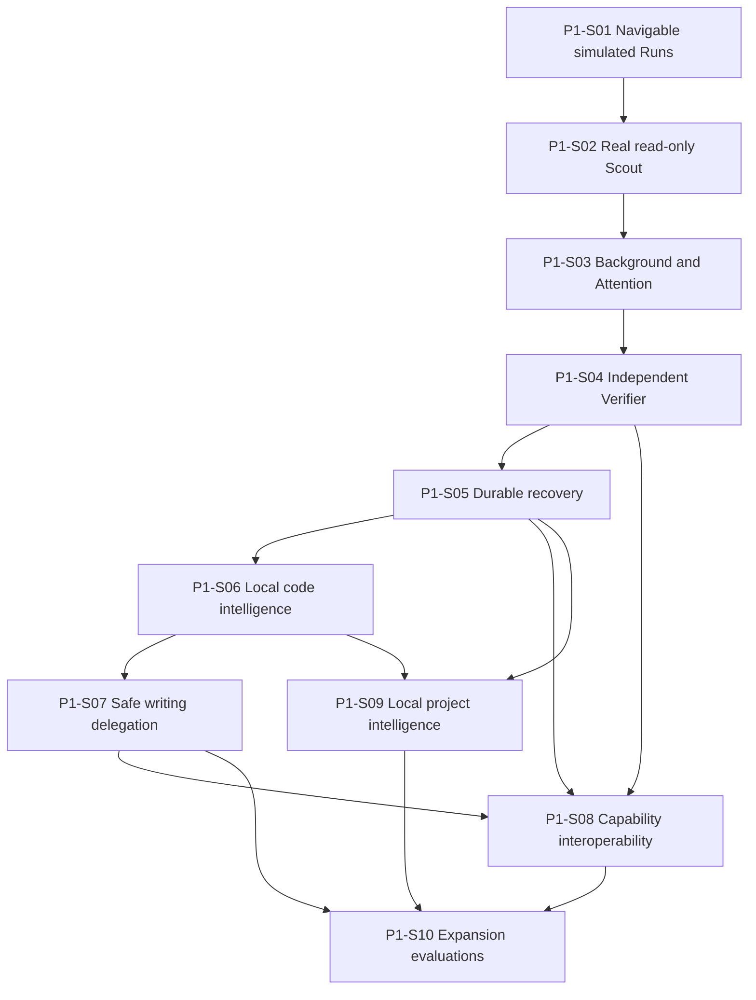

# Roadmap

**Document type:** Implementation-order authority  
**Decision status:** Owner-directed reconciliation  
**Integration status:** Proposed on P0-W16

## Roadmap rule

Kiln is implemented through vertical product slices.

The roadmap does not complete an internal component merely because the final architecture contains it. Each slice must produce user-visible value, deterministic tests, an explicit security boundary, a demo, and a Receipt.

Detailed slice contracts are in `docs/IMPLEMENTATION-SLICES.md`.

## Integrated product sequence

```text
Navigable work
→ real read-only investigation
→ visible background work and Attention
→ independent verification
→ durable recovery
→ local code intelligence
→ safe delegated writing
→ evidence-driven interoperability
→ local project intelligence
→ later expansion evaluations
```

## Reconciliation with the broader architecture sequence

The prior broader sequence remains useful as an architecture map, not as a component-first implementation order.

| Broader architectural area | Reconciled vertical delivery |
| --- | --- |
| Internal foundations | Introduced incrementally in P1-S01 through P1-S05. Domain, events, authority, execution, Evidence, and persistence are not separate pre-product phases. |
| Local code intelligence | P1-S06 after the durable Run kernel exists. Tree-sitter comes before broad live LSP dependence. |
| Protocol interoperability | P1-S08 after native commands, projections, Evidence, and recovery exist. Adapters are independently evidence-gated. |
| Local project knowledge | P1-S09 reuses Slice 6 extractors and indexes under stricter reference-Repository policy. |
| Advanced project intelligence | Deferred until deterministic retrieval and dogfooding identify real missed query classes. |
| Expanded interfaces | ACP begins in P1-S08; AG-UI, Phoenix, and other interfaces remain later consumers of the same projections. |

## Phase 0 — Planning and architecture foundation

**Goal:** constrain the product enough to begin implementation without freezing speculative implementation detail.

### Integrated work

| ID | Outcome | Status |
| --- | --- | --- |
| P0-W01 through P0-W05 | Repository foundation, work governance, development controls, Run graph direction, and planning baseline. | Integrated |
| P0-W06 | Protocol-neutral internal domain model. | Integrated |
| P0-W07 | Capability integration hierarchy and broker. | Integrated |
| P0-W08 | Bounded Context compiler. | Integrated |
| P0-W09 | Protocol and standards strategy. | Integrated through pull request 13 |
| P0-W10 | Git change isolation. | Integrated through pull request 14 |
| P0-W11 | Delegated Run model. | Integrated through pull request 15 |
| P0-W12 | Initial CLI and TUI. | Integrated through pull request 16 |
| P0-W13 | Read-only local project intelligence. | Integrated through pull request 17 |
| P0-W14 | Local project intelligence security boundary. | Integrated through pull request 18 |
| P0-W15 | Trustworthy execution plane. | Integrated through pull request 19 |
| P0-W16 | Integrated architecture, document hierarchy, vertical slices, and first twelve-week target. | In progress |

### Phase 0 exit

Phase 0 exits when P0-W16 is accepted and integrated.

At exit, the Repository has:

- one integrated architecture authority;
- one vertical implementation roadmap;
- one detailed slice plan;
- accepted subject specifications and ADRs;
- explicit version 0.1 scope;
- a first coding task;
- a twelve-week target;
- no claim that planned runtime capabilities are implemented.

---

# Phase 1 — Vertical product slices

## P1-S01 — Navigable simulated Runs

**Purpose:** prove the product interaction before persistence, providers, or Commands.

**Deliver:**

- Session;
- Root and Child Runs;
- Run tree, breadcrumb, Child cards, Parent and sibling navigation;
- simulated streaming events;
- client-local focus;
- renderer-independent projections;
- headless TUI tests.

**Exit:** a user can navigate a deterministic simulated Run graph and the same interactions pass headlessly.

**Branch:** `work/p1-s01-navigable-runs`

## P1-S02 — One real read-only Scout

**Purpose:** prove one real evidence-backed model Child without mutation.

**Deliver:**

- one direct provider adapter, MiniMax first;
- minimal deterministic model routing;
- independent Child Context;
- minimal Capability broker and read-only grants;
- native Repository search and reads;
- token and step limits;
- structured Scout result and source Evidence;
- Parent result delivery.

**Exit:** a real Scout answers one bounded Repository question with current source references and no mutation.

**Branch:** `work/p1-s02-real-read-only-scout`

## P1-S03 — Background work and Attention

**Purpose:** make concurrency visible and user-controlled.

**Deliver:**

- Parent and Child concurrency;
- Worker leases and scheduler limits;
- global Attention inbox;
- questions and permission requests;
- pause, resume, and cancel;
- completion notifications;
- race-safe responses.

**Exit:** background work never becomes hidden or silently blocked.

**Branch:** `work/p1-s03-background-attention`

## P1-S04 — Independent Verifier

**Purpose:** prove that verification is independent from author confidence.

**Deliver:**

- requirement and diff packages;
- independent Verifier Context and grants;
- minimal registered Command runner;
- bounded output Artifacts;
- one structured test-report adapter;
- `PASS`, `FAIL`, and `BLOCKED`;
- current Evidence and verification Receipt;
- no source editing.

**Exit:** a Verifier reproduces results against exact state and cannot repair the evaluated change.

**Branch:** `work/p1-s04-independent-verifier`

## P1-S05 — Durable recovery

**Purpose:** turn the proven interaction and execution semantics into a durable local runtime.

**Deliver:**

- SQLite event journal and migrations;
- durable Sessions, Tasks, Runs, transcripts, Attention, Artifacts, Checkpoints, Receipts, and client cursors;
- rebuildable projections;
- local runtime endpoint;
- snapshot and event replay;
- restart reconciliation and orphan detection.

**Exit:** restarting Kiln reconstructs the same navigable state without transcript reconstruction or duplicate effects.

**Branch:** `work/p1-s05-durable-recovery`

### Version 0.1 milestone — Durable Operator Kernel

Version 0.1 is complete through P1-S05.

It proves:

- navigable Root and Child Runs;
- one real read-only Scout;
- background work and global Attention;
- independent controlled verification;
- Artifacts, Evidence, and Receipts sufficient for those workflows;
- durable restart and recovery;
- CLI and TUI projections over the same state.

It intentionally does not write source.

## P1-S06 — Local code intelligence

**Purpose:** give Runs compact semantic, structural, and documentation awareness of the active Repository.

**Deliver:**

- Repository map;
- Tree-sitter extraction;
- native LSP adapter and on-demand lifecycle;
- persistent normalized semantic cache;
- documentation resolver;
- Agent Skill discovery and lazy loading;
- Context compiler retrieval integration;
- digest-based invalidation.

**Exit:** a Run can answer definition, reference, diagnostic, structural, and documentation questions through bounded provenance-bearing Context.

**Branch:** `work/p1-s06-local-code-intelligence`

## P1-S07 — Safe writing delegation

**Purpose:** add delegated authoring without granting a Child a shared writable checkout.

**Chosen design:** the Child returns an immutable Patch Artifact. The Parent owns one exclusive writable worktree, applies the Patch, formats, validates, and retains rollback Evidence.

**Deliver:**

- task branch and worktree lease;
- Patch-proposal Child contract;
- exact Patch, create, delete, move, and rename preview;
- deterministic preview, conflict checks, atomic application, rollback, and changed regions;
- formatter and focused validation Commands;
- Change set and Patch Receipt.

**Exit:** one delegated proposal is safely applied and verified without simultaneous writers.

**Branch:** `work/p1-s07-safe-writing-delegation`

## P1-S08 — Capability interoperability

**Purpose:** prove that external clients, capability protocols, result formats, and contained Environments adapt to Kiln rather than redefining it.

**Required first increments:**

1. local ACP attach and reconnect;
2. broader structured test and SARIF ingestion.

**Evidence-gated increments:**

3. one local MCP client integration for a concrete capability;
4. one OpenAPI-generated capability for a different concrete service;
5. one accepted Dev Container profile;
6. one pinned OCI worker when stronger disposable isolation is required.

MCP and OpenAPI are not both implemented for the same narrow service merely for protocol coverage.

**Exit:** at least one external Client and one external Capability or Environment path pass native authorization, execution, Artifact, Evidence, and recovery rules.

**Branch:** `work/p1-s08-capability-interoperability`

## P1-S09 — Local project intelligence

**Purpose:** retrieve reusable local engineering evidence across approved roots without instruction authority or execution.

**Deliver:**

- approved roots and opt-out;
- read-only Repository inventory and snapshots;
- exact, structural, dependency, error, and text search;
- compact candidates and explicit inspection;
- complete provenance, freshness, trust, licensing, sanitization, and disclosure state;
- instruction quarantine and secret screening;
- incremental invalidation and atomic snapshot publication;
- malicious fixture corpus.

**Exit:** Kiln finds one useful prior pattern, exposes its differences and provenance, and proves that hostile reference content causes no write, Command, network, secret, or authority effect.

**Branch:** `work/p1-s09-local-project-intelligence`

## P1-S10 — Expansion capability evaluations

**Purpose:** evaluate later capabilities without turning the roadmap into a protocol backlog.

**Candidates:**

- DAP;
- AG-UI;
- MCP server;
- SCIP import or export;
- AHP adapter;
- A2A;
- in-toto export;
- SLSA export;
- WASI and WIT.

**Exit:** candidates have evidence-backed adopt, defer, or reject decisions. No requirement exists to implement all of them.

**Branch:** candidate-specific only after an accepted evaluation.

---

# Dependency graph



The numbered sequence is the default priority. P1-S09 can begin after P1-S06 without waiting for every optional P1-S08 adapter.

# Milestones

| Milestone | Required slices | Observable outcome |
| --- | --- | --- |
| M1 — Interactive Run shell | P1-S01 | Simulated Runs are navigable in the TUI and headless projection tests. |
| M2 — Investigative runtime | P1-S02–S03 | A real Scout can work visibly in the background and raise Attention. |
| M3 — Trustworthy verification | P1-S04 | Controlled Command execution produces independent `PASS`, `FAIL`, or `BLOCKED`. |
| M4 — Durable Operator Kernel | P1-S05 | The complete read-only workflow survives restart. This is version 0.1. |
| M5 — Code-aware investigation | P1-S06 | Tree-sitter, LSP, docs, Skills, and Context retrieval work together. |
| M6 — Safe delegated authoring | P1-S07 | A Patch-proposal Child produces a safely applied and verified change. |
| M7 — Interoperable local platform | P1-S08 | Native state and capability boundaries survive external adapters. |
| M8 — Cross-project intelligence | P1-S09 | Approved-root prior-pattern retrieval is useful and adversarially safe. |
| M9 — Expansion decisions | P1-S10 | Later standards have evidence-backed positions. |

# Recommended first twelve-week target

Complete M4: P1-S01 through P1-S05.

```text
Weeks 1–2   navigable simulated Runs
Weeks 3–4   one real read-only Scout
Weeks 5–6   background work and Attention
Weeks 7–9   independent Verifier and minimal Command runner
Weeks 10–12 SQLite durability, Checkpoints, reconnect, and recovery
```

The target demo is:

```text
start Kiln in a Repository
→ create Session and Root Run
→ delegate one real read-only Scout
→ continue Parent work
→ answer an Attention item
→ run an independent Verifier
→ inspect its Evidence and Receipt
→ kill Kiln
→ restart and return to the same navigable state
```

Do not add source-writing, LSP, Tree-sitter, ACP, MCP, OpenAPI, containers, local project intelligence, embeddings, Phoenix, or formal attestations to the first twelve-week target.

# First coding task

**P1-S01-T01 — Minimal Run event model and pure projection**

Implement:

- Session, Task, and Run structs;
- Root, Parent, Child, and sibling invariants;
- one versioned Event envelope;
- Session creation, Run creation, status, transcript, and simulated activity events;
- one pure reducer;
- stable JSON snapshot;
- deterministic fixtures and property tests.

Do not add SQLite, TUI dependencies, provider code, Commands, Git, a process per Run, or a general service framework.

# Acceptance gates

A slice cannot integrate until:

- its exact Task and criteria are accepted;
- required authority and security tests pass;
- deterministic fixtures pass without live external dependencies;
- optional live smoke tests are clearly distinguished;
- user-visible demo script passes;
- required Receipt is sealed against the tested commit;
- unresolved failures, exclusions, and deferred concerns remain visible;
- Repository CI passes on the final head.

# Explicit exclusions from early roadmap

Through version 0.1, exclude:

- writing Child Runs;
- Git worktree provisioning;
- arbitrary shell;
- dependency installation by a model;
- automatic permission expansion;
- peer-to-peer Child communication;
- recursive manager hierarchy;
- LSP or Tree-sitter production adapters;
- MCP, ACP, OpenAPI, Dev Container, and OCI product adapters;
- cross-project local intelligence;
- embeddings and graph databases;
- multi-provider arbitration;
- remote execution;
- Phoenix, AG-UI, or hosted clients;
- merge, push, publication, or delivery automation;
- formal in-toto, SLSA, DSSE, signing, or level claims.

# Roadmap-change policy

A later change can reorder or split a slice only when it records:

- the user or dogfood workflow;
- current blocking evidence;
- dependency and security consequences;
- migration from existing slice and ticket identifiers;
- new acceptance and demo gates;
- explicit scope removed as well as added.

Do not append a new subsystem to the roadmap without pruning or re-evaluating existing scope.