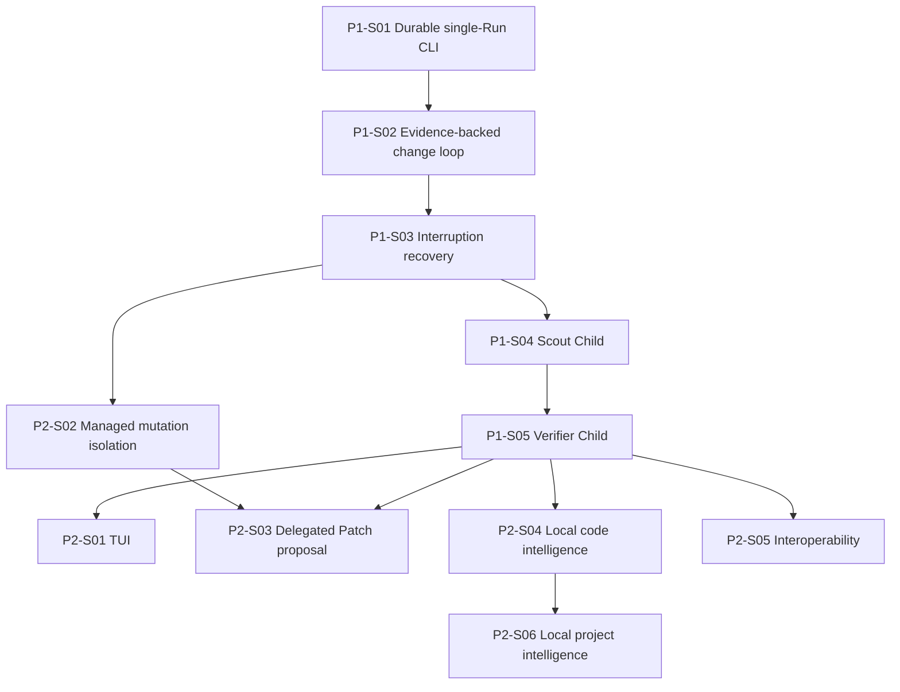

# Roadmap

**Document type:** Implementation-order authority  
**Decision status:** Proposed P0-W18 reconciliation; owner acceptance required  
**Integration status:** Proposed on `work/p0-w18-product-scope-architecture`  
**Implementation status:** No product slice implemented  
**Product-scope authority:** `docs/PRODUCT-SCOPE-AND-MINIMUM-ARCHITECTURE.md`

## Roadmap rule

Kiln is implemented through vertical user workflows.

A slice must produce usable behavior, deterministic tests, an explicit security boundary, a demo, and a bounded Receipt.

A slice does not complete a subsystem merely because the long-term architecture describes it.

Build authorization has not been issued.

# Product sequence

```text
one durable CLI Run
→ one real evidence-backed change
→ interruption and unknown-effect recovery
→ one bounded read-only Scout Child
→ one independent Verifier Child
→ optional TUI projection
→ managed mutation isolation
→ local code intelligence
→ evidence-driven interoperability
→ local project intelligence
```

The sequence proves a coding workflow before it proves a Run graph interface, generalized infrastructure, protocols, or indexes.

# Phase 0 — Planning completion

## Integrated planning

| ID | Outcome | Status |
| --- | --- | --- |
| P0-W01 through P0-W15 | Foundation, domain, Capability, Context, Git, delegation, interface, knowledge, security, and execution planning | Integrated |
| P0-W16 | Integrated architecture and earlier vertical roadmap | Integrated through pull requests 20 and 21 |
| P0-W17 | Planning-completion baseline | Integrated through pull request 22 |
| P0-W18 | Product, scope, and minimum architecture reconciliation | Proposed on current branch |

## Remaining planning-completion sequence

```text
P0-W18  product, scope, and minimum architecture
→ Prompt 3  implementation and scaffold reconciliation
→ Prompt 4  remaining planning-round register
→ Prompt 5  required focused planning rounds
→ Prompt 6  justified conformance scaffolding
→ Prompt 7  independent adversarial review
→ Prompt 8  adjudication and build authorization
```

## Phase 0 exit

Phase 0 exits only after Prompt 8 issues explicit build authorization.

A named first ticket, accepted architecture, passing documentation CI, or existing JSON Schema does not authorize construction.

---

# Phase 1 — Change-loop-first product slices

## P1-S01 — Durable single-Run CLI

**Purpose:** establish the smallest durable Kiln work boundary before model or mutation complexity.

### User-visible outcome

A developer can open one Repository, record one objective and criteria, create one Session, Task, and Root Run, inspect status through the CLI, restart Kiln, and return to the same work state.

### Deliver

- one active Project and Repository boundary;
- Session, Task, Root Run, and minimum lifecycle;
- append-oriented SQLite journal;
- current projections;
- transcript records separate from domain events;
- CLI start, status, inspect, cancel, and resume actions;
- restart reconstruction;
- one bounded slice Receipt.

### Explicit exclusions

- provider invocation;
- source mutation;
- Commands;
- Child Runs;
- TUI;
- Capability broker service;
- code intelligence;
- protocols.

### Exit

The same objective, criteria, Task, Root Run, current status, warnings, and user decisions are reconstructed after restart without treating a transcript summary as state.

### Proposed ticket sequence

| Ticket | Outcome |
| --- | --- |
| P1-S01-T01 | Minimal Project subset, Session, Task, Run, Event, identifiers, and pure transition rules |
| P1-S01-T02 | SQLite journal transaction and migration boundary |
| P1-S01-T03 | Current Session, Task, and Run projections plus deterministic replay |
| P1-S01-T04 | CLI start, status, inspect, cancel, and resume actions |
| P1-S01-T05 | Restart, duplicate-event, invalid-transition, and Receipt fixtures |

No ticket plan is accepted until Prompt 8 authorizes implementation.

## P1-S02 — Evidence-backed single-Run change loop

**Purpose:** prove Kiln's complete coding value in one Root Run.

### User-visible outcome

A developer can ask one model to investigate the active Repository, inspect one exact Patch proposal, approve it, apply it, run one registered verification Command, and accept completion only when current Evidence passes.

### Deliver

- one provider-neutral behaviour;
- deterministic fake provider;
- one configured real provider adapter;
- explicit Context package and manifest;
- at most four model-facing Tools;
- native bounded Repository read and exact search;
- Claims separated from source observations;
- exact base-bound Patch proposal;
- explicit user Approval for the Patch digest;
- transactional Patch application and rollback reference;
- one registered non-shell verification Command;
- transient model and Command Workers;
- initial Artifact store;
- criterion Evidence and completion Receipt;
- recovery without automatic repeat of uncertain effects.

### Explicit exclusions

- Child Runs;
- background concurrency;
- TUI;
- managed worktrees;
- arbitrary shell;
- general model router;
- general Capability broker;
- Skills;
- LSP or Tree-sitter;
- protocols.

### Exit

One real source change moves from accepted intent to user-accepted verified completion. Failed, blocked, stale, contradictory, or orphaned Evidence prevents completion.

### First-month milestone — Single-Run Change Alpha

P1-S01 and P1-S02 form the first-month target.

```text
open Repository
→ record objective and criteria
→ investigate through bounded reads
→ propose exact Patch
→ approve Patch digest
→ apply Patch
→ run registered verification
→ inspect current Evidence
→ accept completion
→ restart and restore the record
```

## P1-S03 — Interruption and unknown-effect recovery

**Purpose:** make model, Patch, Command, and application interruption safe and honest.

### User-visible outcome

The developer can cancel active execution, restart after failure, inspect the last durable boundary, and reconcile uncertain effects without Kiln claiming success or repeating work automatically.

### Deliver

- explicit model and Command cancellation;
- primary-platform process-tree control;
- timeout behavior;
- Patch rollback and partial-failure fixtures;
- `orphaned` state and reconciliation actions;
- idempotency keys for external-effect requests;
- stale Evidence invalidation;
- retained dirty work and safe cleanup decisions;
- recovery-focused CLI output.

### Exit

Every interrupted model invocation, Patch, and Command resolves to a known failure, cancellation, rollback, or explicit orphaned state.

## P1-S04 — One bounded Scout Child

**Purpose:** earn the Run graph through one useful delegated investigation.

### User-visible outcome

The Root Run can create one read-only Scout Child, continue or wait, inspect the Child through the CLI, respond to a blocking question, cancel it, and receive one bounded evidence-backed result.

### Deliver

- one depth-one Child Run;
- maximum one active Child per Session;
- immutable delegation contract;
- independent Child Context and narrower grants;
- one transient Child Worker lease;
- bounded result delivery;
- Root-visible Attention for question, permission, failure, and completion;
- CLI Run list, inspect, enter, return-to-Root, answer, deny, and cancel;
- no source mutation;
- no nested delegation.

### Exit

A real Scout Child improves investigation without hidden work, ambient authority, transcript copying, or recursive management.

## P1-S05 — Independent Verifier Child

**Purpose:** separate completion Evidence from author confidence.

### User-visible outcome

The Root Run can create one Verifier Child with independent Context and read-only authority. The Child reproduces required checks and returns `PASS`, `FAIL`, or `BLOCKED` without repairing the evaluated change.

### Deliver

- Verifier role contract;
- independent criteria and state package;
- no author-confidence narrative in initial Context;
- no write or Patch Tool;
- controlled reuse of registered Commands;
- structured result and Evidence freshness;
- bounded Parent delivery;
- verification Receipt;
- CLI comparison of Root Claim and Verifier result.

### Exit

Completion can require an independently reproduced result that cannot be converted to `PASS` by the authoring model, a Receipt, or missing tooling.

### Version 0.1 milestone — Trustworthy Delegated CLI

Version 0.1 is complete through P1-S05.

It includes:

- one complete durable source-change loop;
- one read-only Scout Child;
- one independent Verifier Child;
- maximum Child depth one;
- maximum one active Child;
- Root-visible Attention;
- exact mutation and Command controls;
- current Evidence and Receipts;
- restart and orphan recovery;
- CLI access to all required actions and status.

It does not include a TUI, nested or concurrent Child graph, writing Child, managed worktree provisioning, code intelligence, protocols, local project intelligence, telemetry export, or remote execution.

---

# Phase 2 — Evidence-gated expansion

Phase 2 items do not enter version 0.1 merely because planning exists.

## P2-S01 — TUI projection

**Entry conditions:**

- CLI commands and projections are stable;
- one real Child workflow exists;
- terminal navigation has actual work to display;
- the chosen TUI library passes a focused dependency and headless-behavior review.

**Outcome:** a renderer-independent Run-focused TUI consumes existing commands and projections without becoming state authority.

## P2-S02 — Managed mutation isolation

**Entry conditions:**

- the single selected checkout creates a measured safety or concurrency limitation;
- Patch application and recovery are stable;
- worktree lifecycle and cleanup planning is accepted.

**Outcome:** one managed exclusive worktree supports an authorized mutation owner. Writing Children remain separately gated.

## P2-S03 — Safe delegated Patch proposal

**Entry conditions:**

- Scout and Verifier Child boundaries are stable;
- managed mutation isolation is available when required;
- Patch proposal quality and review cost justify delegated authoring.

**Outcome:** one read-only Child returns an immutable Patch Artifact. The Root or authorized applying Run owns application and verification.

## P2-S04 — Local code intelligence

**Entry conditions:**

- deterministic source search has measured retrieval, latency, or token failures;
- one supported language workflow is accepted;
- parser and language-server lifecycle planning is complete.

**Outcome:** Tree-sitter, selected read-only LSP operations, version-matched documentation, and an optional normalized cache improve bounded active-Repository Context.

## P2-S05 — Capability interoperability

**Entry conditions:**

- native requests, results, policy, Evidence, and recovery are stable;
- one concrete external Client, capability, service, or Environment exists;
- simpler function, library, CLI, or API options were evaluated.

**Candidates:**

- ACP Client adapter;
- one MCP client capability;
- one OpenAPI capability;
- one accepted Dev Container or OCI Environment.

No requirement exists to implement every candidate.

## P2-S06 — Local project intelligence

**Entry conditions:**

- active-Repository retrieval is stable and useful;
- explicit approved roots and no-execution policy exist;
- instruction quarantine, licensing, secret screening, and disclosure planning is accepted;
- a measured user workflow justifies cross-project Evidence.

**Outcome:** read-only provenance-bearing pattern retrieval from approved repositories without product-direction or authority contamination.

## Research register

The following remain research or rejected-for-now candidates rather than implementation slices:

- DAP;
- AG-UI;
- MCP server;
- SCIP import or export;
- AHP;
- A2A;
- WASI and WIT;
- in-toto and SLSA export;
- OTLP export;
- embeddings and hosted retrieval.

Prompt 4 determines whether any candidate earns a focused planning round.

# Dependency graph



# Delivery targets

## First month

| Weeks | Product outcome |
| --- | --- |
| 1–2 | Durable single-Run CLI and restart |
| 3–4 | Real evidence-backed Patch and verification loop |

The first-month target must produce a real source change. It is not complete if it only renders simulated Runs, validates Schemas, or builds internal services.

## Twelve weeks

| Weeks | Product outcome |
| --- | --- |
| 1–4 | Single-Run Change Alpha |
| 5–6 | Interruption, timeout, rollback, and orphan recovery |
| 7–9 | One bounded read-only Scout Child and Root-visible Attention |
| 10–12 | Independent Verifier Child and version 0.1 aggregate proof |

The target supports one active Repository, one Session per CLI process, one Root Run, one active depth-one Child, one provider, and one primary operating-system process-control target.

# First implementation ticket status

No implementation ticket is accepted or authorized.

After Prompt 8 authorizes construction, the expected first ticket is:

**P1-S01-T01 — Define the minimal Project, Session, Task, Run, Event, and transition model.**

It should implement only the pure data and rules required by P1-S01. It must not add provider code, Patch application, Commands, Child Runs, TUI, protocols, or a process per Run.

Prompt 3 must first reconcile current scaffolding and conformance with this target.

# Slice completion

A slice completes only when:

- all accepted tickets are integrated;
- deterministic tests pass against one exact state;
- security and failure gates pass;
- the user-visible demo passes;
- required Evidence is current;
- the aggregate Receipt references the exact state;
- warnings, exclusions, and unknowns remain visible;
- the owner or accepted policy accepts the milestone when required;
- roadmap status is updated.

A green obsolete check, model summary, planned gate name, Schema, or collection of merged tickets does not complete a slice.

# Roadmap-change policy

A roadmap change must record:

- the user or dogfood workflow;
- current blocking Evidence;
- product, dependency, and security consequences;
- identifiers and migration effects;
- new acceptance and demo gates;
- explicit scope removed as well as added.

Do not append a subsystem without pruning or re-evaluating current scope.
