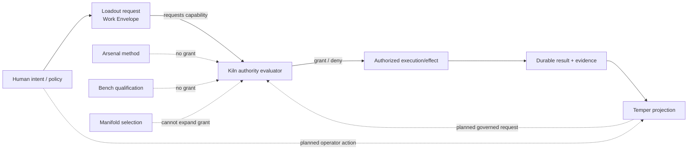

# Authority Flow

Loadout's real driver embodies the current boundary operationally: a denied Kiln authority decision prevents the procedure from running.

The Temper → Kiln operator-action edge is a **planned control-path rule**, not current Temper ownership and not a blanket claim that Workbench actions exist. If implemented, Temper may ask Kiln to perform an operation; Kiln must validate authority, current state, and action semantics and remain the durable source of resulting truth.

A remote topology does not change this rule. The operator host may be physically separate from the execution host without receiving the execution authority held by Kiln.
