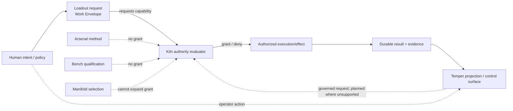

# Authority Flow

Loadout's real driver embodies the current boundary operationally: a denied Kiln authority decision prevents the procedure from running.

The Temper → Kiln operator-action edge is an architectural control-path rule, not a blanket claim that every planned Workbench action already exists. When implemented, Temper may ask Kiln to perform an operation; Kiln must still validate authority, current state, and action semantics and must remain the durable source of resulting truth.

A remote topology does not change this rule. The operator host may be physically separate from the execution host without receiving the execution authority held by Kiln.
