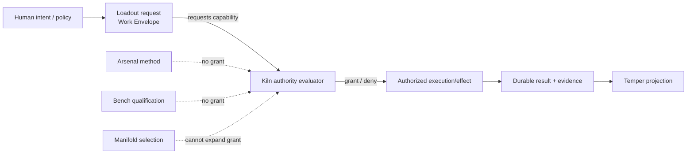

# Authority Flow

Loadout's real driver embodies this boundary operationally: a denied Kiln authority decision prevents the procedure from running.

The diagram does not imply every future human-approval step is already implemented across the whole Development Loop. It shows the current ownership rule that future slices must preserve.
