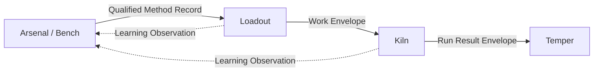

# Data Flow



The canonical contract documents live at the repository root. Products keep language-specific adapters and types but must not create competing canonical semantics.

The experimental Learning Observation v0 contract names **Loadout or Kiln** as producers through an explicit reviewed projection and **Arsenal** as the consumer. An observation is not qualification evidence by itself and has no automatic path into Kiln enforcement.

## Current real path

Repository Recon exercises the middle of this graph now:

```text
Loadout Plan
→ Work Envelope v0
→ Kiln supervision
→ Run Result Envelope v0
→ Temper projection
```

## Qualification and selection

Qualified Method Record v0 exists as a cross-product contract and Arsenal/Bench produce qualification-related evidence. Manifold's future assignment/selection output is not yet a runtime contract in this monorepo. Do not add one merely to make a diagram symmetrical.
