# Evidence Flow

```mermaid
flowchart LR
    P[Proposal / prepared work]
    X[Execution + effects]
    V[Registered verification]
    D[Decision / acceptance]
    RR[Run Result projection]
    LO[Learning Observation]
    AR[Arsenal learning / adjudication]
    BE[Bench evaluation / qualification evidence]

    P --> X --> V --> D --> RR
    RR -. reviewed projection .-> LO
    LO --> AR
    AR -. only when justified by evaluation work .-> BE
```

The current repository implements meaningful parts of the runtime flow, but not a single complete Development Loop that exercises every box exactly as drawn.

Learning Observation v0 names Loadout or Kiln as producers and Arsenal as the consumer. It explicitly forbids treating an observation as a Claim, qualification, or policy and provides no automatic path into Kiln enforcement. Bench may later participate when Arsenal determines that controlled evaluation or qualification work is justified; the observation itself is not Bench evidence.

The important architectural property is separation: runtime evidence about a specific change is not automatically qualification evidence about a model, and qualification evidence does not become permission to mutate a repository.
