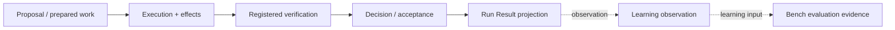

# Evidence Flow

The current repository implements meaningful parts of this flow, but not a single complete Development Loop that exercises every box exactly as drawn.

The important architectural property is separation: runtime evidence about a specific change is not automatically qualification evidence about a model, and qualification evidence does not become permission to mutate a repository.
