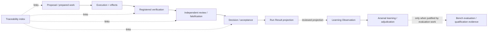

# Evidence Flow

The exact degree of runtime automation for these stages varies by current repository state; this page describes the evidence boundaries the system must preserve. Check [Current system status](../status.md) before treating the whole diagram as an implemented product path.

A traceability record indexes authoritative artifacts. It does not transform evidence, approve it, or make a model's narrative authoritative.

Learning Observation v0 names Loadout or Kiln as producers and Arsenal as the consumer. It explicitly forbids treating an observation as a Claim, qualification, or policy and provides no automatic path into Kiln enforcement. Bench may later participate when Arsenal determines that controlled evaluation or qualification work is justified; the observation itself is not Bench evidence.

## Evidence versus judgment

Verification establishes bounded facts about a particular state and command/scenario. Independent review challenges whether those facts support the intended property and whether important negative cases were missed. A human decision, where required, accepts/revises/rejects the work; it is not inferred from test success.

The important architectural property is separation: runtime evidence about a specific change is not automatically qualification evidence about a model, qualification evidence does not become permission to mutate a repository, and documentation does not turn either one into acceptance.

See [Engineering traceability](../reference/traceability.md) for the minimal relationship that should remain visible during active work.
