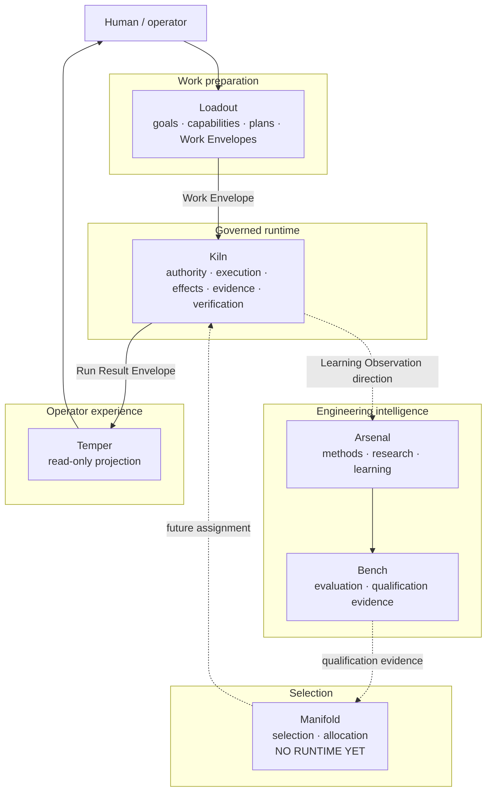

# System Map

Solid edges are present in the current Repository Recon system where applicable. Dashed edges represent architecture that is either indirect or not yet implemented end to end.

## Canonical shared surfaces

`contracts/` defines the cross-product facts. `integration/` proves selected cross-product behavior. `program/` preserves decisions, planning, and history. None is a peer product.
