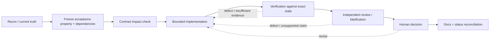

# Evidence-Driven Engineering Process

Invariant documentation participates in the engineering process without becoming runtime authority. The docs define accepted direction, boundaries, dependencies, acceptance properties, and required evidence; implementation and executable evidence determine what is actually true.

The practical goal is low-friction confidence: an engineer should be able to enter a work package, identify the governing contracts and unresolved decisions, know what proof is required, and follow the resulting evidence through review and human acceptance without reconstructing the system from chat history.

## Start gate

Before implementation, read only the surfaces needed to establish the current contract:

1. [Current status](../status.md) for the last evidence-backed maturity claim.
2. [Product boundaries](../architecture/product-boundaries.md) for ownership and negative authority rules.
3. [Cross-product contracts](../architecture/contracts.md) for producer/consumer semantics.
4. The relevant product documentation and roadmap.
5. [Traceability](../reference/traceability.md) for the work-package evidence chain.

Do not treat a roadmap, prior agent summary, green aggregate test count, or model completion report as proof of the property being changed.

## Work-package contract

Every consequential work package should be able to answer the following. This may live in an existing state/handoff file; do not create duplicate paperwork when an authoritative record already exists.

```text
WORK_PACKAGE =
OBJECTIVE =
ACCEPTANCE_PROPERTY =
AUTHORITATIVE_INPUTS =
OWNER / DECISION_AUTHORITY =
CONTRACTS_CONSUMED =
CONTRACTS_CHANGED =
DEPENDENCIES =
PARALLEL_SAFE_WITH =
STATE_BASIS = branch/worktree + base SHA
IMPLEMENTATION_SURFACE =
REQUIRED_EVIDENCE =
VERIFICATION =
INDEPENDENT_REVIEW =
HUMAN_DECISION =
DOCUMENTATION_IMPACT =
STATUS =
```

The record is an index into truth, not a substitute for it. Link to contracts, source, tests, evidence artifacts, accepted SHAs, and decision records rather than copying their contents into a second ledger.

## Change loop



The stages are process requirements; they are not a claim that every stage is automated by current Invariant runtime code.

## Contract gate

Before changing a producer/consumer boundary:

- name the canonical contract;
- enumerate current producers and consumers;
- identify compatibility and migration behavior;
- identify stale/conflicting state behavior;
- decide whether retries/idempotency or recovery semantics change;
- define negative tests that prove authority cannot expand accidentally.

A local type change that silently forks a root contract is a defect even when its product tests pass.

## Evidence gate

Required evidence should be chosen from the acceptance property backward. Prefer the smallest set that demonstrates the property and its important negative cases.

At minimum, consequential work should record:

- exact repository/worktree state under test;
- commands or executable scenarios run;
- relevant output/artifact locations;
- negative/failure cases when authority, recovery, freshness, or completion semantics are involved;
- reviewer identity/context when independence matters;
- the explicit human decision when acceptance is required.

Passing tests are evidence. They are not the judgment that the intended property was proven.

## Parallelization rule

Parallel work is safe when it does not consume an unresolved decision, shared mutable contract, or state another lane is still defining. Documentation/recon, independent falsification against frozen inputs, and tests of already-defined contracts are often parallel-safe. Implementation against an unsettled authority boundary is not.

When in doubt, freeze the shared contract first and fan out second.

## Closeout gate

A work package is not ready to disappear into history until:

- the accepted implementation/evidence state is identified;
- the relevant verification and independent review results are linked;
- unresolved limitations are preserved;
- the human decision is explicit where required;
- [traceability](../reference/traceability.md) can connect requirement → contract → implementation → evidence → decision;
- current documentation and roadmap status are reconciled without rewriting historical records.

If the implementation lives only in an unmerged/local branch, documentation may record the direction or reported state, but must not upgrade the main current-status claim until the evidence basis is inspectable from the documented repository state.
