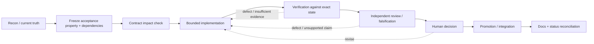

# Evidence-Driven Engineering Process

Invariant documentation participates in the engineering process without becoming runtime or acceptance authority. The docs define accepted direction, boundaries, dependencies, acceptance properties, and required evidence; implementation, executable evidence, independent review, and explicit human decisions determine what is actually accepted.

The practical goal is low-friction confidence: an engineer should be able to enter a work package, identify governing contracts and unresolved decisions, know what proof is required, and follow the resulting evidence through review and human acceptance without reconstructing the system from chat history.

## Start gate

Before implementation, establish:

1. the current evidence-bound state and authoritative handoff;
2. the intended acceptance property;
3. product ownership and negative authority rules;
4. consumed or changed contracts;
5. dependencies and unresolved shared decisions;
6. evidence and independent-review requirements;
7. whether a human decision is required before promotion/integration.

Do not treat a roadmap, prior agent summary, green aggregate test count, model completion report, or documentation CI result as proof of the property being changed.

## Acceptance-sensitive state

Documentation consumption and Git-history integration are separate operations.

If an active work package has not already reached an immutable candidate plus required verification, independent review, and explicit human acceptance, documentation work must not mutate that evidence-bound worktree merely for convenience.

Use a reviewed documentation state read-only, preferably pinned to an exact commit in a detached worktree:

```bash
git worktree add --detach ../invariant-documentation <reviewed-docs-sha>
```

Do not finish an acceptance decision on the owner's behalf. Do not rebind product evidence to a later documentation-only commit. Until an existing authoritative decision record or explicit owner decision says otherwise:

```text
HUMAN_DECISION = PENDING
```

Repository-history integration of documentation should wait for a safe acceptance boundary when integrating it earlier would change the candidate identity under review.

## Work-package contract

Every consequential work package should be able to answer the following. This may live in an existing state/handoff file; do not create duplicate paperwork when an authoritative record already exists.

```text
WORK_PACKAGE =
OBJECTIVE =
ACCEPTANCE_PROPERTY =
AUTHORITATIVE_INPUTS =
OWNER =
DECISION_AUTHORITY =
CONTRACTS_CONSUMED =
CONTRACTS_CHANGED =
DEPENDENCIES =
UNRESOLVED_DECISIONS =
PARALLEL_SAFE_WITH =
STATE_BASIS = worktree + branch + base SHA + candidate SHA
IMPLEMENTATION_SURFACE =
REQUIRED_EVIDENCE =
PRODUCED_EVIDENCE =
VERIFIED_EVIDENCE =
VERIFICATION =
INDEPENDENT_REVIEW =
HUMAN_DECISION =
DOCUMENTATION_IMPACT =
OPEN_UNCERTAINTY =
STATUS =
```

The record is an index into truth, not a substitute for it. Link to contracts, source, tests, evidence artifacts, accepted SHAs, and decision records rather than copying their contents into a second ledger.

## Change loop



The stages are process requirements; they are not a claim that every stage is automated by current Invariant runtime code.

## Contract gate

Before changing a producer/consumer boundary:

- name the canonical contract;
- enumerate current producers and consumers;
- identify compatibility and migration behavior;
- identify stale/conflicting state behavior;
- decide whether retries/idempotency or recovery semantics change;
- define negative tests that prove authority cannot expand accidentally.

A local type change that silently forks a root contract is a defect even when its product tests pass.

## Evidence gate

Required evidence should be chosen from the acceptance property backward. Prefer the smallest set that demonstrates the property and its important negative cases.

At minimum, consequential work should record:

- exact repository/worktree state under test;
- commands or executable scenarios run;
- relevant output/artifact locations;
- negative/failure cases when authority, recovery, freshness, or completion semantics are involved;
- reviewer identity/context when independence matters;
- the explicit human decision when acceptance is required.

Passing tests are evidence. They are not the judgment that the intended property was proven.

## Independent review contract

For consequential work requiring independent review:

```text
IMPLEMENTER != INDEPENDENT_REVIEWER
```

The reviewer is read-only against an immutable candidate and does not repair that candidate during review. The reviewer should separate:

```text
DEMONSTRATED_DEFECTS
SPECULATIVE_CONCERNS
UNPROVEN_PROPERTIES
```

The implementer may repair demonstrated defects. Any repair creates a new candidate; the independent reviewer must then re-check that repaired candidate. Approval of an older SHA is not approval of the new one.

Independent review is also not human acceptance unless an explicit governing contract assigns those authorities to the same human. Do not assume that equivalence.

## Parallelization rule

Parallel work is safe when it does not consume an unresolved decision, shared mutable contract, or state another lane is still defining. Documentation/recon, independent falsification against frozen inputs, and tests of already-defined contracts are often parallel-safe. Implementation against an unsettled authority boundary is not.

When in doubt, freeze the shared contract first and fan out second.

## Documentation integration guard

Before integrating a reviewed documentation commit into an engineering branch:

1. record `PRE_DOCS_INTEGRATION_HEAD` and the accepted product candidate identity;
2. check whether the exact docs commit is already an ancestor;
3. if not, check whether an equivalent patch is already present under another SHA;
4. integrate only at a state where changing branch history does not invalidate product acceptance evidence;
5. validate the integrated range, not merely an empty working tree.

Example range check:

```bash
git diff --check "$PRE_DOCS_INTEGRATION_HEAD..$POST_DOCS_INTEGRATION_HEAD"
```

Never silently rebind `ACCEPTED_PRODUCT_CANDIDATE_SHA` to `POST_DOCS_INTEGRATION_HEAD` when the latter includes documentation-only changes.

## Closeout gate

A work package is not ready to disappear into history until:

- the accepted implementation/evidence state is identified;
- relevant verification and independent review results are linked;
- unresolved limitations are preserved;
- the human decision is explicit where required;
- [traceability](../reference/traceability.md) can connect requirement → contract → implementation → evidence → review → decision;
- current documentation and roadmap status are reconciled without rewriting historical records.

If the implementation lives only in an unmerged/local branch, documentation may record the direction or reported state, but must not upgrade the main current-status claim until the evidence basis and decision are inspectable from the documented repository state.

If the process/documentation integration itself still has `HUMAN_DECISION = PENDING`, stop after the completion report. Verification and independent review do not authorize entry into the next implementation lane by themselves.
