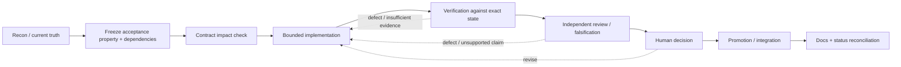

# Evidence-Driven Engineering Process

Invariant documentation participates in the engineering process without becoming runtime or acceptance authority. The docs define accepted direction, boundaries, dependencies, acceptance properties, and required evidence; implementation, executable evidence, independent review, and explicit human decisions determine what is actually accepted.

The practical goal is low-friction confidence: an engineer should be able to enter a work package, identify governing contracts and unresolved decisions, know what proof is required, and follow the resulting evidence through review and human acceptance without reconstructing the system from chat history.

## Start gate

Before implementation, establish:

1. the current evidence-bound state and authoritative handoff;
2. the intended acceptance property;
3. product ownership and negative authority rules;
4. consumed or changed contracts;
5. dependencies and unresolved shared decisions;
6. evidence and independent-review requirements;
7. whether a human decision is required before promotion/integration.

Do not treat a roadmap, prior agent summary, green aggregate test count, model completion report, or documentation CI result as proof of the property being changed.

## Acceptance-sensitive state

Documentation consumption and Git-history integration are separate operations.

If an active work package has not already reached an immutable candidate plus required verification, independent review, and explicit human acceptance, documentation work must not mutate that evidence-bound worktree merely for convenience.

Use a reviewed documentation state read-only, preferably pinned to an exact commit in a detached worktree:

```bash
git worktree add --detach ../invariant-documentation <reviewed-docs-sha>
```

Do not finish an acceptance decision on the owner's behalf. Do not rebind product evidence to a later documentation-only commit. Until an existing authoritative decision record or explicit owner decision says otherwise:

```text
HUMAN_DECISION = PENDING
```

Repository-history integration of documentation should wait for a safe acceptance boundary when integrating it earlier would change the candidate identity under review.

## Work-package contract

Every consequential work package should be able to answer the following. This may live in an existing state/handoff file; do not create duplicate paperwork when an authoritative record already exists.

```text
WORK_PACKAGE =
OBJECTIVE =
ACCEPTANCE_PROPERTY =
AUTHORITATIVE_INPUTS =
OWNER =
DECISION_AUTHORITY =
CONTRACTS_CONSUMED =
CONTRACTS_CHANGED =
DEPENDENCIES =
UNRESOLVED_DECISIONS =
PARALLEL_SAFE_WITH =
STATE_BASIS = worktree + branch + base SHA + candidate SHA
IMPLEMENTATION_SURFACE =
REQUIRED_EVIDENCE =
PRODUCED_EVIDENCE =
VERIFIED_EVIDENCE =
VERIFICATION =
INDEPENDENT_REVIEW =
HUMAN_DECISION =
DOCUMENTATION_IMPACT =
OPEN_UNCERTAINTY =
STATUS =
```

The record is an index into truth, not a substitute for it. Link to contracts, source, tests, evidence artifacts, accepted SHAs, and decision records rather than copying their contents into a second ledger.

The work-package contract should also carry a `RISK_TIER` (one of `Tier 0`, `Tier 1`, `Tier 2`, `Tier 3`) classified by the property below. The tier determines verification burden; it is not project-management metadata.

## Risk-scaled verification

Apply the minimum process necessary to prove the property at risk. Increase verification burden only when a change can affect authority, canonical state, shared contracts, provenance, recovery, or completion truth. This is the principle the four tiers below implement.

### Tier model

Classify the change by the worst property it can affect, not by the size of the diff.

```text
Tier 0  local / mechanically bounded
        copy changes, styling, isolated refactors,
        deterministic transformations, obvious local
        defects with negligible shared-state impact

Tier 1  bounded behavioral change
        provider adapters using an existing contract,
        UI projections, CLI/parser behavior, small
        runtime features, localized error handling

Tier 2  shared contract / state boundary
        serialization, canonical Session state,
        cross-product interfaces, reconnect/recovery
        semantics, provider contracts, shared schemas,
        persistent compatibility

Tier 3  authority / completion truth
        authorization, governed mutation, approval,
        completion semantics, provenance/evidence,
        qualification, independent review authority,
        human decision authority, recovery truth
```

### Verification burden by tier

```text
Tier 0
  focused validation; relevant tests/lint/build;
  no independent-review ceremony unless
  implementation discovers additional risk

Tier 1
  explicit acceptance property; focused regression
  coverage; an appropriate public-boundary or
  integration check when the behavior exposes one;
  independent review optional unless discovered
  risk warrants escalation

Tier 2
  frozen acceptance property; regression coverage;
  public-boundary verification; independent review
  of the actual diff and affected contract; explicit
  compatibility / regression assessment

Tier 3
  acceptance property defined before implementation;
  adversarial independent review; reviewer independently
  reconstructs or reproduces the important path where
  possible; public-boundary / end-to-end evidence where
  applicable; explicit accounting of what remains
  unproven; human acceptance remains separate from
  implementation and review
```

These tiers exist to determine verification burden. They are not project-management bureaucracy.

### Three mandatory questions for Tier 1-3 work

Answer these before implementation. Keep the answers concise.

```text
PROPERTY
  What must actually be true when the work is complete?
  Do not describe only the implementation task.

  Bad:    Add Kimi support.
  Better: A canonical provider invocation can use Kimi
          through the existing Kiln provider boundary
          and produce a normalized result without
          transferring execution authority.

BOUNDARY
  Where must the property be demonstrated?
  Examples: unit boundary, public API, CLI subprocess,
  provider seam, filesystem/git boundary, reconnect
  path, governed workflow. Use the smallest boundary
  that genuinely proves the property.

MISLEADING GREEN
  What could make tests pass while the intended
  property is still false?
  Examples: internal functions work but CLI argument
  wiring is broken; fixtures serialize differently
  from runtime state; adapter tests pass but the
  canonical invocation path is broken; initial
  connection works but reconnect/resync is incorrect;
  projection snapshots pass while canonical state
  handling is wrong.
```

This section exists specifically to prevent proxy tests from becoming completion evidence.

### Evidence vocabulary

The repository must clearly distinguish:

```text
REPORTED
  The implementer says something happened.
  This is a claim.

SUPPLIED EVIDENCE
  The implementer provides logs, test output,
  snapshots, artifacts, traces, command results.
  This is evidence, but still implementer-supplied.

INDEPENDENTLY VERIFIED
  A reviewer independently reruns the relevant path,
  inspects repository state, reproduces the behavior,
  or directly verifies the contract or property.

INFERENCE
  A conclusion supported by evidence but not directly
  demonstrated. Label it accordingly.

UNPROVEN
  A material claim for which available evidence is
  insufficient. Do not upgrade unproven claims merely
  because the implementation appears coherent.
```

An implementation-agent completion summary is a **claim set** to evaluate, not authoritative evidence of repository state. Narrative quality must not substitute for proof.

### Frozen acceptance rule

Implementation or repair difficulty does not silently weaken acceptance.

```text
If acceptance requires:        Then internal function
  public CLI behavior           tests passing
  is not a substitute.

If acceptance requires:        Then initial connection
  reconnect restores canonical  succeeding
  Session truth                 is not a substitute.

If acceptance requires:        Then adapter unit tests
  provider-backed governed      passing
  execution                     is not a substitute.
```

Changing acceptance requires an explicit human decision. Repair work must not redefine success by attrition.

### Repair-loop discipline

After a repair attempt fails, do not stack another speculative repair based only on the previous narrative. Use:

```text
failure observed
  → reproduce violated property
  → isolate smallest demonstrated cause
  → repair
  → rerun original failing path
  → run relevant regression
```

Avoid:

```text
failure
  → plausible patch
  → adjacent warning
  → second plausible patch
  → tests become greener
  → completion claim
```

When a material defect escaped prior verification or caused repeated repair work, the report should contain:

```text
DEFECT
  What was actually wrong.

VIOLATED PROPERTY
  Which intended property was false.

ROOT CAUSE
  Demonstrated cause rather than guessed symptom.

WHY PREVIOUS VERIFICATION MISSED IT
  What boundary or property was not exercised.

VERIFICATION REPAIR
  What now detects this failure class.
```

Do not require this for trivial typos or obvious local mistakes. Use it when prior meaningful verification failed.

### Risk can escalate or de-escalate

Initial classification is not permanent. A Tier 0 or Tier 1 task should escalate if implementation discovers effects involving canonical state, shared contracts, authority, provenance, recovery, persistent compatibility, or completion semantics. Likewise, if investigation demonstrates a supposedly high-risk change is mechanically bounded, do not retain Tier-3 ceremony merely because the change was originally feared to be complex.

### Ceremony test

Every process step must protect a named failure mode or acceptance property. If removing it would not materially reduce confidence, remove it.

```text
Do NOT require by default:
  independent review for cosmetic changes
  elaborate evidence directories for trivial
    deterministic changes
  architecture proposals for one-off adapters
  generalized abstractions before repeated
    concrete implementations expose a stable
    common requirement
  full-system E2E tests when a smaller public
    boundary directly proves the property
  postmortems for obvious local mistakes

DO require stronger verification where false
confidence would be expensive.
```

### Existing Invariant doctrine preserved

The tier model must not weaken:

```text
- capability is not authority
- intelligence proposes, infrastructure enforces
- completion requires evidence
- test the property, not the proxy
- independent review must actually be independent
- human decision authority remains human
- canonical truth must not be invented by projections
- provenance matters where mutation or completion
  depends on it
```

This section concentrates rigor, not dilutes it.

## Change loop



The stages are process requirements; they are not a claim that every stage is automated by current Invariant runtime code.

## Contract gate

Before changing a producer/consumer boundary:

- name the canonical contract;
- enumerate current producers and consumers;
- identify compatibility and migration behavior;
- identify stale/conflicting state behavior;
- decide whether retries/idempotency or recovery semantics change;
- define negative tests that prove authority cannot expand accidentally.

A local type change that silently forks a root contract is a defect even when its product tests pass.

## Evidence gate

Required evidence should be chosen from the acceptance property backward. Prefer the smallest set that demonstrates the property and its important negative cases.

At minimum, consequential work should record:

- exact repository/worktree state under test;
- commands or executable scenarios run;
- relevant output/artifact locations;
- negative/failure cases when authority, recovery, freshness, or completion semantics are involved;
- reviewer identity/context when independence matters;
- the explicit human decision when acceptance is required.

Passing tests are evidence. They are not the judgment that the intended property was proven.

## Independent review contract

For consequential work requiring independent review:

```text
IMPLEMENTER != INDEPENDENT_REVIEWER
```

The reviewer is read-only against an immutable candidate and does not repair that candidate during review. The reviewer should separate:

```text
DEMONSTRATED_DEFECTS
SPECULATIVE_CONCERNS
UNPROVEN_PROPERTIES
```

The implementer may repair demonstrated defects. Any repair creates a new candidate; the independent reviewer must then re-check that repaired candidate. Approval of an older SHA is not approval of the new one.

Independent review is also not human acceptance unless an explicit governing contract assigns those authorities to the same human. Do not assume that equivalence.

## Parallelization rule

Parallel work is safe when it does not consume an unresolved decision, shared mutable contract, or state another lane is still defining. Documentation/recon, independent falsification against frozen inputs, and tests of already-defined contracts are often parallel-safe. Implementation against an unsettled authority boundary is not.

When in doubt, freeze the shared contract first and fan out second.

## Documentation integration guard

Before integrating a reviewed documentation commit into an engineering branch:

1. record `PRE_DOCS_INTEGRATION_HEAD` and the accepted product candidate identity;
2. check whether the exact docs commit is already an ancestor;
3. if not, check whether an equivalent patch is already present under another SHA;
4. integrate only at a state where changing branch history does not invalidate product acceptance evidence;
5. validate the integrated range, not merely an empty working tree.

Example range check:

```bash
git diff --check "$PRE_DOCS_INTEGRATION_HEAD..$POST_DOCS_INTEGRATION_HEAD"
```

Never silently rebind `ACCEPTED_PRODUCT_CANDIDATE_SHA` to `POST_DOCS_INTEGRATION_HEAD` when the latter includes documentation-only changes.

## Closeout gate

A work package is not ready to disappear into history until:

- the accepted implementation/evidence state is identified;
- relevant verification and independent review results are linked;
- unresolved limitations are preserved;
- the human decision is explicit where required;
- [traceability](../reference/traceability.md) can connect requirement → contract → implementation → evidence → review → decision;
- current documentation and roadmap status are reconciled without rewriting historical records.

If the implementation lives only in an unmerged/local branch, documentation may record the direction or reported state, but must not upgrade the main current-status claim until the evidence basis and decision are inspectable from the documented repository state.

If the process/documentation integration itself still has `HUMAN_DECISION = PENDING`, stop after the completion report. Verification and independent review do not authorize entry into the next implementation lane by themselves.
