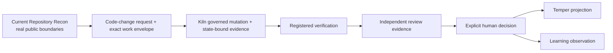

# Invariant Roadmap

This roadmap is a reconciliation, not a concatenation of older plans.

`program/PROJECT-STATE.md` and `program/DEPENDENCIES.md` preserve an earlier multi-repository launch phase and are not used as current execution order. Product-local roadmaps remain valuable where they describe accepted product sequencing, but system milestones still need to respect current cross-product boundaries.

A roadmap records intent and dependencies. It does **not** grant implementation or execution authority.

## NOW — demonstrated foundation

| Milestone | Owner | Acceptance property | Evidence |
| --- | --- | --- | --- |
| Canonical monorepo | Invariant root | one Git root without collapsing product boundaries | root checks, migration record, boundary policy |
| Repository Recon real golden path | Loadout + Kiln + Temper | Work Envelope crosses real Kiln boundary and result is truthfully projected | `integration/scenarios/repository-recon/run.sh` |
| Arsenal capability/evaluation foundation | Arsenal + Bench | reusable methods/capability artifacts are machine checked and evaluation claims remain scoped | Arsenal gates + Bench v0 corpus |
| Durable runtime foundation | Kiln | current Run/authority/evidence/verification foundations survive repository-native gates | Kiln implementation/tests + migration CI record |
| Read-only real-run workbench | Temper | operator can inspect accepted plan/run facts without Temper inventing authority | Temper tests + Repository Recon |

## NEXT — smallest coherent system advance

The next system milestone is **Development Loop v0: one real code change through the intended public boundaries**.

It should not begin as six unrelated feature streams. Several pieces consume unresolved or dependency-sensitive boundaries.

### NEXT dependency graph

| Milestone | Owning product | Problem | Prerequisites / dependencies | Acceptance property | Required evidence | Status / blocker |
| --- | --- | --- | --- | --- | --- | --- |
| DL0-1 Code-change envelope | Loadout + contract consumers | prepare a real change request without granting authority | current Plan/Work Envelope; existing verify-change work; contract review if semantics change | one bounded change request is representable without hidden execution policy | contract fixtures + Loadout tests + consumer tests | `partial`; exact system-level request shape must be reconciled with current implementation |
| DL0-2 Governed mutation slice | Kiln | turn an authorized exact proposal into an observed repository effect | Kiln's accepted product slice ordering; exact base-state binding; one mutation owner | unauthorized/stale proposal cannot mutate; authorized exact bytes produce observable bounded effect | negative tests, state binding, durable effect record, restart/reconciliation evidence | `planned`; must follow Kiln authorization rather than docs roadmap |
| DL0-3 Verification binding | Kiln | prove required checks ran against the exact accepted state | DL0-2; current registered verification | required verification is registry-bound, state-bound, and cannot be replaced by arbitrary shell success | command/evidence artifacts + negative stale-state cases | `partial`; registered verification exists, full change-loop binding remains to prove |
| DL0-4 Independent review | Arsenal method + Kiln runtime evidence | challenge implementation without letting implementer self-grade | DL0-3; reviewer independence semantics; no Manifold requirement unless selection is genuinely needed | reviewer receives bounded independent context and cannot fabricate acceptance | review artifact/evidence + independence proof + falsification cases | `planned`; exact reviewer-selection/representation boundary unresolved |
| DL0-5 Human decision | Kiln-owned durable truth, surfaced by Temper | record accept/revise without moving authority into UI | DL0-4; decision schema/state owner | human decision is explicit, durable, attributable, and cannot be inferred from passing tests | decision record + projection tests + denial/absence cases | `planned`; operator action surface must not make Temper canonical authority |
| DL0-6 Learning observation | Arsenal / Bench consumer | preserve useful outcome evidence without laundering one run into broad efficacy | DL0-5; Learning Observation contract | runtime observation retains scope/provenance and does not auto-promote capability/model lifecycle | contract fixture + consumer validation | `planned` |
| DL0-7 Whole-loop acceptance | Invariant integration | prove the property through public boundaries | DL0-1 through DL0-6 | one real code change traverses public boundaries, fails closed, survives required restart/review checks, and ends with explicit human decision | clean end-to-end scenario + negative matrix + exact commit/state receipts | `planned` |

## Parallel-safe vs dependency-sensitive work

Safe to advance independently when it does not consume unsettled runtime semantics:

- documentation and source-of-truth checks;
- Bench evaluation-case health and controlled campaign infrastructure;
- Temper read-only projection improvements for facts already present in accepted contracts;
- Arsenal methods that do not grant or imply runtime authority;
- integration negative tests for already-defined current contracts.

Dependency-sensitive work that should not be fanned out prematurely:

- governed mutation before Kiln's exact authority/effect contract is accepted;
- independent reviewer runtime wiring before reviewer identity/context/evidence boundaries are settled;
- Temper accept/revise mutation UI before the durable decision owner/API is settled;
- Manifold runtime before multiple qualified configurations make selection a real requirement;
- learning/lifecycle promotion based on a single runtime result without Bench claim-scope rules.

## LATER

After Development Loop v0 has accepted evidence:

- broader restart/unknown-effect recovery matrices;
- bounded child-run delegation and independent verifier runtime where Kiln's accepted roadmap authorizes it;
- richer operator navigation/interactions that continue to delegate authority to owning components;
- evidence-based model/configuration routing backed by Bench evidence;
- richer learning/knowledge-plane integration based on real run histories;
- portability and packaging work justified by demonstrated multi-language/product needs.

## FRONTIER

Explicitly not committed implementation:

- deep Manifold allocation/routing policies beyond the minimal selection need;
- nested/concurrent agent organizations;
- remote execution and multi-machine orchestration;
- repository quality memory derived from large longitudinal evidence sets;
- broad third-party capability marketplaces;
- organization-scale policy/signing/attestation surfaces.

Those directions may be useful. They are not reasons to widen the next acceptance slice.

## Product roadmaps

- [Arsenal](arsenal.md)
- [Loadout](loadout.md)
- [Kiln](kiln.md)
- [Temper](temper.md)
- [Manifold](manifold.md)
- [System](system.md)
