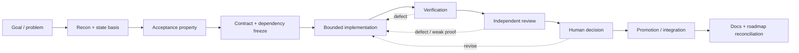

# Governed Engineering Loop

This page specifies the **engineering process shape** Invariant work should follow. It does not claim that every stage is automated by current product code. Use [Current system status](../status.md) for implementation maturity.



## What must be true at each transition

| Transition | Minimum condition |
| --- | --- |
| Recon → acceptance | Current state, ownership, and relevant prior evidence are identified. |
| Acceptance → contract freeze | The intended property is explicit enough to distinguish proof from proxy. |
| Contract freeze → implementation | Shared contracts/decisions consumed by implementation are resolved or explicitly bounded. |
| Implementation → verification | Candidate state is immutable/identifiable and the relevant checks target that state. |
| Verification → review | Evidence artifacts are available with scope and limitations; implementer narrative is not the only source. |
| Review → human decision | Material defects/uncertainty are classified; reviewer did not silently become acceptance authority. |
| Human decision → promotion | The authorized state and exact decision are recorded; rejected/revise states cannot be promoted as complete. |
| Promotion → docs reconciliation | Current docs, status, roadmap, and historical records reflect the new truth without rewriting history. |

## Visibility requirement

Every consequential lane should expose enough [traceability](../reference/traceability.md) to answer:

```text
what property?
which owner/authority?
which contract?
which exact state?
which evidence?
which independent challenge?
which human decision?
which documentation/status changed because of it?
```

A compact authoritative handoff/state file is preferable to repeating the same information in every lane.

## Parallel work

Parallel execution is cheap; independent work is not. Fan out recon, falsification, documentation, or tests only when they do not consume unresolved shared decisions. Shared contract/authority decisions should be frozen before dependent implementation lanes proceed.

## Completion

A model saying “done,” a clean diff, or a green test suite may be necessary evidence. None is sufficient by itself. Completion is the accepted result of the governed process for the stated property.
