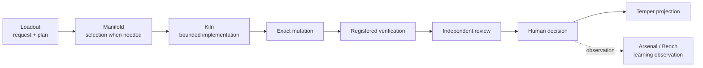

# Development Loop v0

The next system milestone is deliberately small: prove one real code change through the intended authority boundaries.

Target shape:

## Current vs target

Current components already cover substantial pieces: Loadout planning, real Kiln supervision, registered verification foundations, Arsenal review methods, Temper projection, and cross-product contracts.

The complete chain above is still **planned**. In particular, documentation must not imply that Manifold selection, governed mutation, independent reviewer selection, explicit human decision, and learning feedback are all currently connected as one public workflow.

## Acceptance property

A v0 implementation is credible only when a real repository change traverses the intended public boundaries, authority cannot be bypassed through convenience paths, verification/review are state-bound, the human decision is explicit, and the final projected result can be independently inspected.
