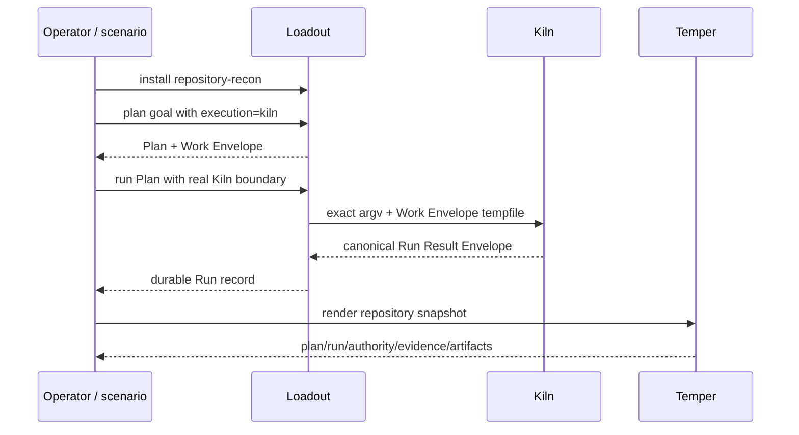

# Repository Recon

Repository Recon is the best current answer to “Can these components actually cross their public boundaries in one real workflow?”

## Run it

```bash
./invariant test integration
```

or directly:

```bash
./integration/scenarios/repository-recon/run.sh
```

## What happens



The runner creates a temporary real Git repository from the deterministic fixture so repository identity and currentness are not faked.

## What it proves

- one-checkout product interoperability;
- Work Envelope transport into real Kiln supervision;
- canonical Run Result parsing;
- explicit rejection of simulated labeling on the real path;
- Temper can project the recorded result.

## What it does not prove

The runner's own header is explicit: restart durability, eight negative cases, and dogfood remain specified in `TEST-MATRIX.md` rather than automated here. It also does not prove the future governed code-mutation Development Loop.
